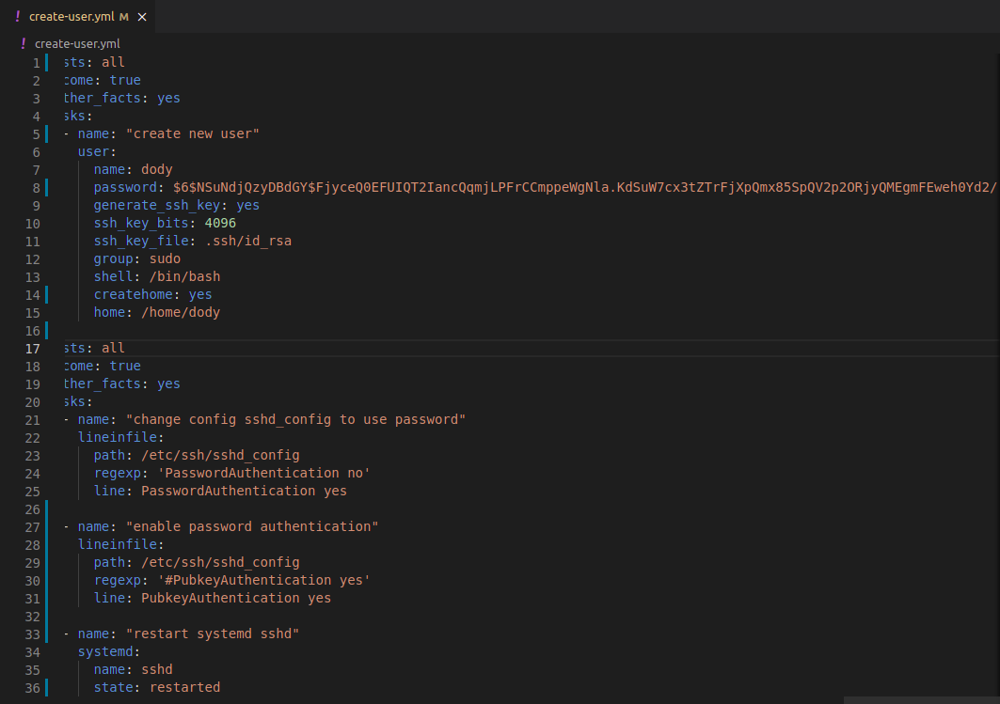
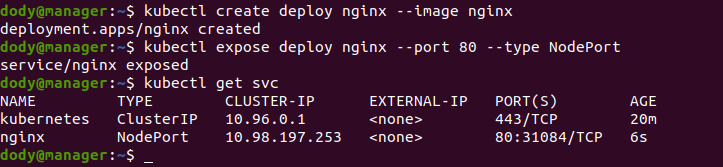

# **KUBERNETES & MICROSERVICES**

Pada additional task kali ini, kita akan mendeploy sebuah app microservice menggunakan kubernetes.

## Buat server di multipass

1. Buka terminal dan buat sever seperti berikut;  
     

2. Buat ansible file untuk create user.  
     

   - Jalankan ansible playbooknya.  
      

3. Lakukan update & upgrade pada server yang telah dibuat.  
     

## Install kubernetes

1. Login as root.
2. Disable firewall 
            
        ufw disable

3. Turn off swap.

        swapoff -a; sed -i '/swap/d' /etc/fstab

4. Update kernel config.

        cat >>/etc/sysctl.d/kubernetes.conf<<EOF
        net.bridge.bridge-nf-call-ip6tables = 1
        net.bridge.bridge-nf-call-iptables = 1
        EOF

5. Check the configuration.

        sysctl --system
      

6. Install docker.  
     

7. Setup docker daemon.  
   
        cat <<EOF | sudo tee /etc/docker/daemon.json
        {
        "exec-opts": ["native.cgroupdriver=systemd"],
        "log-driver": "json-file",
        "log-opts": {
        "max-size": "100m"
        },
        "storage-driver": "overlay2"
        }
        EOF

        sudo systemctl enable docker
        sudo systemctl daemon-reload
        sudo systemctl restart docker
      

8. Install kubelet, kubeadm, dan kubectl.

        sudo apt -y install curl apt-transport-https
        curl -s https://packages.cloud.google.com/apt/doc/apt-key.gpg | sudo apt-key add -
        echo "deb https://apt.kubernetes.io/ kubernetes-xenial main" | sudo tee /etc/apt/sources.list.d/kubernetes.list
        sudo apt update -y; sudo apt -y install kubelet kubeadm kubectl
      

    - Lakukan langkah 1-8 ke server worker1 & worker2.

9. Lakukan kubeadm setup pada server manager / master. Ganti ip address dengan ip server manager.

        sudo kubeadm init --apiserver-advertise-address=ip-address --pod-network-cidr=192.168.0.0/16  --ignore-preflight-errors=all
      

10. Buat kubeconfig.

        mkdir -p $HOME/.kube
        sudo cp -i /etc/kubernetes/admin.conf $HOME/.kube/config
        sudo chown $(id -u):$(id -g) $HOME/.kube/config
      

11. Jalankan config network berikut; 

        kubectl --kubeconfig=/etc/kubernetes/admin.conf create -f https://docs.projectcalico.org/v3.14/manifests/calico.yaml

        kubectl get pods --all-namespaces
      
      

12. Lakukan join cluster pada server `worker1 & worker2`.  

        kubeadm join 10.111.45.120:6443 --token hyitxr.1bzopblod2tg15ad --discovery-token-ca-cert-hash sha256:e883822795f8055b2e12b5a073857c20311cadedba2ee37b921f3b27b9c3ea2b
      
      

13. Kemudian change label untuk worker1 & worker2.

        kubectl label node worker node-role.kubernetes.io/worker=worker
      

14. Coba deploy simple app.

        kubectl create deploy nginx --image nginx
        kubectl expose deploy nginx --port 80 --type NodePort
        kubectl get svc
      

15. Berikut adalah hasilnya.  
      
      
      

## Deploy microservices app in kubernetes

1. Lakukan clone repository dari `https://github.com/djatmico4/dumbways-microservices.git`.  
     

2. Lalu build images.  
     

3. Buat repository di `hub.docker`.  
     

4. Push images ke docker hub.  
     

5. Kemudian jalankan perintah `kubectl apply -f kubernetes.yml`.  
     

6. 
