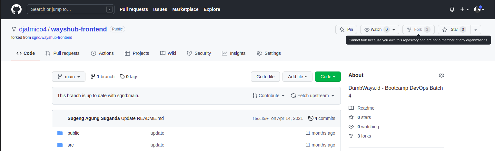

# **ADD REPOSITORY**

1. Lakukan forking pada dumbflix frontend & backend app.  
     
     

2. Buat branch baru Development dan Production pada repository.  
     

   - Lakukan hal yang sama untuk repository backend.  

3. Setup git confignya terlebih dahulu.  
     

    - Lakukan hal yang sama untuk repository frontend.  

4. Hasilnya seperti berikut ini;  
     
   