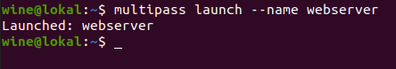
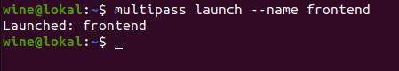
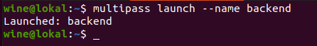
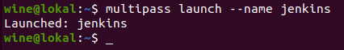
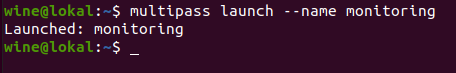
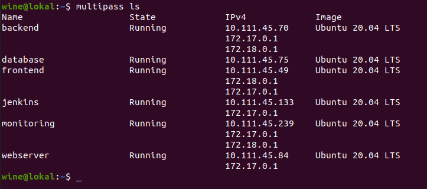

# **SERVER**

1. Buatlah server terlebih dahulu menggunakan multipass, masing-masing untuk webserver, frontend, backend, cicd, dan monitoring.  
     
     
     
     
     

2. Berikut adalah tampilan all servernya.  
     