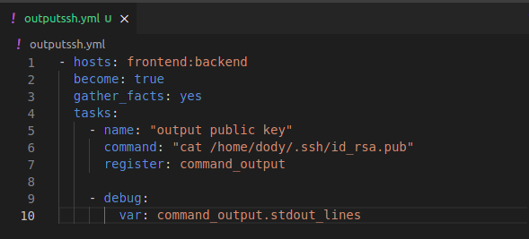

# **ADD SSH-KEY TO GITHUB**

1. Pertama set dulu git remotenya.  
     

2. Buat ansible playbook untuk load hasil sshnya saat pembuatan user tadi.  
     
     

3. Add ssh key tadi ke github.  
   