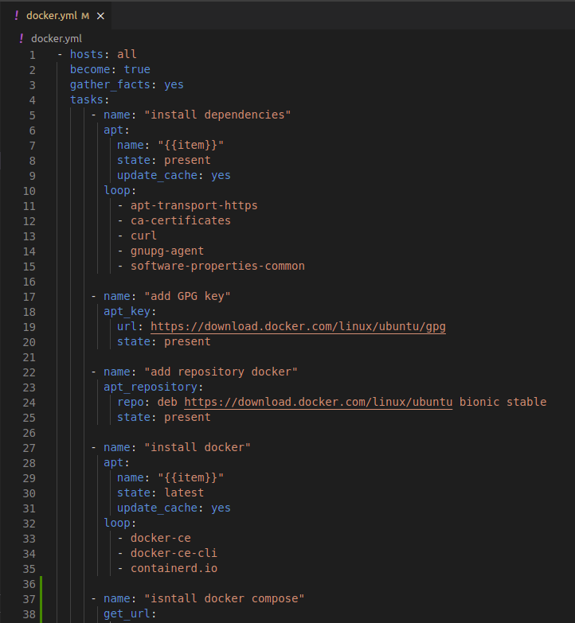
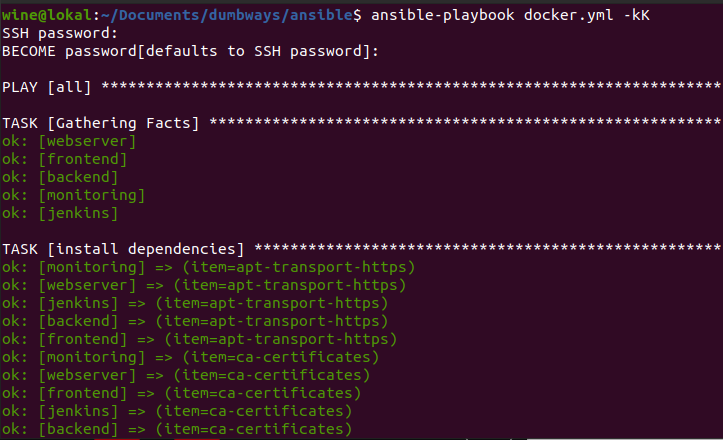
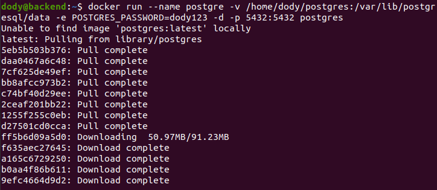
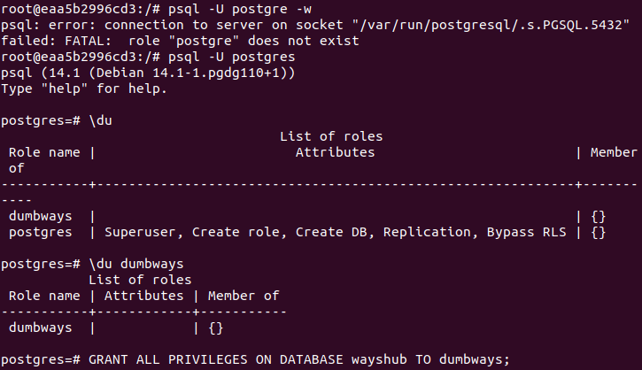

# **SETUP DATABASE FOR APP**

1. Sebelum install databasenya, kita install docker dan docker compose terlebih dahulu.  
   

2. Jalankan ansible playbooknya.  
     

3. Kemudian install postgresql dengan docker.  
     

4. Berikut hasilnya.  
   