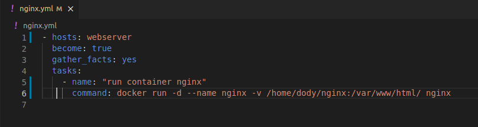
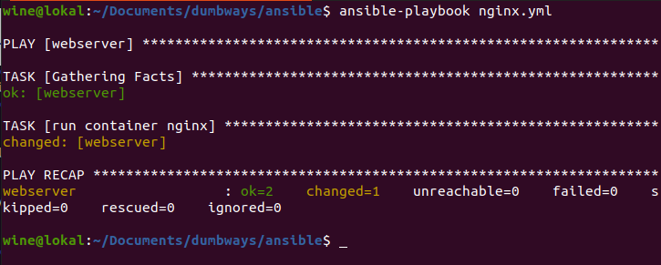
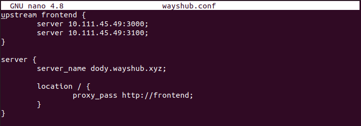
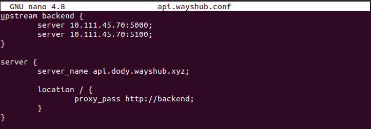
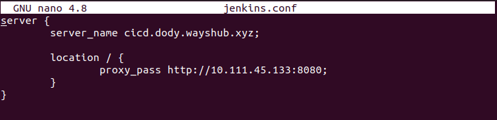
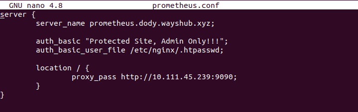
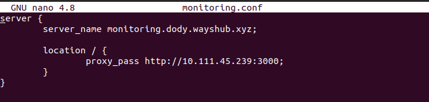

# **WEBSERVER**

1. Install nginx menggunakan ansible.  
     

2. Jalankan ansible playbooknya.  
     

3. Kemudian buat reverse proxy untuk masing-masing server seperti frontend, backend, cicd, dan monitoring.  
     
     
     
     
     