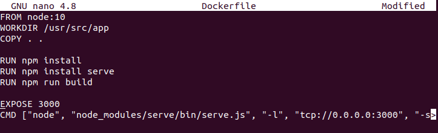
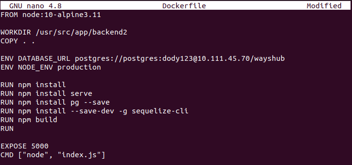
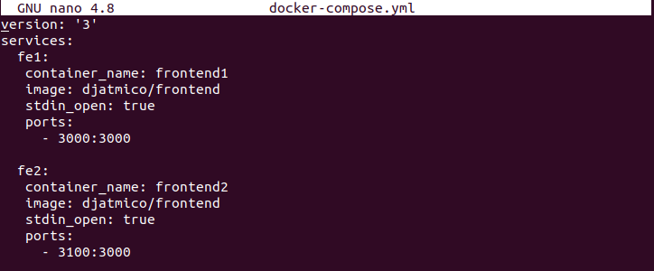
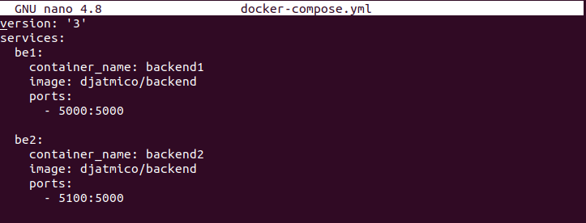
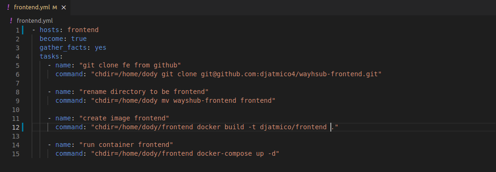
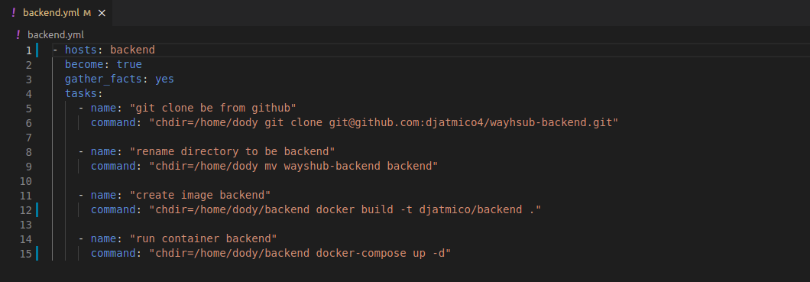
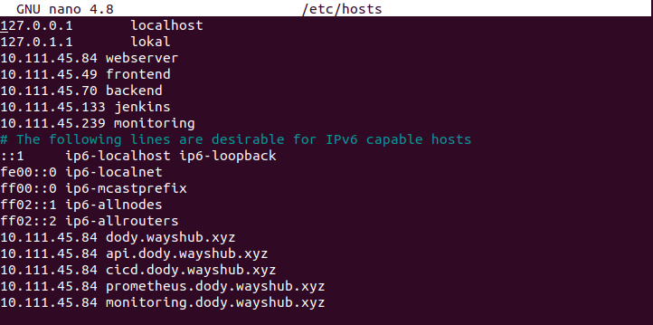
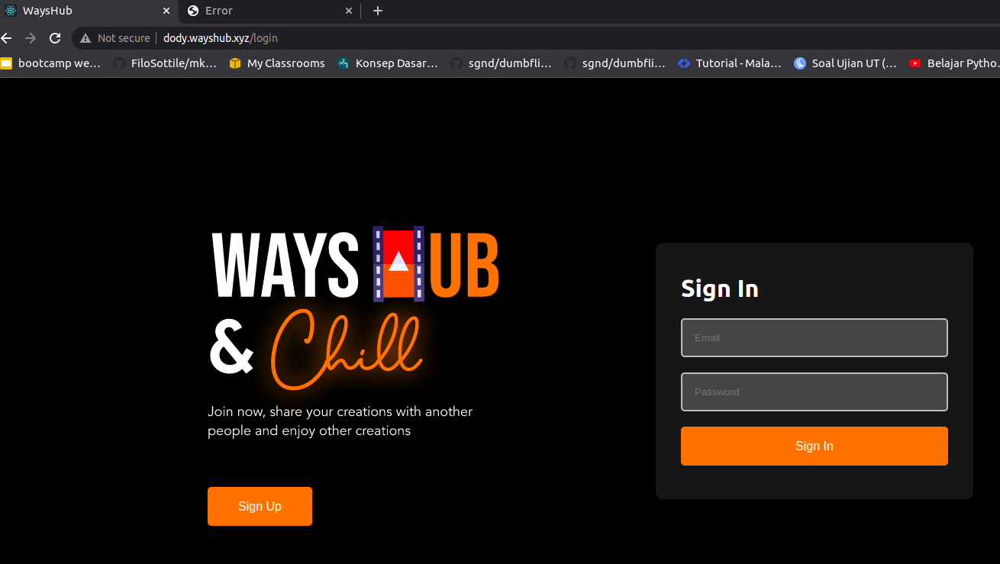
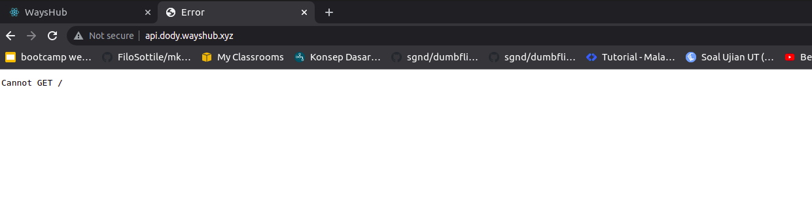

# **DEPLOYMENT**

1. Pertama buatlah Dockerfile untuk frontend & backend.  
     
     

2. Kemudian buatlah file docker compose untuk frontend & backend.  
     
     

3. Lalu jalankan ansible playbook untuk frontend & backend nya.  
     
     

4. Karena kita tidak mempunyai server, maka untuk lokal harus menambahkan subdomain di /etc/hosts agar seolah kita mempunyai domain.  
     

5. Buka browser dan akses domain yang sudah dibuat untuk reverse proxy sebelumnya, `dody.wayshub.xyz` & `api.dody.wayshub.xyz`  
     
     