# **CICD**

1. Di sini saya membuat dan menjalankan cicd menggunakan ansible.  
   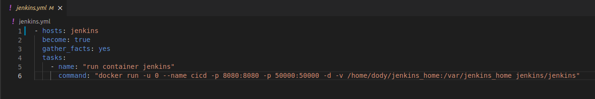  

2. Masuk ke `cicd.dody.wayshub.xyz` dan masukkan admin password yang bisa anda lihat di `/var/jenkins_home/secrets/initialAdminPassword`.  

        sudo docker exec ${CONTAINER_ID or CONTAINER_NAME} cat /var/jenkins_home/secrets/initialAdminPassword 
    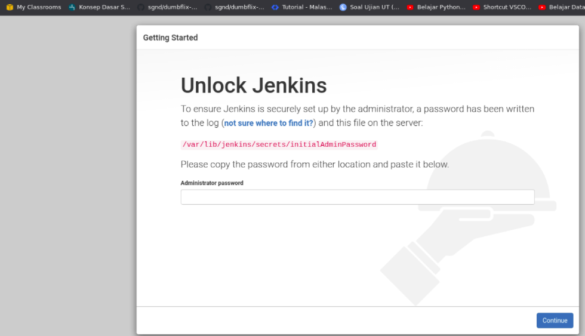  

3. Pilih jenis instalasi plugin jenkins pilih yang `suggested plugins` dan tunggu proses instalasi plugin selesai.
4. Buat admin jenkins, simpan dan lanjut.  
   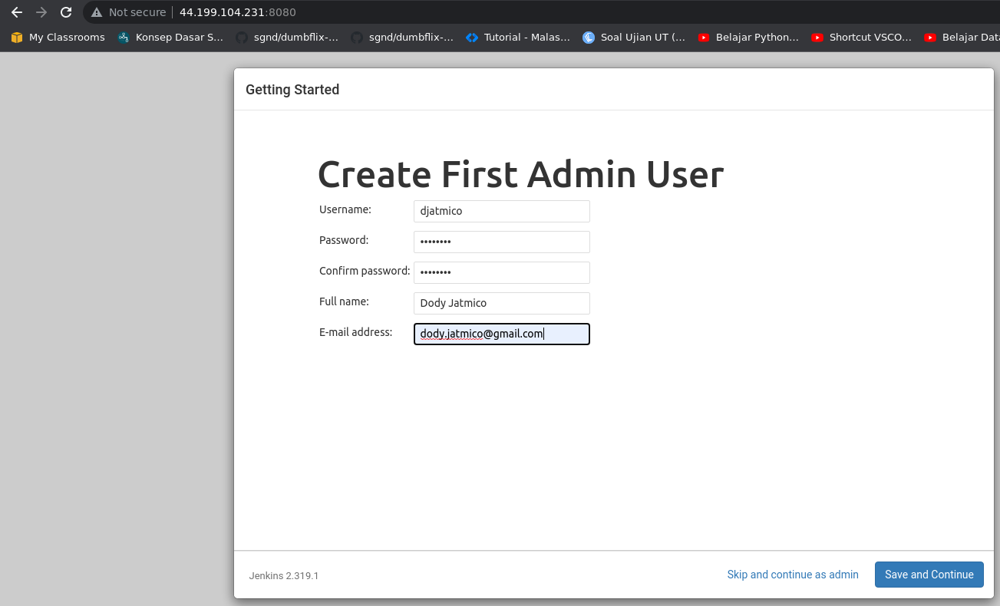  

5. Install plugins `Publish Over SSH`. Kemudian setup konfigurasinya.  
   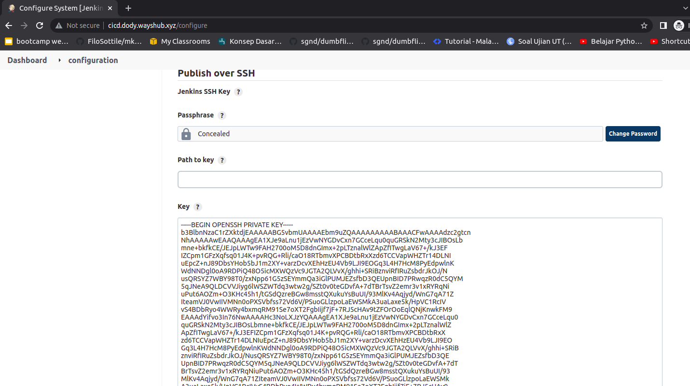  
   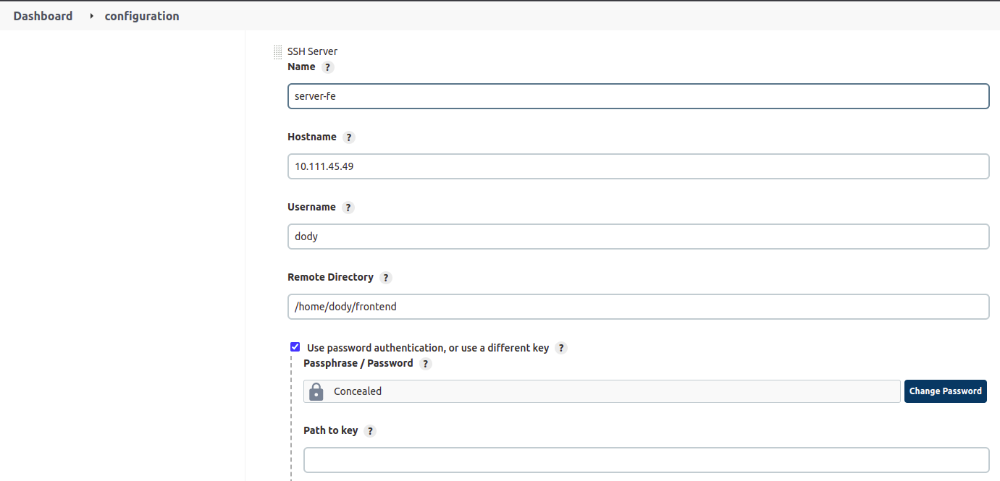  
   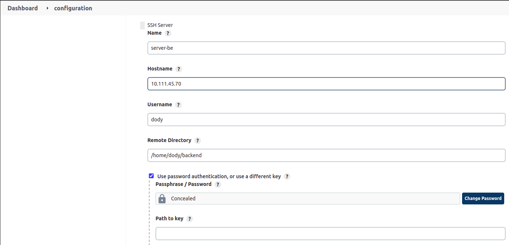  

6. Setup credentials untuk access server dan github, masing-masing untuk frontend & backend.  
   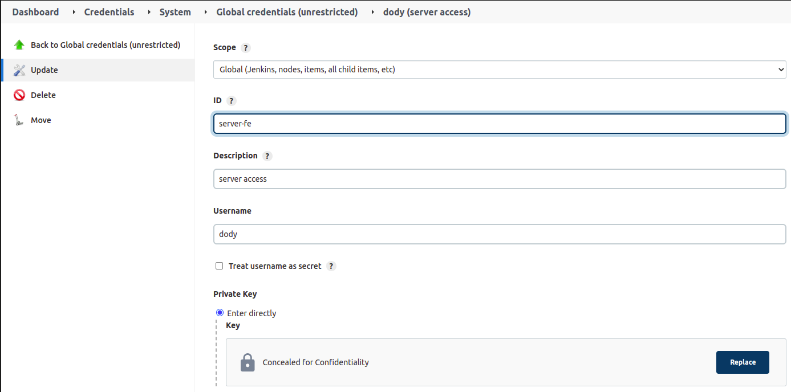  
   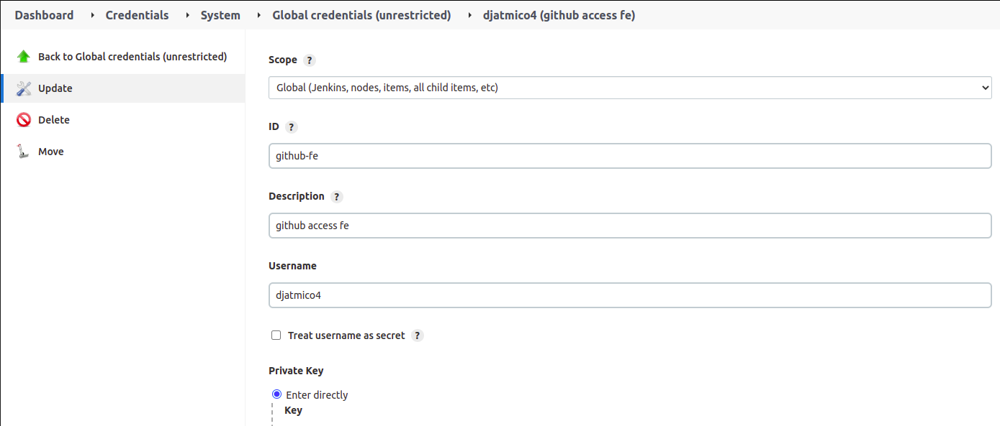  

7. Buat jobs untuk frontend & backend.  
   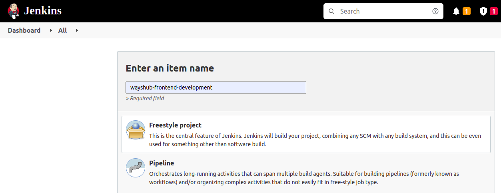  
   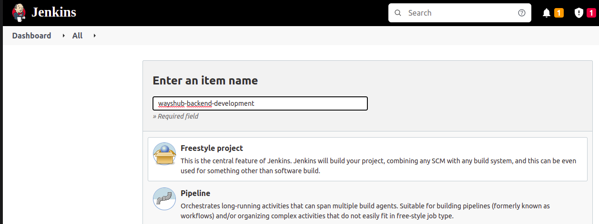  

8. Lakukan setup untuk jobs frontend.  
   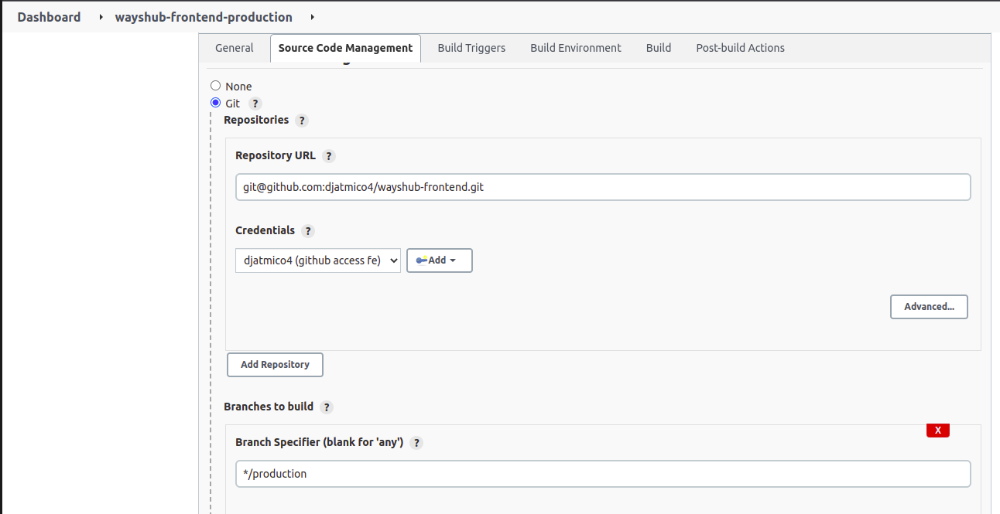  
   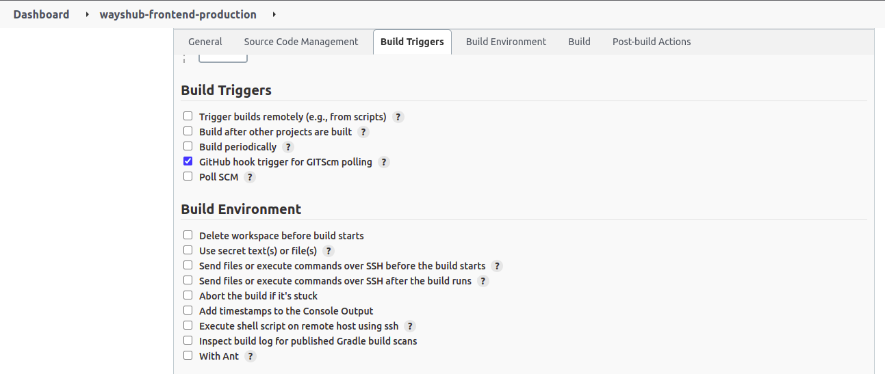  
   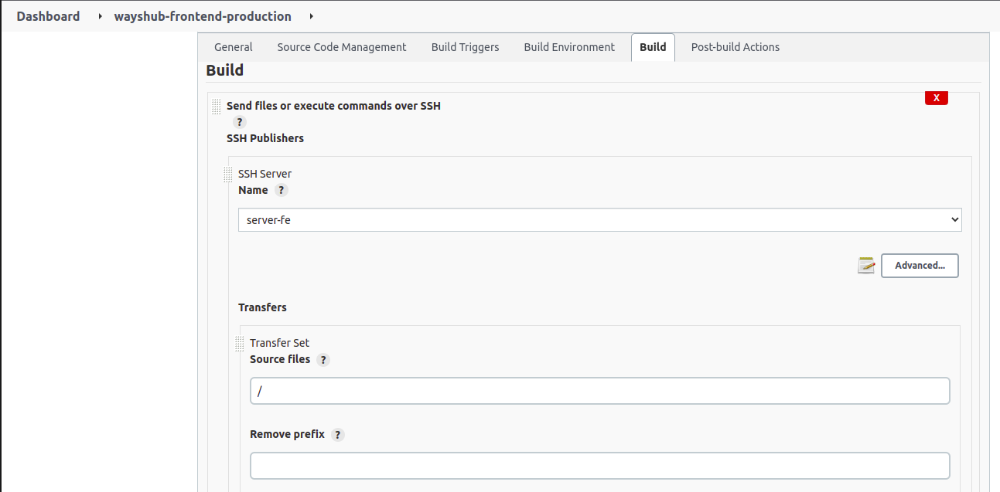  
   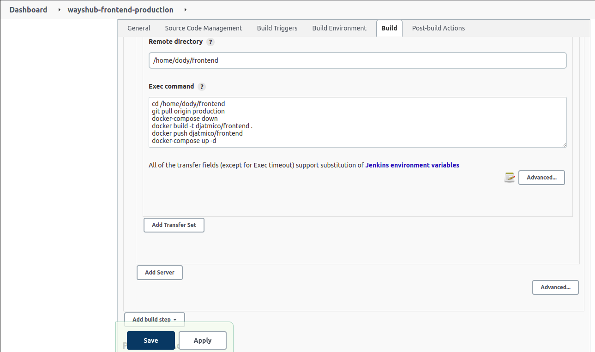  

   - Lakukan hal yang sama untuk backend.  
    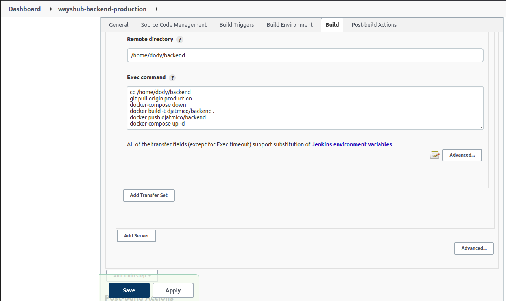  

9. Tambahkan webhook di github.  
    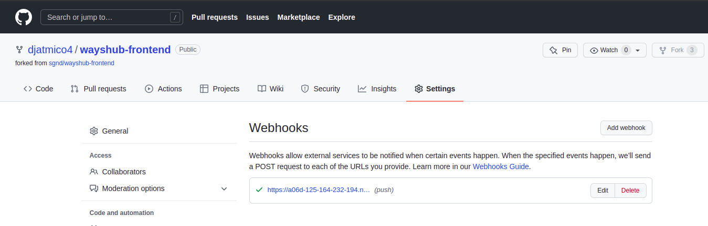  
    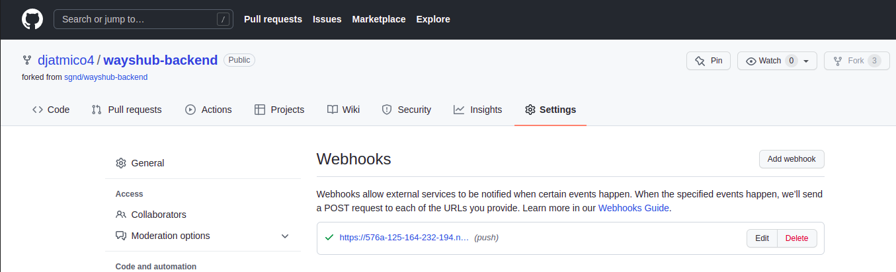  

        