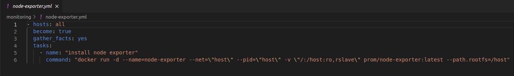
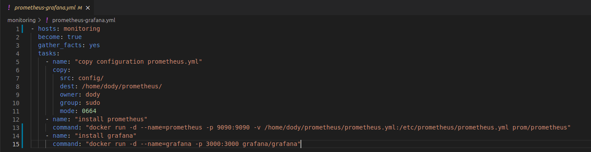
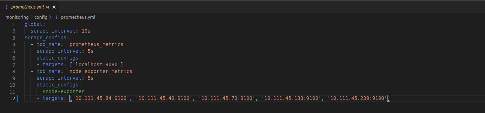
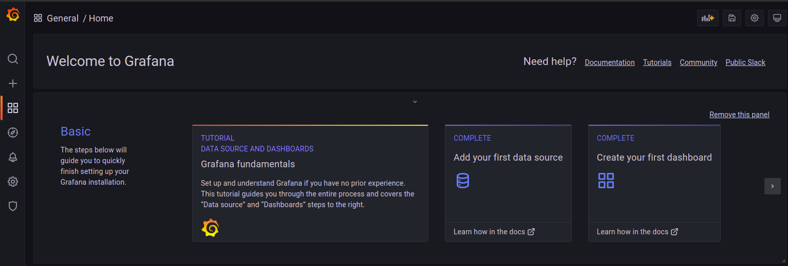
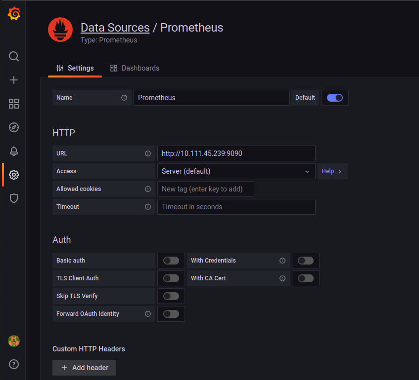
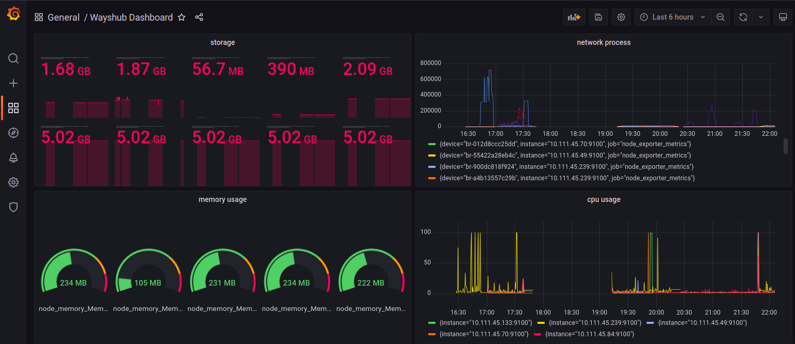

# **SETUP MONITORING SERVER WITH PROMETHEUS & GRAFANA**

1. Pertama kita install node exporter ke semua server yang sudah dibuat sebelumnya menggunakan ansible.  
     

2. Kemudian install prometheus & grafana di server monitoring.  
     
     

3. Masuk ke website grafana.
     

4. Tambahkan data source.  
     

5. Berikut dahsboard yang sudah dibuat.  
     