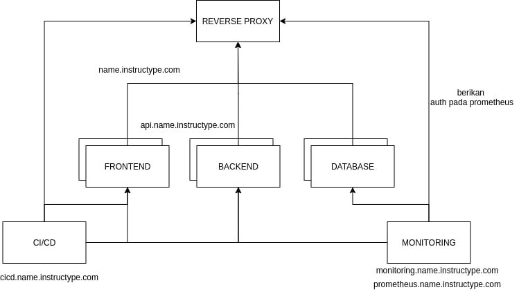

# **FINAL TASK**

- ## **Final Task**
  
  Final task merupakan tugas terakhir dari rangkaian bootcamp mulai dari week 1 - week 4 oleh DumbWays 
  
  Pada final task ini, akan dijelaskan secara step by step mengenai ;

- Repository.
- Server.
- User.
- SSH.
- Database.
- Web server.
- Deployment.
- Monitoring.
- Auth.

       

# **Kebutuhan**

Sebelum memulai tugas di atas, hal-hal yang perlu dipersiapkan antara lain ;

- Server : Ubuntu server (18.x), web server (nginx) & AWS
- Security group : 22, 80, 443 & all traffic
- Aplikasi frontend : dumbflix-frontend 
- Aplikasi backend: dumbflix-backend   

# **Penyelesaian**
- 
