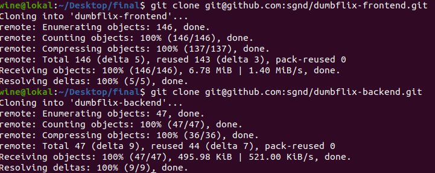
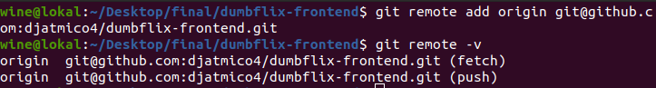
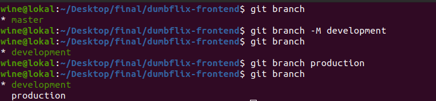
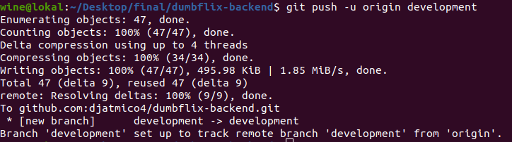

# **Repository**
## Create Own Repository for fe & be

1. Clone aplikasi fe & be dari `git@github.com:sgnd/dumbflix-frontend.git` dan `git@github.com:sgnd/dumbflix-backend.git`.  

        git clone git@github.com:sgnd/dumbflix-frontend.git
     

2. Ganti git remote untuk repository sendiri. Lakukan hal ini untuk fe & be.
   
        git remote add origin git@github.com:sgnd/dumbflix-frontend.git
     

3. Membuat branch development dan production. Lakukan hal ini untuk fe & be.

        git branch -M development
        git branch production
      

4. Push ke dalam repositorty sendiri. Lakukan hal ini untuk fe & be.
   
        git push -u origin development
    