# **SERVER**
## Membuat Server di AWS

1. Login ke AWS lalu browse VPC.  
     

2. Buat vpc. Isikan nama dan IPV4 CIDR seperti pada gambar. 10.0.0.0/16 adalah sebagai primary CIDR block pada vpc kita  
   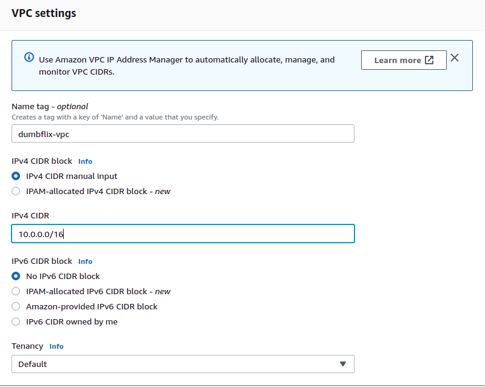  
   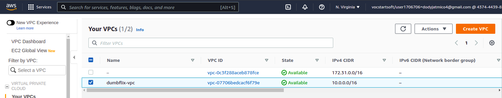  

3. Buatlah subnet untuk public dan private.  
   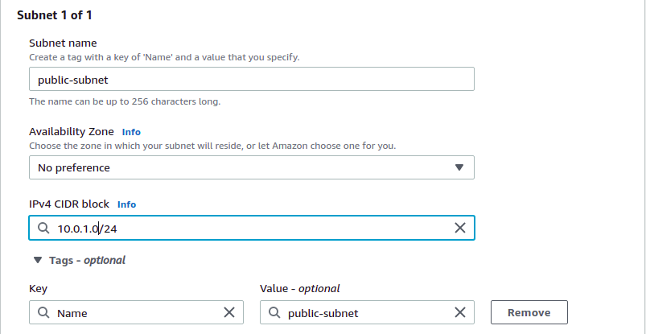  
   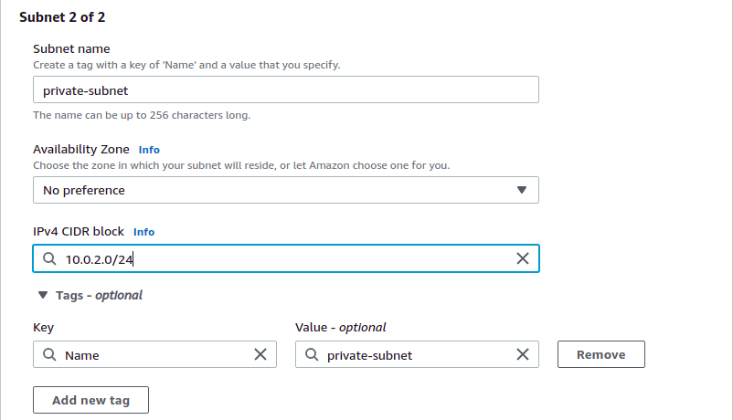  

   - Arahkan subnet associations sesuai dengan route tablesnya.  
   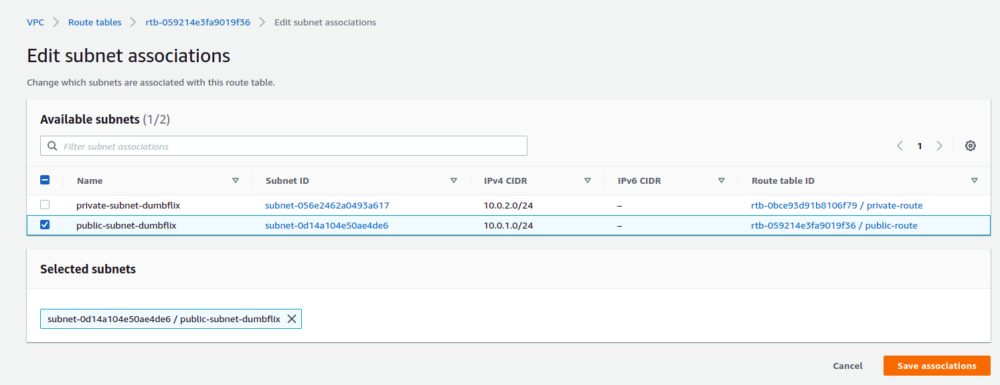  
   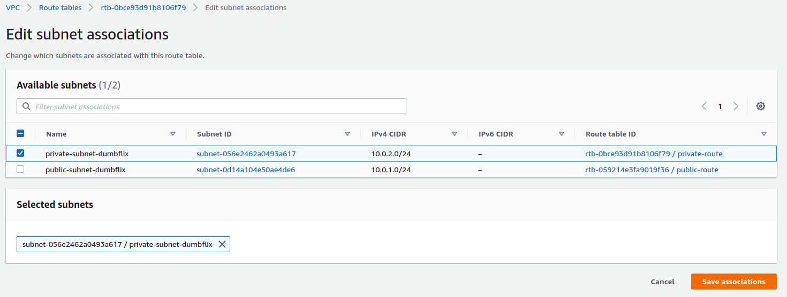  

4. Buat internet gateway yang berfungsi untuk menghubungkan VPC ke internet.  
   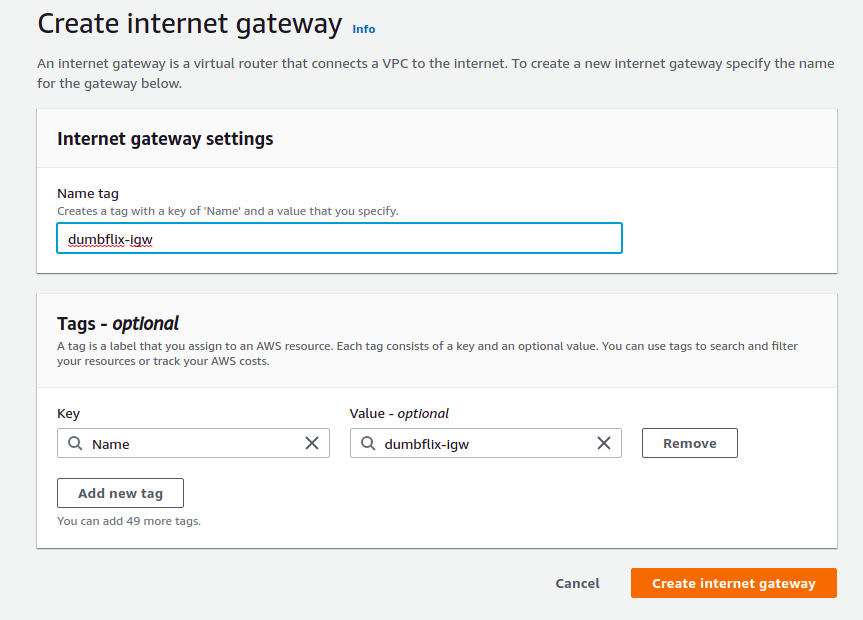  

5. Attach igw ke vpc yang sudah dibuat tadi.  
   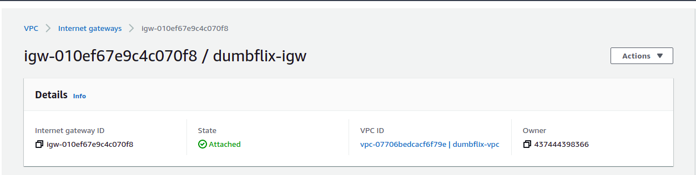  

6. Ganti nama default route menjadi “Public Route”. Pada route table, arahkan route target ke internet gateway yang telah kita attach di VPC tadi dengan destinasi 0.0.0.0/0 (All IP).  
   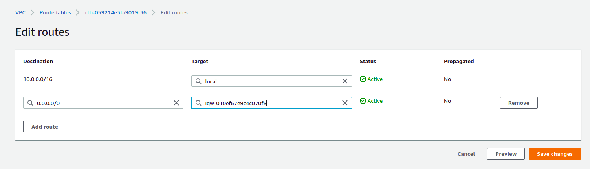  

7. Buat instance untuk nginx.  
   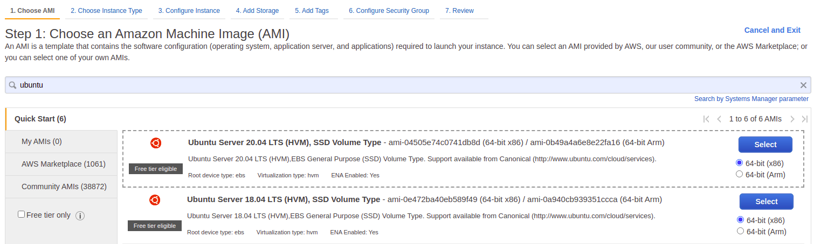  
   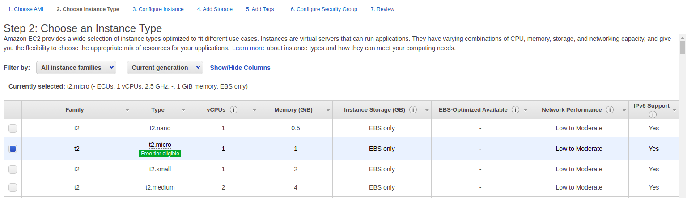  
   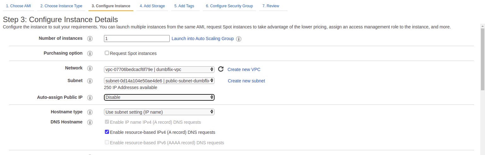  
   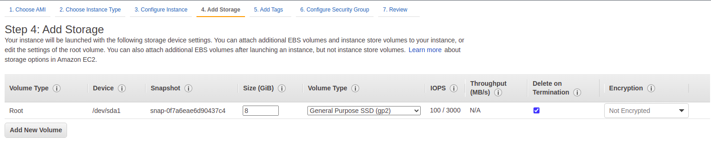  
   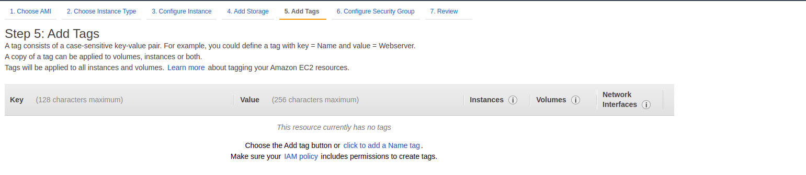  
   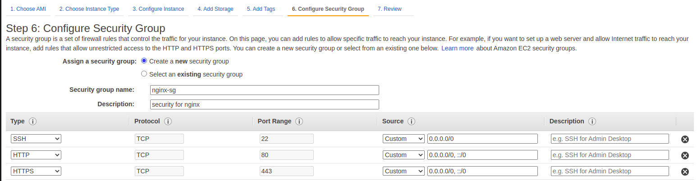  
   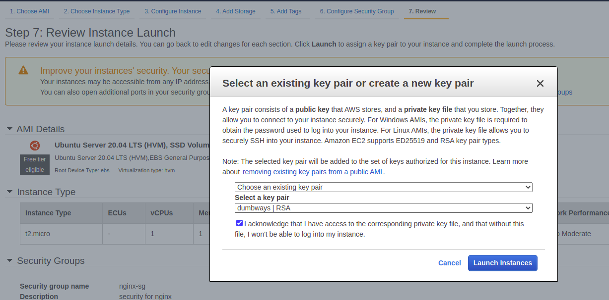  

8. Membuat elastic IP yang kita nanti attach ke public server/nginx.  
   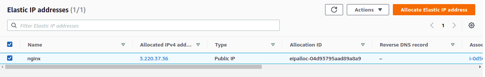  

   - Kita harus stop source/destination check pada instance public server jika kita ingin membuat NAT Instance.
   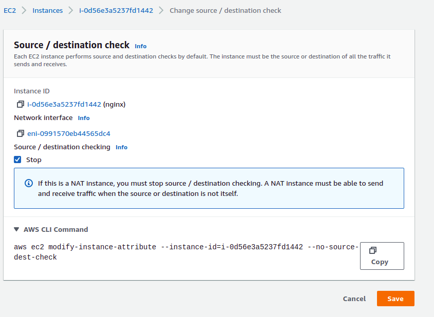  

9. Buat private route. Setelah itu pergi ke route tables dan edit Private Route dengan target dari instances public server yang telah dibuat. Hal ini agar private instances bisa mengakses internet lewat NAT instance ini.  
    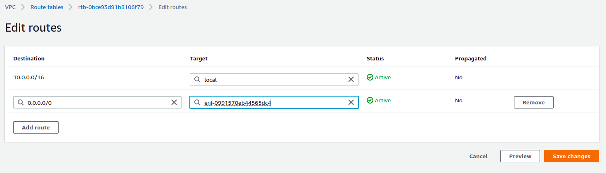  

10. Buatlah private server sebanyak kebutuhan. Di sini saya membuat untuk fe, be, db, ci/cd, monitoring. Atur security group ke all traffic.
11. Login ke nginx.  
    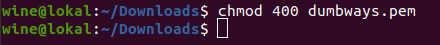  
    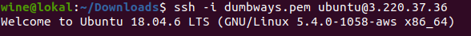  

12. Enable fitur ipv4 forwading pada kernel dan gunakan NAT untuk membolehkan private subnet mengakses outside world.
    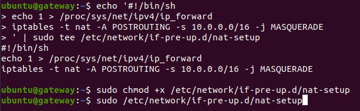  

13. Agar tidak menggunakan key pair saat login SSH, ubah file sshd_config pada /etc/ssh dengan mengganti Password Authentication menjadi Yes.  
    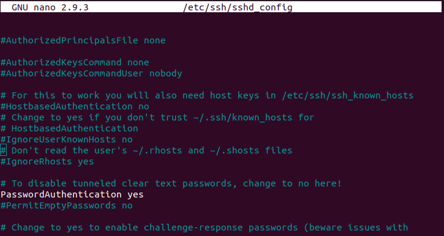  

14. Tambahkan username baru dan beri akses sudo ke user baru tersebut. Jangan lupa untuk restart SSH.  
    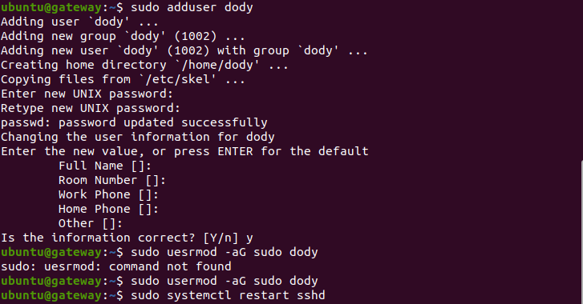  

15. Copy key pair ke public server dengan scp dan arahkan pada direktori /home/mico.  
    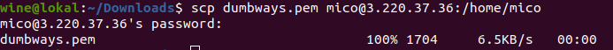  

16. Login ke private server dari public server dengan key pair. Hal ini karena Password Authentication di private server belum disetting, jadi masih perlu key pair.  
      