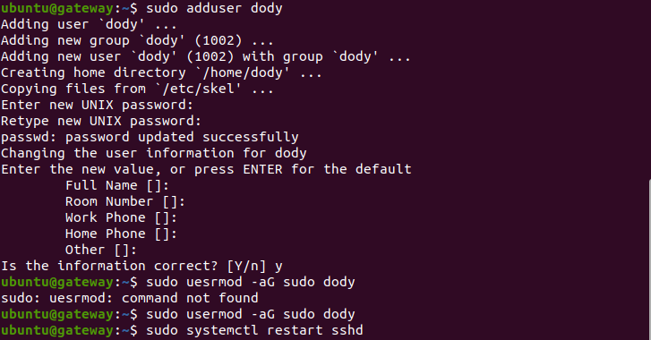

# **USER**
## Create User with Password & Disable Sign In without Password

1. Login ke masing-masing server untuk membuat user baru.  
     

2. Agar tidak menggunakan key pair saat login SSH, ubah file sshd_config pada /etc/ssh dengan mengganti Pubkey Authentication yes dan Password Authentication menjadi No.  
      