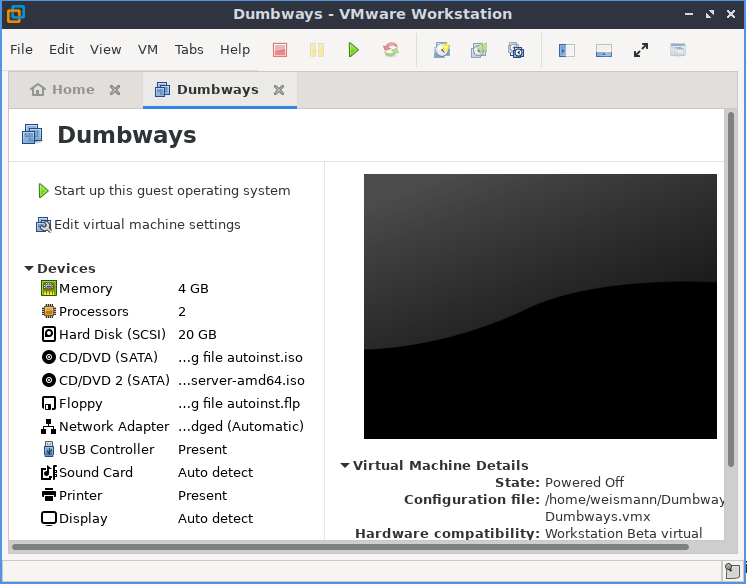
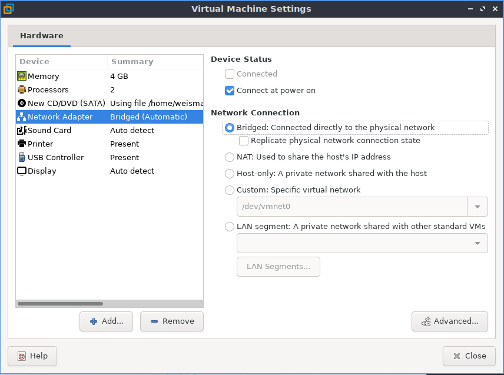
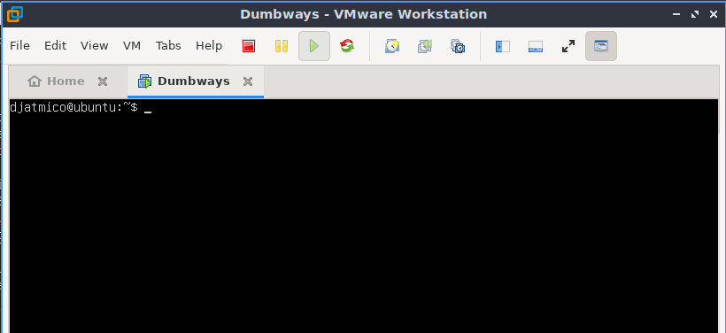
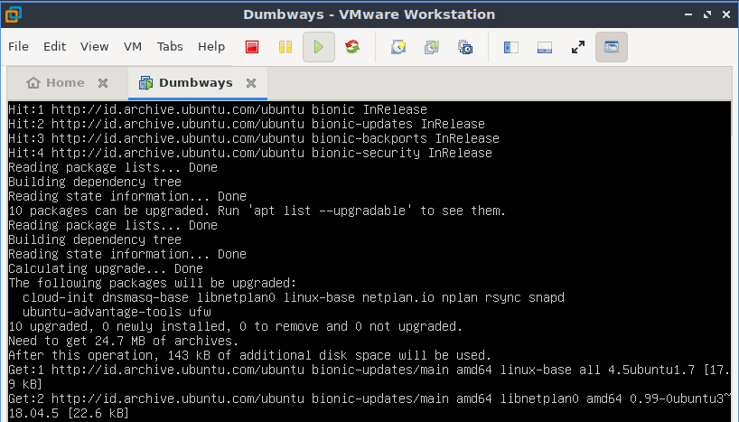
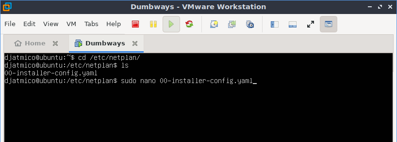
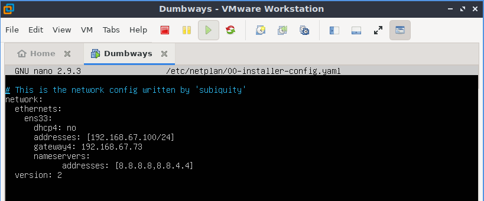
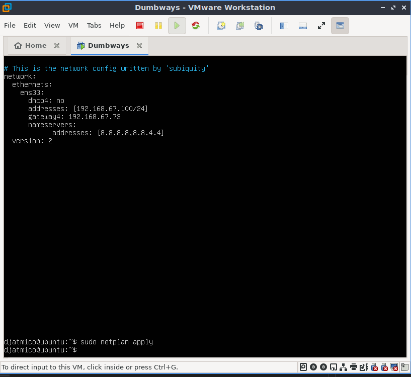
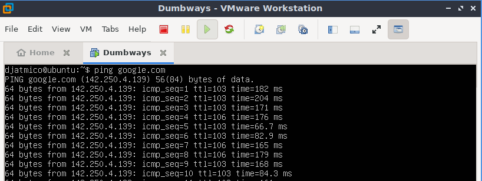

# **VMWARE  SETUP NETWORK**
## Change Network from NAT to Bridge & Make The IP To Be Static

1. Pertama bukalah aplikasi VMWare, pilih `Edit virtual machine settings`.  
     

2. Pilih `network adapter`, lalu di kolom sebelah kanan pilih `Bridge`.  
     

3. Untuk setting IP address menjadi static, buka dan jalankan ubuntu server.  
     

4. Update dan upgrade terlebih dahulu dengan perintah ;

        sudo apt update -y && sudo apt upgrade -y
      

5. Pindah ke directory `/etc/netplan/` dan edit file .yaml di dalamnya, kemudian apply.  

        cd /etc/netplan/
        sudo nano 00-installer-config.yaml
      
      
      

6. Test konkesi menggunakan ping.  
   
         ping google.com
     