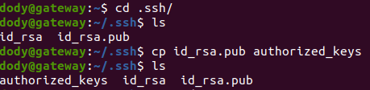
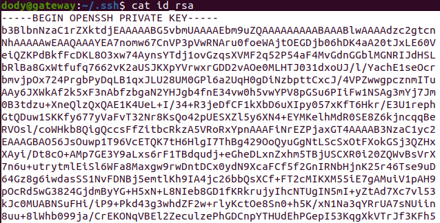
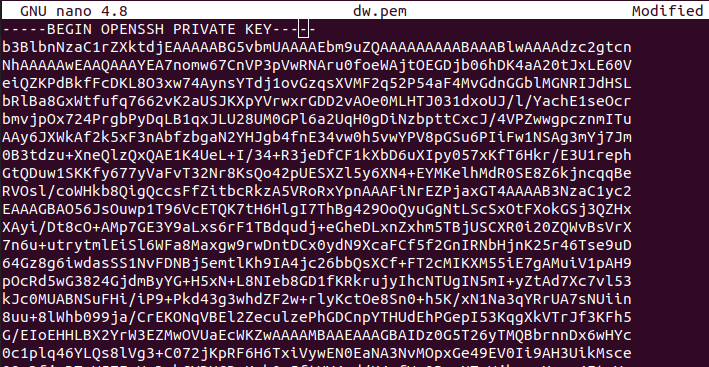
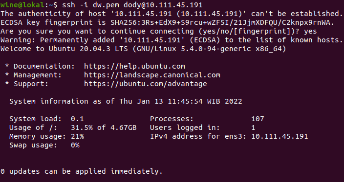

# **CREATE SERVER MULTIPASS**
## Create two servers for reverse proxy and application with multipass.

1. Langkah pertama install dahulu `snapd`.

        sudo apt install snapd
      

2. Kemudian install `multipass`.

        sudo snap install multipass
      

3. Buat 2 server yang nantinya akan digunakan untuk reverse proxy dan application.

        multipass launch --name gateway
        multipass launch --name fe
      
     

4. Masuk ke server dan lakukan update dan upgrade agar aman.

        multipass shell gateway
        sudo apt update -y; sudo apt upgrade -y
      
      

5. Buat user baru dan beri hak akses sudo pada user baru.

        sudo adduser dody
        sudo usermod -aG sudo dody
      

6. Kemudian buat ssh key agar server bisa diakses melalui ssh.
   
        ssh-keygen
      

    - Buka directory `.ssh`, copy dan jadikan file `id_rsa.pub` menjadi `authorized_keys` dan copy isi file `id_rsa` lalu paste di lokal.

            ssh-keygen
            cd .ssh/
            cp id_rsa.pub authorized_keys
            cat id_rsa
          
          

    - Buat file baru yang nantinya akan di-paste-kan dari `id_rsa` tadi di lokal.
  
            nano dw.pem
        

    - Beri hak akses dengan perintah `chmod 400 dw.pem`
    - Remote server melalui ssh.

            ssh -i dw.pem dody@10.111.45.191
          

7. Lakukan langkah 4-6 untuk server fe (application).
8. Setup firewall dan buka port 22, 80, 443 untuk reverse proxy serta all traffic untuk application.

        sudo ufw allow 22
        sudo ufw allow 80
        sudo ufw allow 443
      

