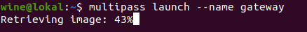

# **CREATE SERVER MULTIPASS**
## Create two servers for reverse proxy and application with multipass.

1. Langkah pertama install dahulu `snapd`.

        sudo apt install snapd
      

2. Kemudian install `multipass`.

        sudo snap install multipass
      

3. Buat 2 server yang nantinya akan digunakan untuk reverse proxy dan application.

        multipass launch --name gateway
        multipass launch --name fe
      
     

4. Masuk ke server dan lakukan update dan upgrade agar aman.

        multipass shell gateway
        sudo apt update -y; sudo apt upgrade -y
      
      

5. Setup firewall dan buka port 22, 80, 443 untuk reverse proxy serta all traffic untuk application.

        sudo ufw allow 22
        sudo ufw allow 80
        sudo ufw allow 443
      

