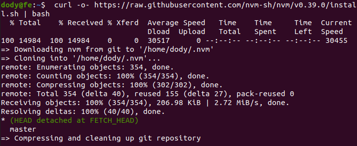

# **SETUP ENVIRONMENT**
## Setting the environment and cloning fronend app

1. Pertama login dulu ke server app (fe).
2. Lakukan update dan upgrade.  
     

3. Buat user baru dan beri hak akses sudo pada user baru.

        sudo adduser dody
        sudo usermod -aG sudo dody
      
    
4. Kemudian install nginx.

        sudo apt install nginx -y
      

5. Setup node.js.

         curl -o- https://raw.githubusercontent.com/nvm-sh/nvm/v0.39.0/install.sh | bash
      

    - Install node.js.

            nvm install 10
          

6. Setup monitoring tool.  
  
  

7. Clone aplikasi dari https://github.com/sgnd/wayshub-frontend, lalu ubah namanya menjadi `frontend`.
   
        git clone https://github.com/sgnd/wayshub-frontend
        
        mv wayshub-frontend frontend
      

    - jalankan npm install dahulu.  
    

8. Deploy aplikasinya.

        npm run start
      
    