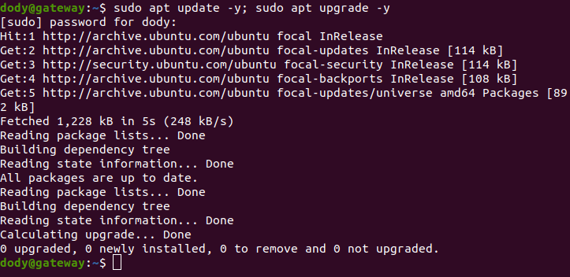
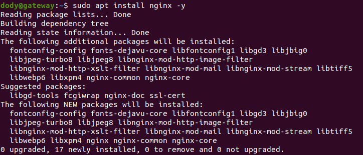
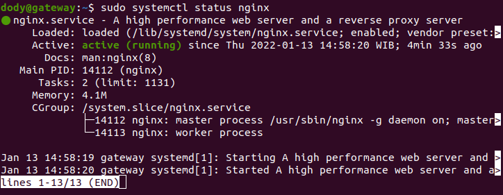
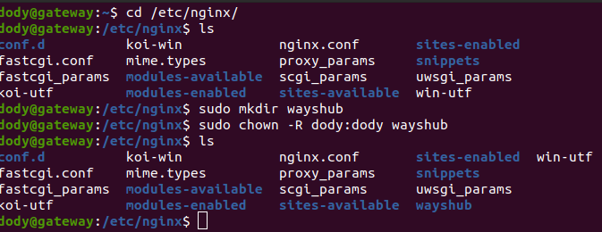
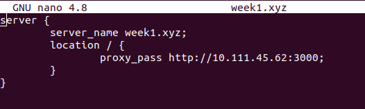
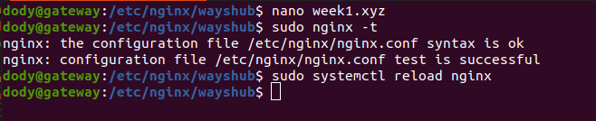
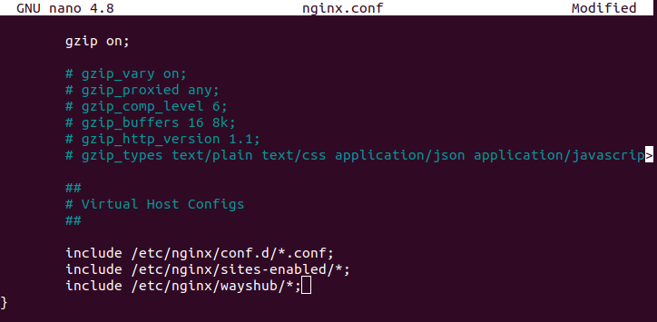
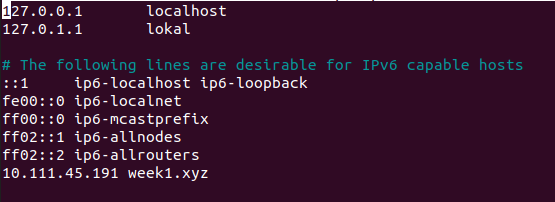
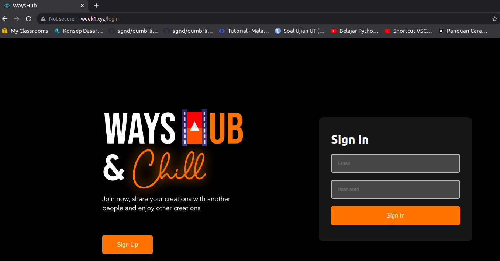

# **REVERSE PROXY**
## Setup server for reverse proxy

1. Login ke server gateway untuk reverse proxy.
2. Lakukan update dan upgrade sistem.

        sudo apt update -y; sudo apt upgrade -y
      

3. Instal webserver untuk reverse proxy, di sini saya menggunakan Nginx.

        sudo apt install nginx -y
      

    - Cek status nginx, apakah sudah jalan.

            sudo systemctl status nginx
          

4. Buat directory baru untuk menaruh file config.
     

5. Buat file config dengan nama bebas.

            nano week1.xyz
      

    - Jangan lupa validasi terlebih dahulu.  
      

    - Tambahkan folder yang sudah dibuat tadi ke dalam file `nginx.conf` agar config yang sudah dibuat dapat terbaca oleh nginx.

            sudo nano nginx.conf
      

6. Karena kita tidak mempunyai server, maka untuk lokal harus menambahkan subdomain di `/etc/hosts` agar seolah kita mempunyai domain.

        sudo nano /etc/hosts
      

7. Buka browser dan jalankan.
     
    