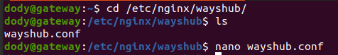
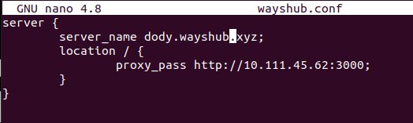
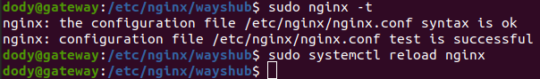
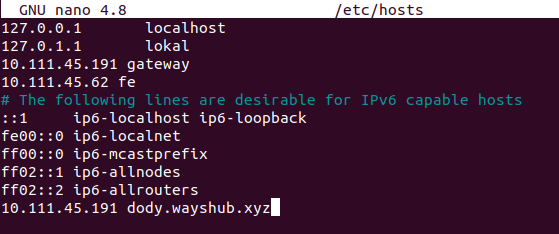
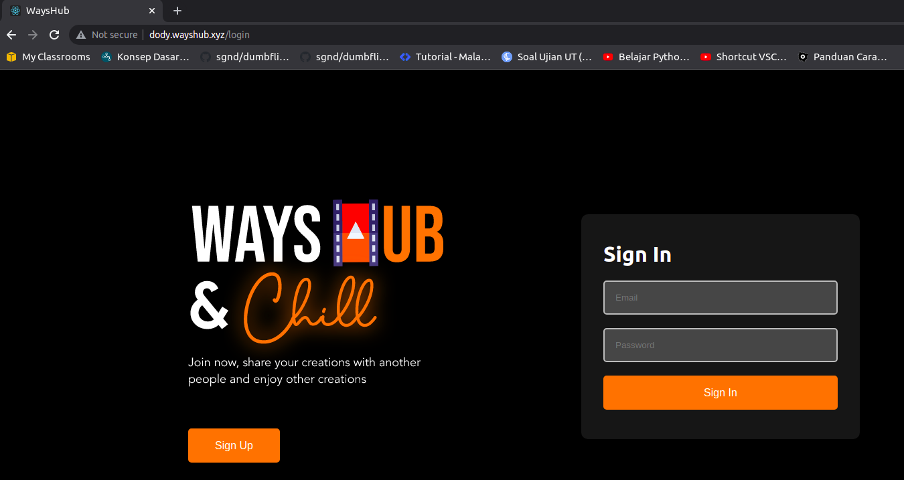

# **CREATE VIRTUAL DOMAIN**

1. Pertama, login dulu ke server gateway.
2. Kemudian pindah ke directory dimana kita menyimpan file confignya. Kemudian ubah server namenya

        cd /etc/nginx/wayshub/
        nano wayshub.conf
      
      

3. Lakukan validasi apakah confignya sudah benar.

        sudo nginx -t
        sudo systemctl reload nginx
      

4. Karena kita tidak mempunyai server, maka untuk lokal harus menambahkan subdomain di `/etc/hosts` agar seolah kita mempunyai domain.

        sudo nano /etc/hosts
    
      

5. Buka browser dan akses domain yang sudah kita buat tadi.  
   