# **AWS - CREATE AND SETUP SERVER**
## **Create and Setup Server on AWS**   
## **Server untuk reverse proxy**

1. Login terlebih dahulu ke dalam AWS Educate.
2. Go to classrom.
3. Pilih `AWS console`, lalu pergi ke alamat link yang dituju.
   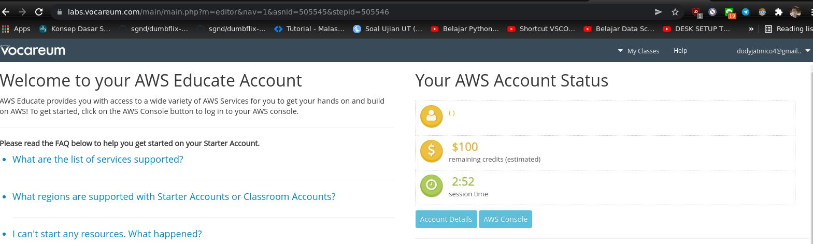  

4. Di dalam dashboard atau `AWS management console`, pilih `Launch a virtual machine`.
   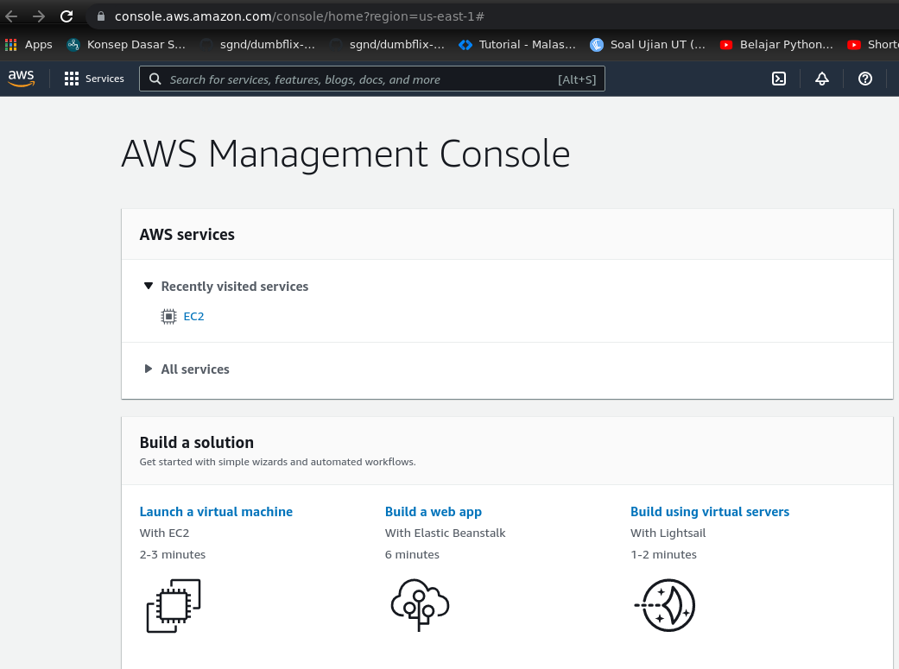  

5. Pada `Step 1: Choose an Amazon Machine Image (AMI)`, pilih Ubuntu Server 18.x OS.
   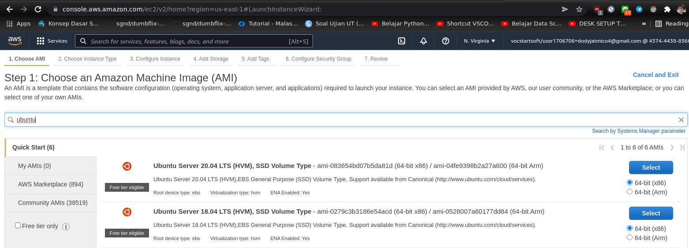  

6. Step 2, pilih instance type sesuai kebutuhan, `next`.
     

7. Step 3, klik pada `Auto assign public IP` pilih `disable`, lalu `next`.
   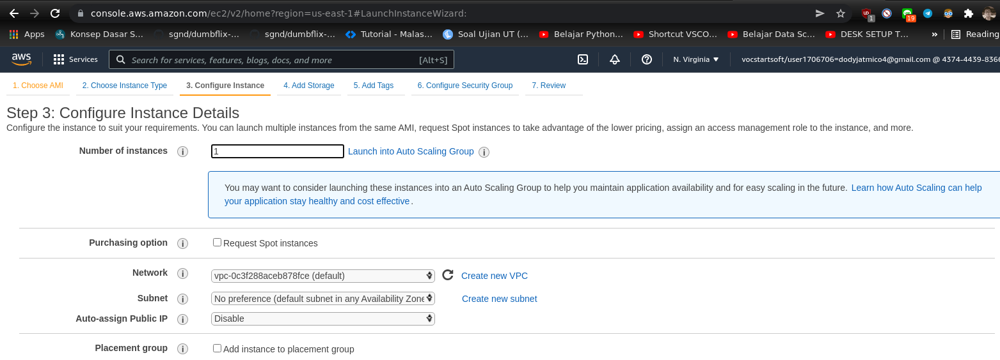  

8. Step 4, isikan storage sesuai kebutuhan, klik `next`.
   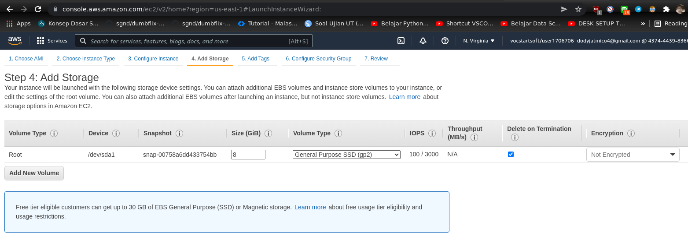  

9. Step 5, biarkan saja default, pilih `next`.
    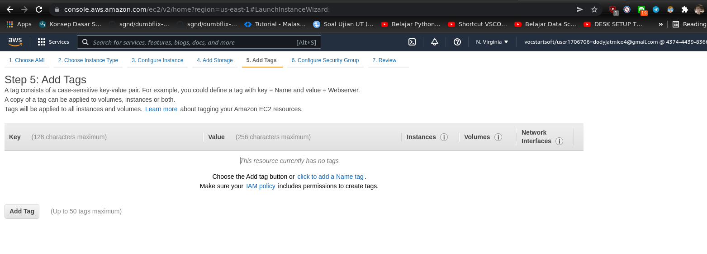  

10. Step 6 security group, pilih `create a new security group` tentukan type sesuai keinginan, di sini kita pilih SSH, HTTP, dan HTTPS, lalu klik `review and launch`.
    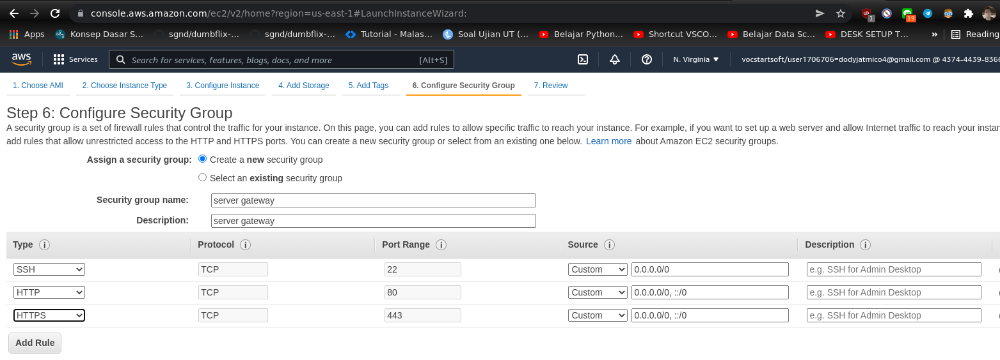  

11. Step 7, review instance launch. Review konfigurasi yang sudah dibuat, klik `launch`.
    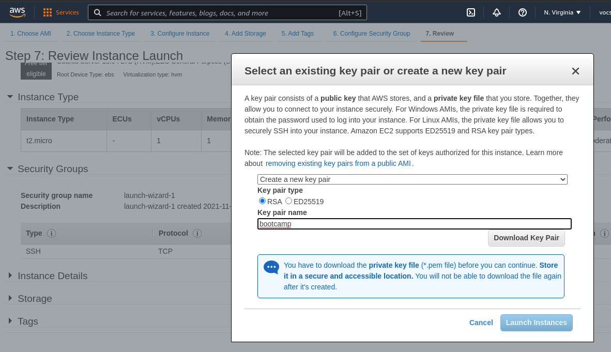  

12. Masuk ke Elastic IPs yang berada di sidebar console bagian network & security.
    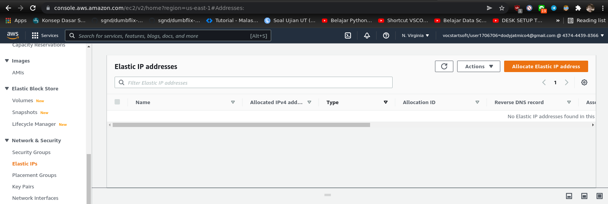  

13. Pilih `Allocate ip address`, biarkan default saja, lalau `allocate`. AWS akan mengalokasikan sebuah IP yang dapat digunakan.
    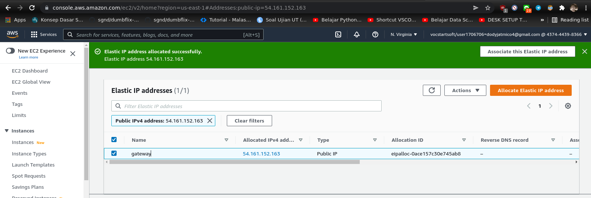  

14. Pada tombol `Actions`, pilih `Associate ellastic IP address`, lalu pilih instancenya. Klik `Associate`
    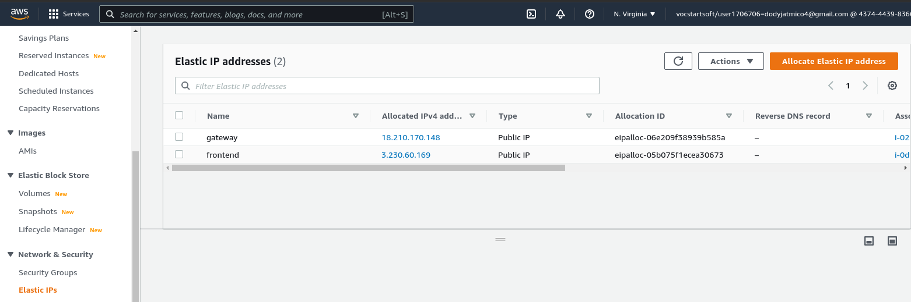  

15. Masuk ke instances, lalu refresh.
    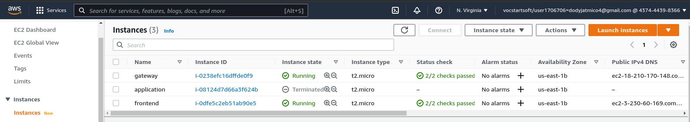  

16. Buka terminal, pindah ke directory `Downloads` serta ubah hak akses pada key pair.

        cd Downloads/
        chmod 400 bootcamp.pem
    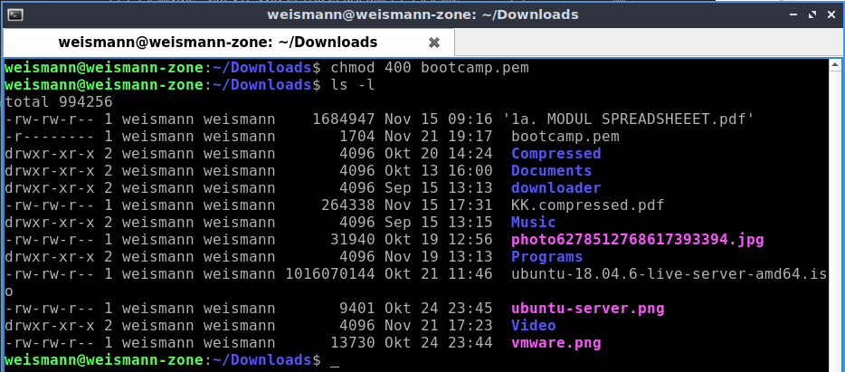  

17. Server bisa diakses melalui SSH menggunakan IP public tadi.

        ssh -i bootcamp.pem ubuntu@ip-public
    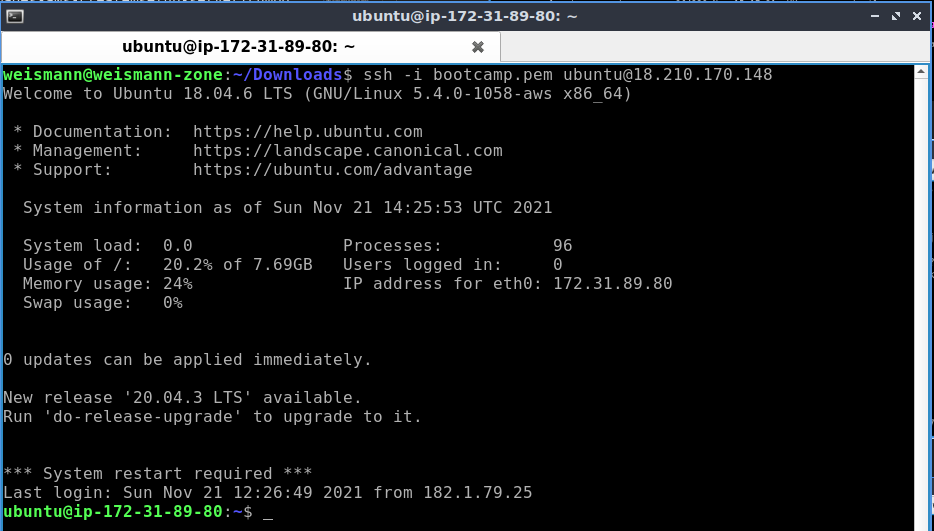  

    - Jangan lupa untuk update dan upgrade agar lebih aman.
    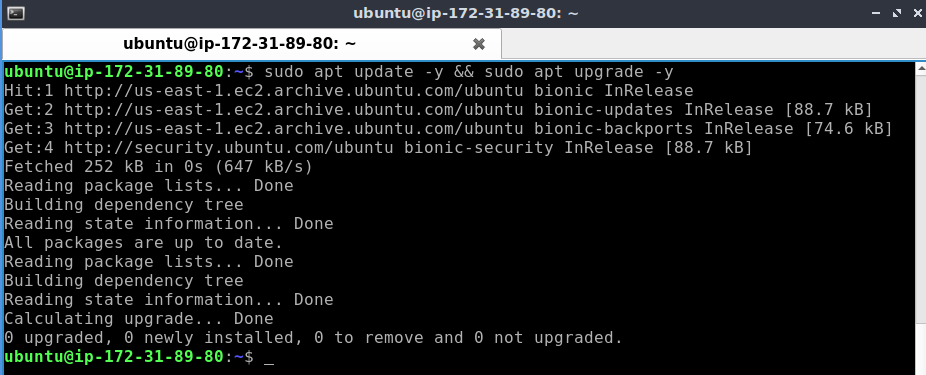   

## **Server untuk reverse proxy**

1. Login terlebih dahulu ke dalam AWS Educate.
2. Go to classrom.
3. Di dalam dashboard atau `AWS management console`, pilih `Launch a virtual machine`.
     

4. Pada `Step 1: Choose an Amazon Machine Image (AMI)`, pilih Ubuntu Server 18.x OS.
     

5. Step 2, pilih instance type sesuai kebutuhan, `next`.
     

6. Step 3, klik pada `Auto assign public IP` pilih `disable`, lalu `next`.
     

7. Step 4, isikan storage sesuai kebutuhan, klik `next`.
     

8. Step 5, biarkan saja default, pilih `next`.
      

9. Step 6, setup security group. Pilih `All traffic` lalu `review and launch`.
    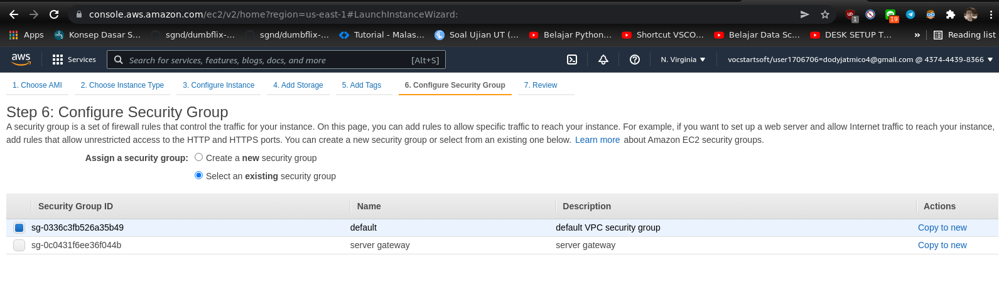  

10. Step 7, review konfigurasi yang sudah dibuat, kemudian `launch`.
    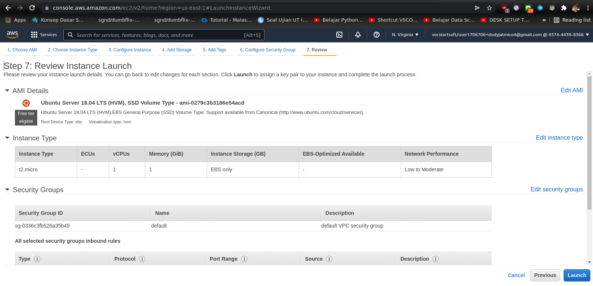  

    - Gunakan key pair yang sama pada reverse proxy yang sudah didownload tadi, lalu `launch instance`.
    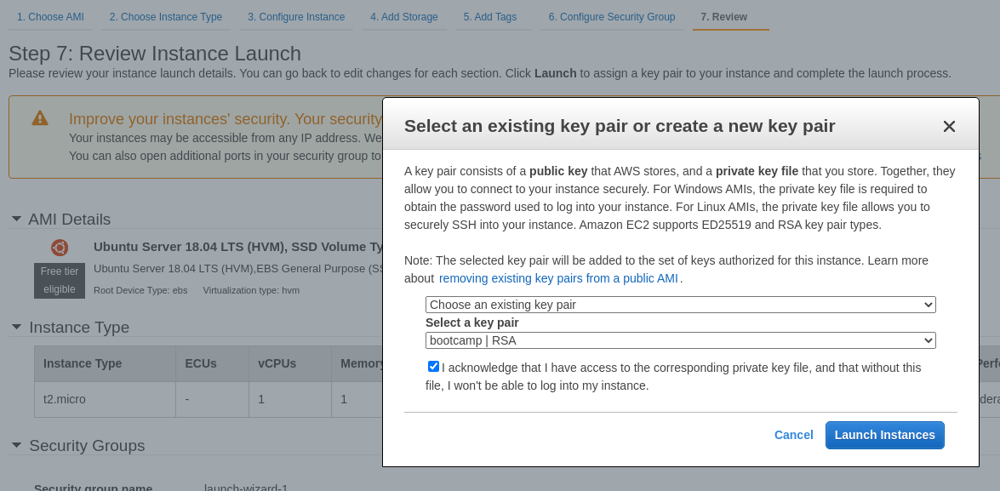  

11. Masuk ke Elastic IPs yang berada di sidebar console bagian network & security. Allocate dan associate untuk mendapatkan IP address.
    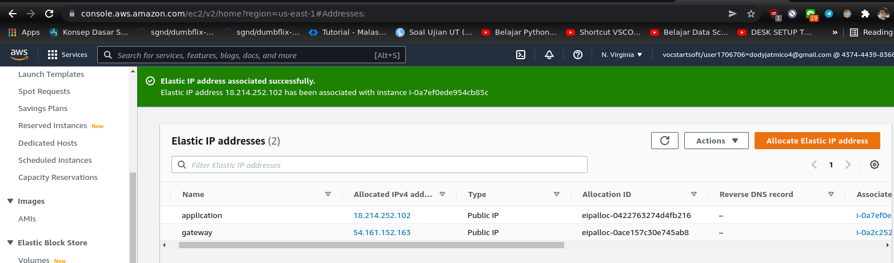  

    - Masuk instances dan refresh.
    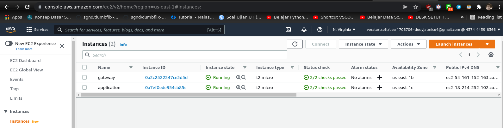  
    
12. Buka terminal, pindah ke directory `Downloads` lalu lakukan remote.

        cd Downloads/
        ssh -i bootcamp.pem ubuntu@ip-public
    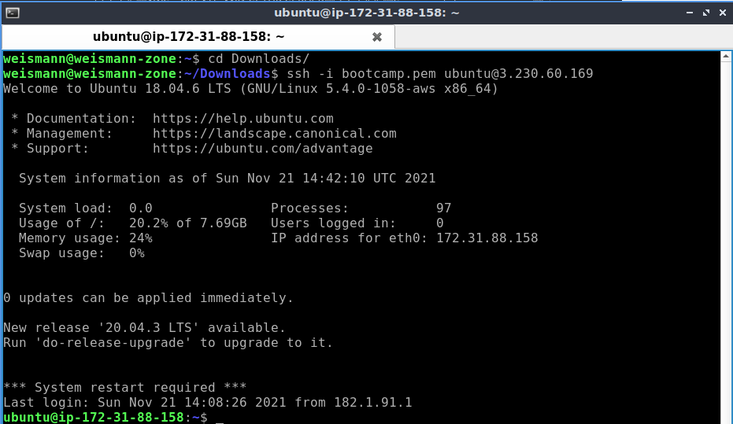  

    - Jangan lupa update dan upgrade agar lebih aman.
    ![]