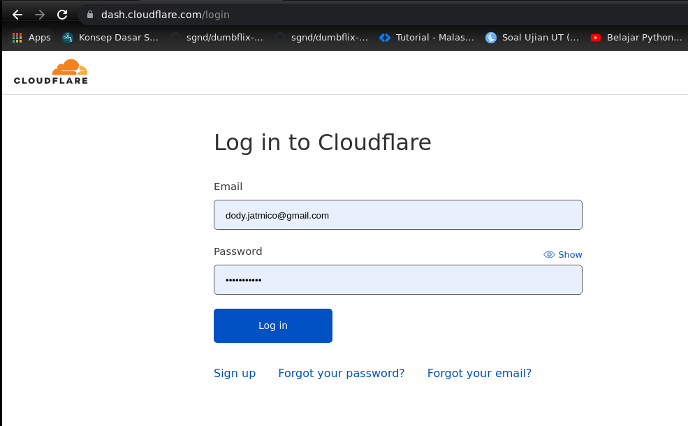
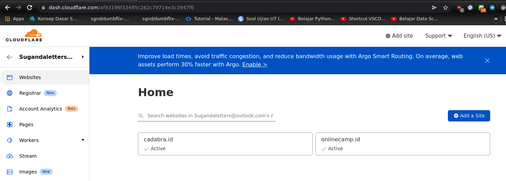
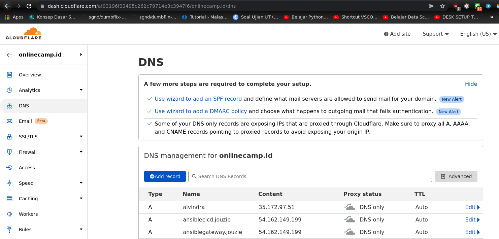
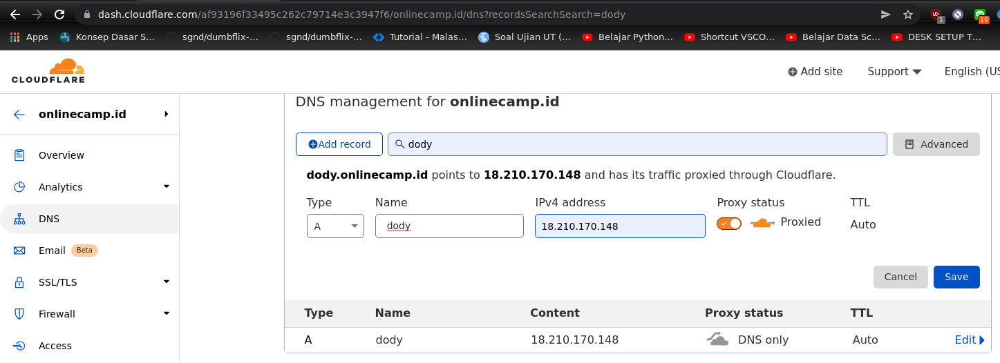
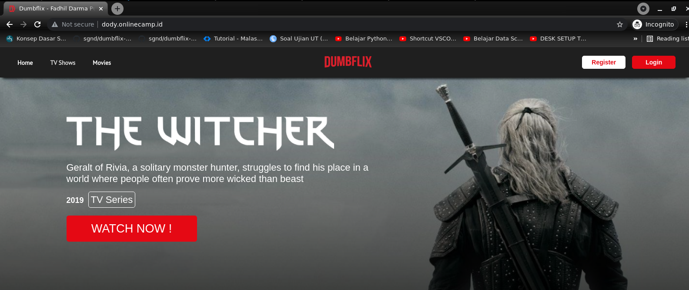

# **AWS - CUSTOM DOMAIN**
## Create Sub-Domain

1. Login ke penyedia nama domain, contoh yang akan digunakan di sini yaitu cloudflare.
     

2. Lalu di sini pilih `account` yang akan digunakan, disini saya memilih `Sugandaletters@outlook.com`.
     

3. Kemudian klik atau pilih `onlinecamp.id`.
     

4. Klik `DNS` dan `Add record`.
     
     

5. Tunggu sebentar, lalu akses `dody.onlinecamp.id`.
   