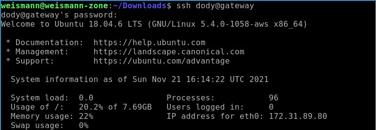
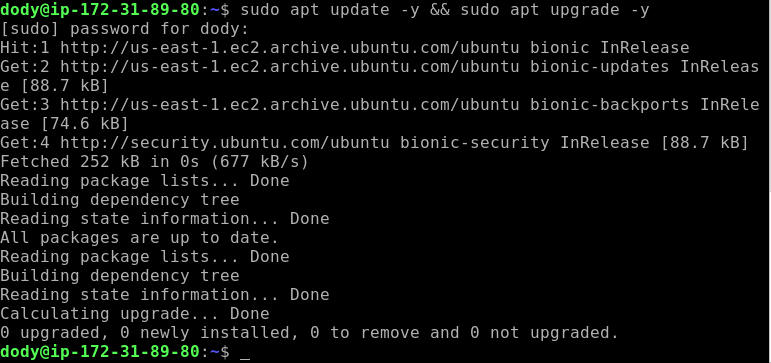
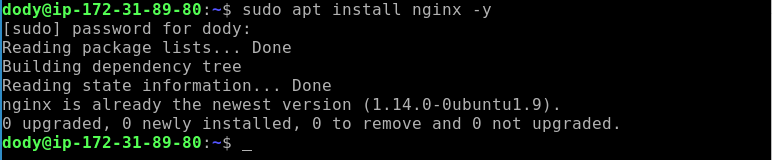
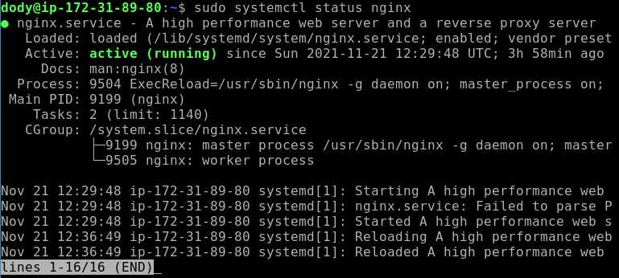
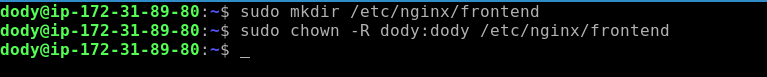
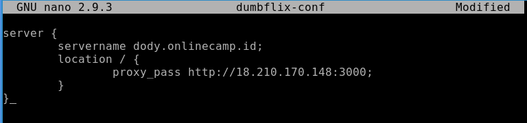
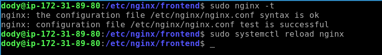
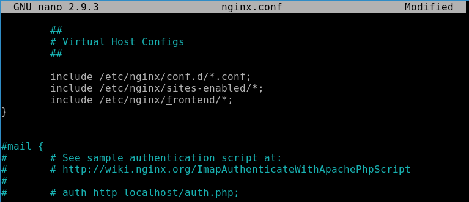
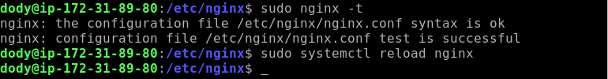
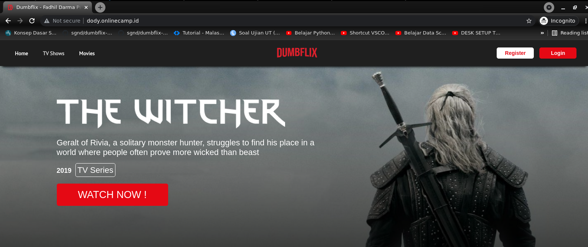

# **AWS - REVERSE PROXY**
## Make A Reverse Proxy

1. Lakukan remote untuk masuk ke server.

        ssh dody@gateway
      

    - Lakukan update dan upgrade.
      

2. Install nginx.

        sudo apt install nginx -y
      

    - Cek status `Nginx`
      

3. Buat directory baru dan ubah hak aksesnya.

        sudo mkdir /etc/nginx/frontend
        sudo chown -R dody:dody /etc/nginx/frontend
      

4. Buat file config pada directory `frontend`.
    
        nano dumbflix-conf
      

    - Cek validasi dan reload.
      

    - Masukan config yang sudah dibuat ke dalam `/etc/nginx/nginx.conf`.
      

    - Lakukan validasi dan reload nginx.
      

5. Jalankan di browser
   

