# **AWS - SSL CONFIGURATION**
## Generate API Key

1. Pertama, login dan masuk ke dalam dashboard `cloudflare`.
2. Pada sidebar kiri, klik `My Profile`, lalu klik `API Tokens`.
   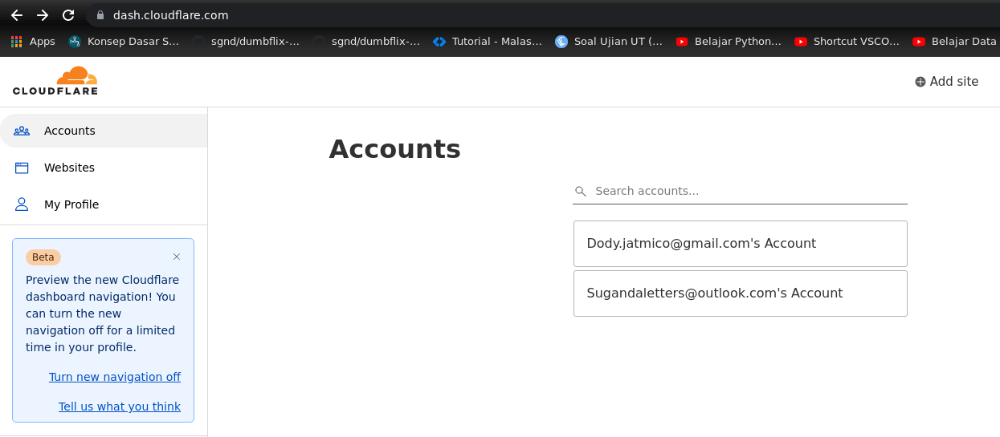  
   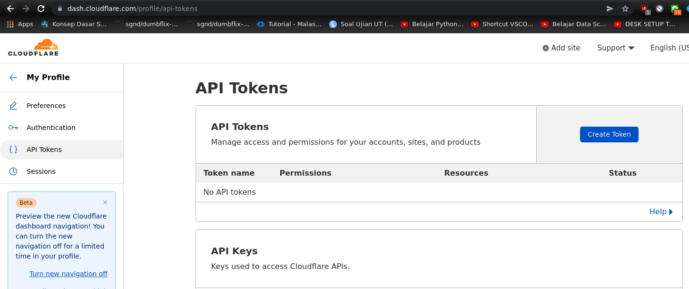  

3. Pada bagian `Global API Key`, klik `view`, lalu akan muncul kotak dialog.
   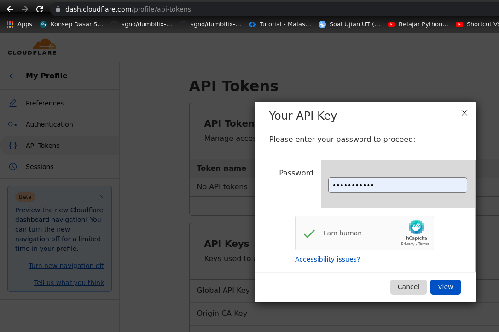  

4. Masukkan password untuk mendapatkan key.
5. Copy dan simpan api key.
   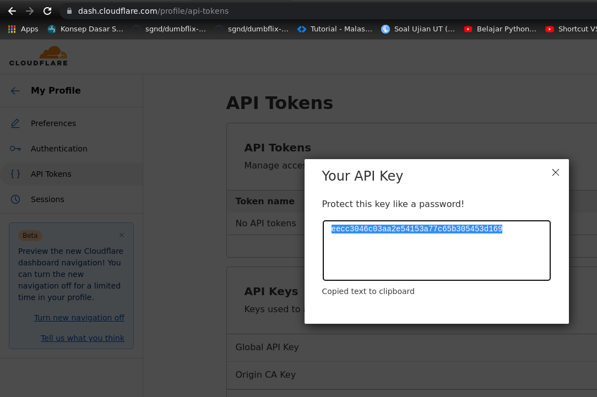  

6. Buka terminal dan masuk ke ddalam server.
7. Buatlah folder dan di dalamnya buat file untuk menyimpan api key cloudflare.
   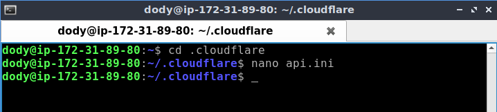  
   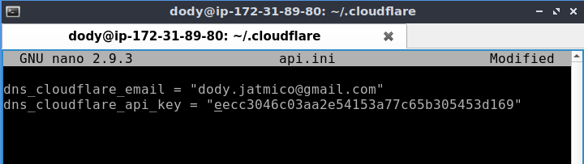  

8. Berikan hak akses pada folder dan file.
   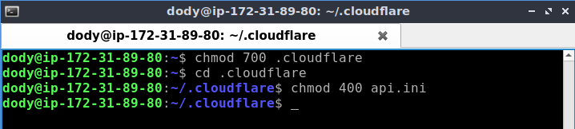   

## Install Cerbot dan Cloudflare DNS Authenticator Plugin

1. Update snap sudo snap install core; sudo refresh core.
2. Install certbot sudo snap install --classic certbot.
   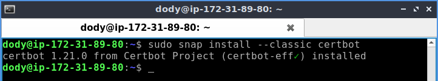  

3. Link certbot dari /snap/bin/certbot ke /usr/bin/certbot.
    
        sudo ln -s /snap/bin/certbot /usr/bin/certbot
    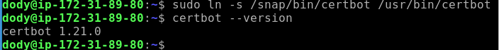  
        
4. Generate SSL sudo certbot.
   
        sudo certbot --nginx
    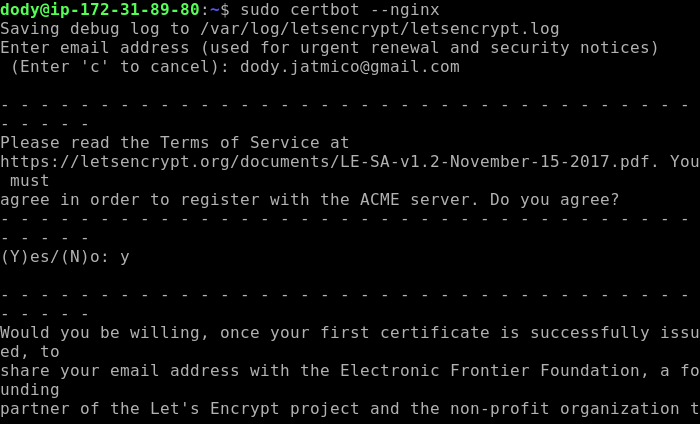  

    - Masukkan e-mail address.
    - Kemudian `Terms of Agreement`.
    - Pilih nama website yang akan dipakaikan HTTPS.
    - Tunggu sampai request berhasil.
    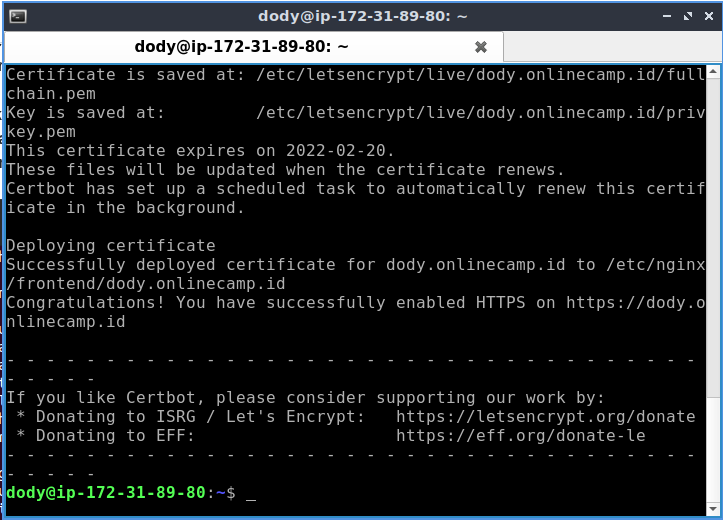  

5. Untuk mengeceknya, masuk ke directory `/etc/nginx/frontend/`
6. Lalu cek isi dari confignya.
   
        cat dody.onlinecamp.id
    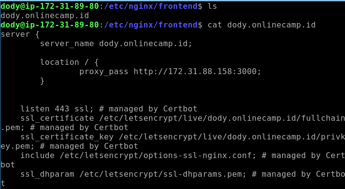  

7. Lakukan validasi dan reload `nginx`
   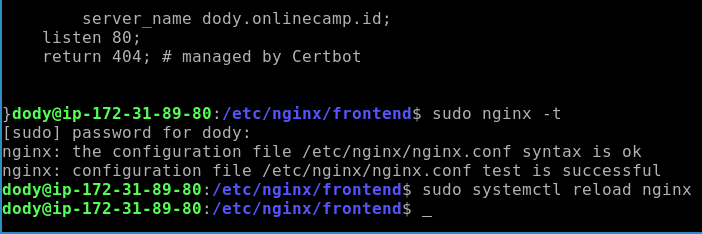  

8. Jalankan di browser.
   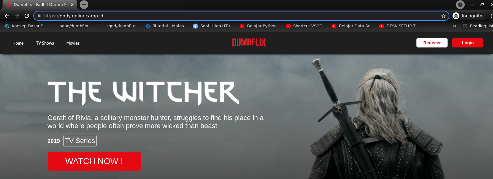  