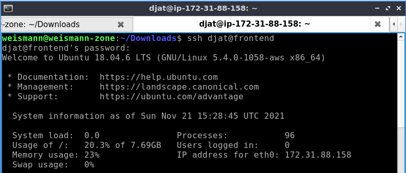
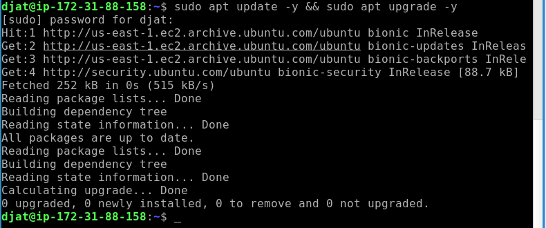
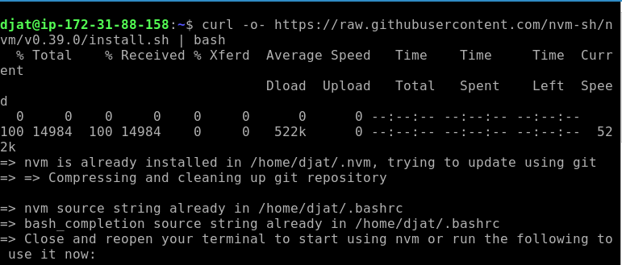
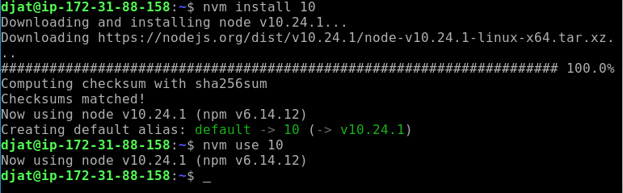
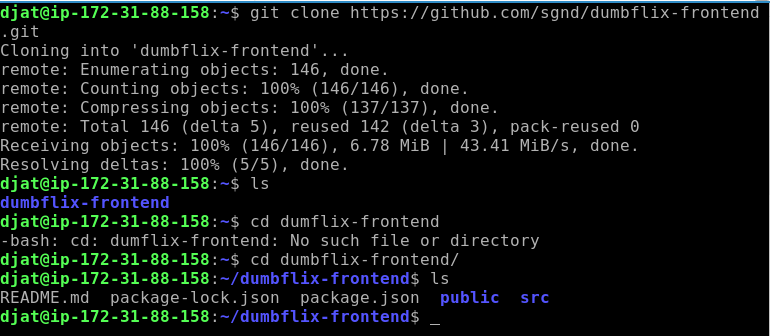
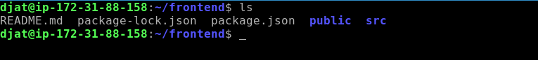
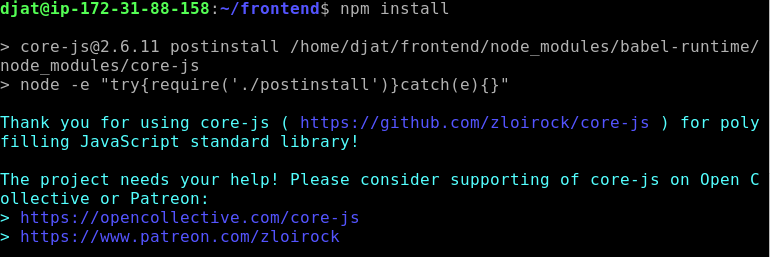
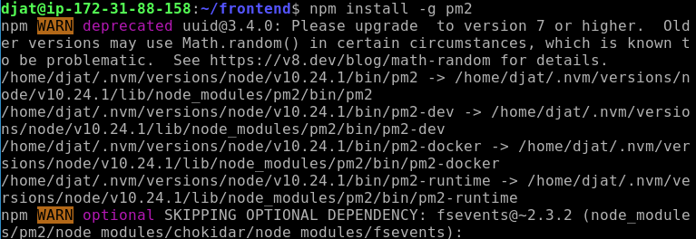
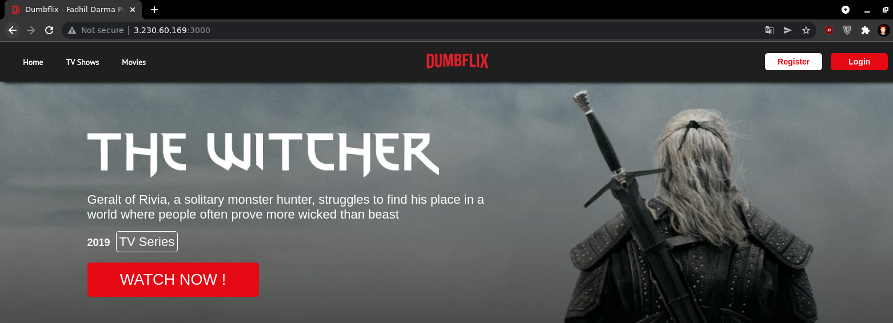

# **AWS - SERVER FOR APPLICATION**
## Making Server for Application

1. Lakukan remote untuk masuk ke server.
   
        ssh djat@frontend
      

    - Lakukan update dan upgrade.
      

2. Install nvm.

        curl -o- https://raw.githubusercontent.com/nvm-sh/nvm/v0.39.0/install.sh | bash
      

    - Install `NodeJS versi 10.x`
  
            nvm install 10
      

3. Clone aplikasi `https://github.com/sgnd/dumbflix-frontend.git`

        git clone https://github.com/sgnd/dumbflix-frontend.git
      

    - Ubah nama folder.
      

4. Install dependencies yang diperlukan.

        npm install
      

5. Install pm2.
   
        npm install -g pm2
      

    - Start applikasi.
  
            pm2 start ecosystem.config.js
      
      