# **VMWARE - INSTALL UBUNTU SERVER** 
## Install Ubuntu Server 18.x With VMWare

1. Pertama download latest VWMware dan Ubuntu Server (18.x) ISO.
2. Install WMWare dan jalankan aplikasinya.
3. Buat virtual machine baru dengan memilih tombol new.  
   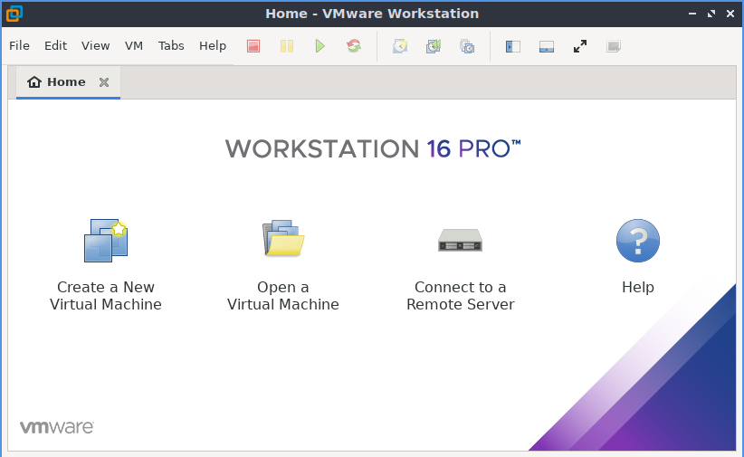  

4. Pilih typical ataupun custom, pilih next.  
   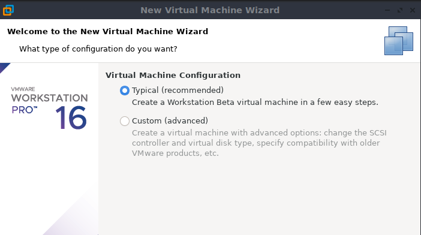  

5. Pilih file ISO Ubuntu Server, pilih next.  
   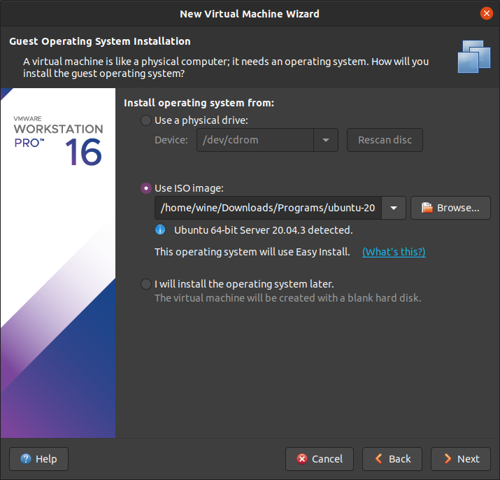  

6. Isikan personalizenya, lalu next.  
   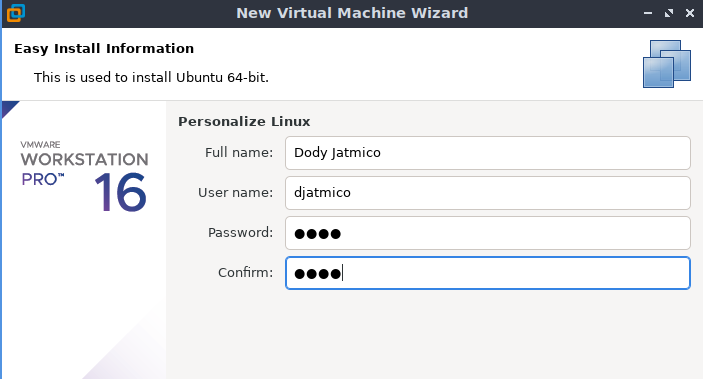  

7. Setting nama dan lokasi penginstalan, pilih next.  
   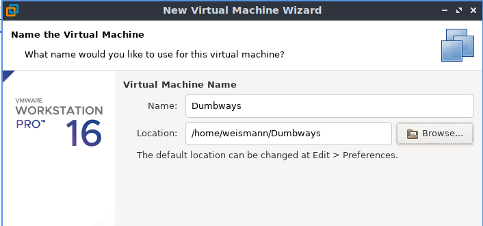  

8. Alokasikan storage yang akan digunakan, pilih next.  
   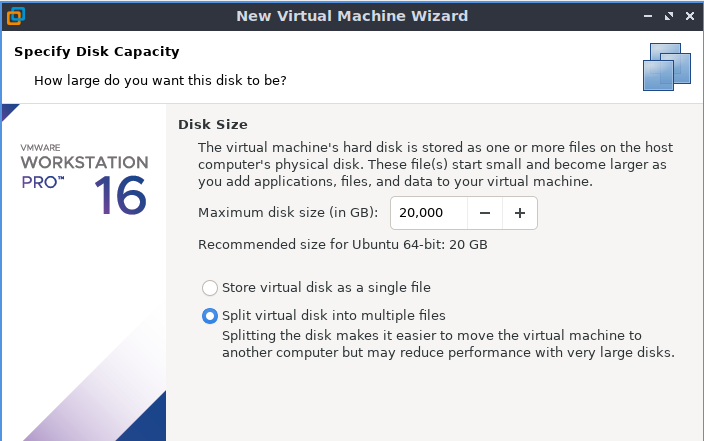  

9. Kemudian pilih finish.  
    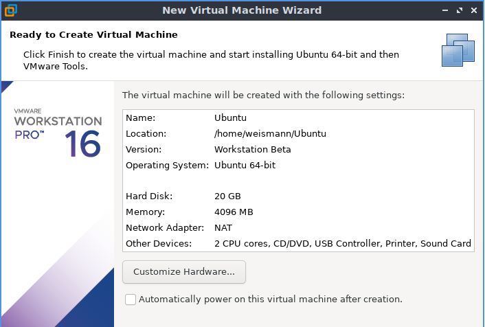  

10. Pilih preferensi bahasa.  
    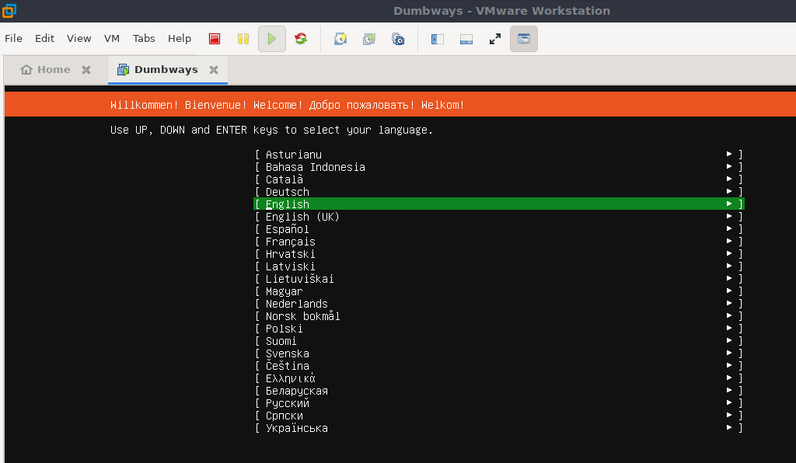  

11. Pilih preferensi layout keyboard, lalu done.  
    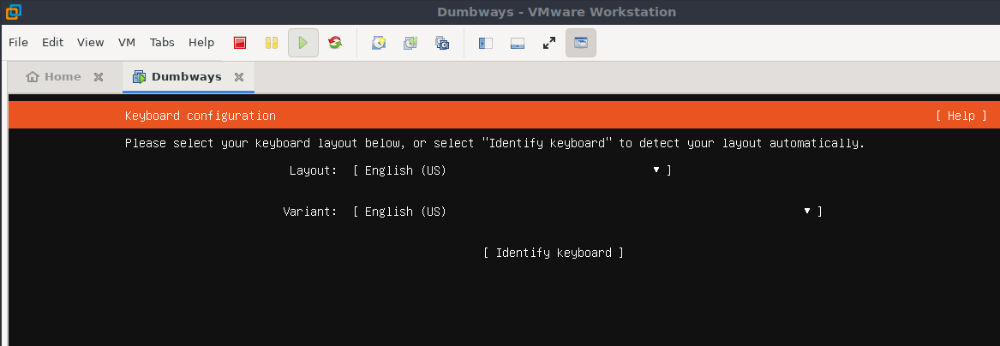  

12. Untuk network connections kita biarkan dinamis, pilih done.  
    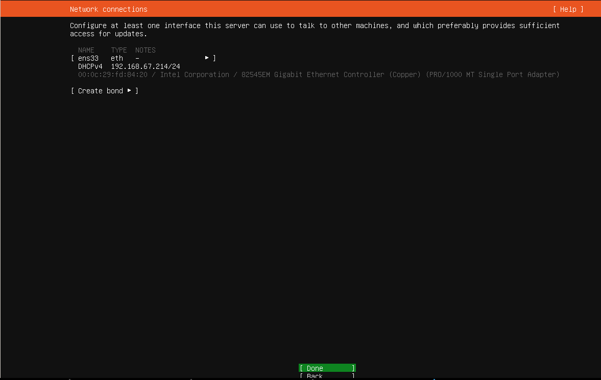  

13. Untuk proxy address kosongkan saja, done.  
      

14. Untuk mirror address kita biarkan default saja, done.  
    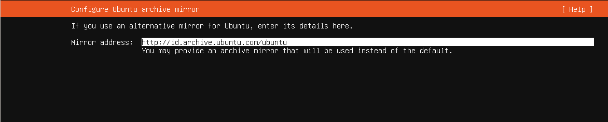  
 
15. Untuk guided storage pilih custom, done.  
    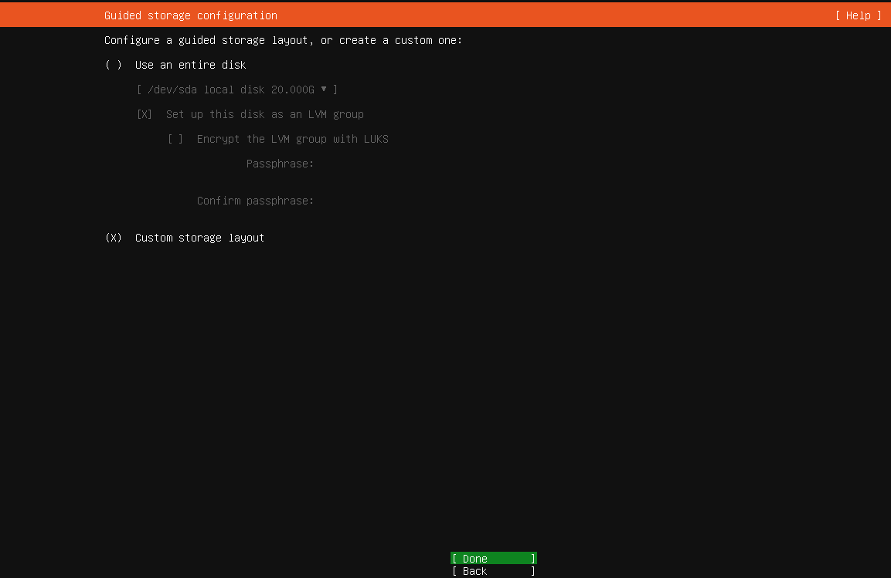  

    Alokasisan storage tadi masing-masing untuk swap dan root partition, done.  
    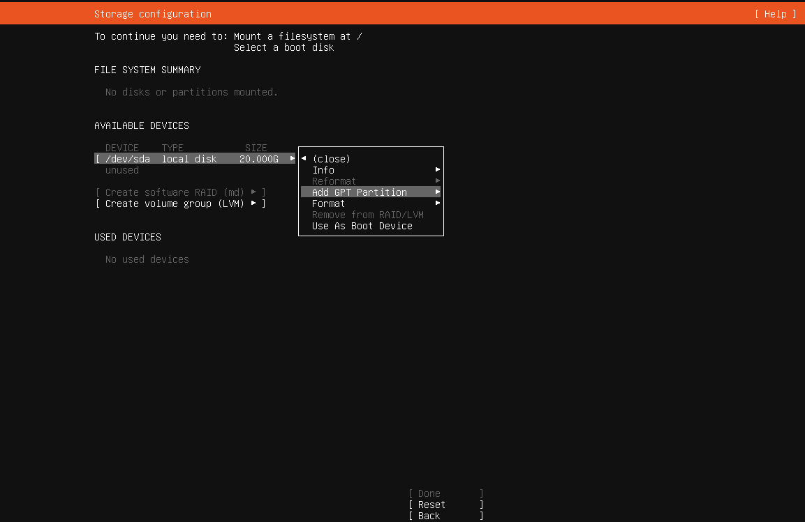  

    - Swap partition.  
    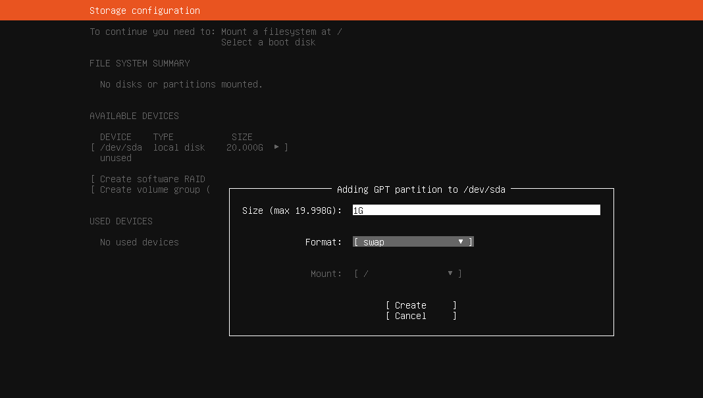  

    - Root partition.  
    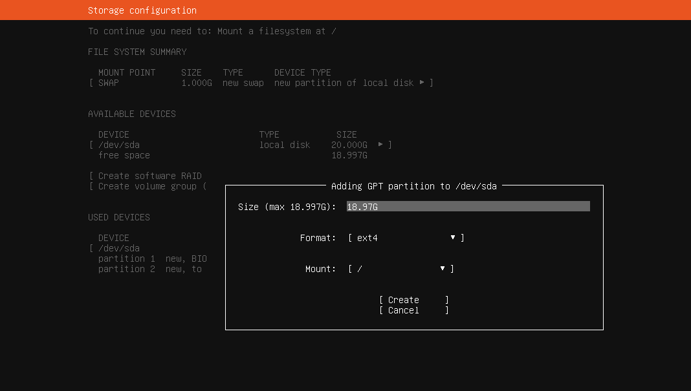  

    - akan muncul notif konfirmasi, pilih continue.
    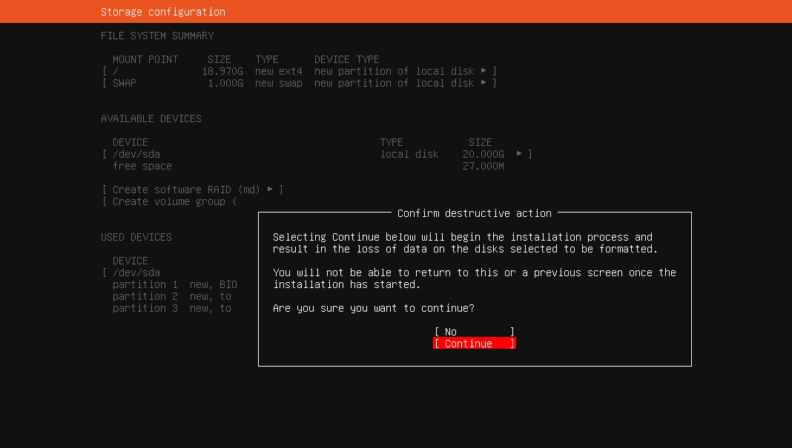  

16. Isikan profile setup.  
    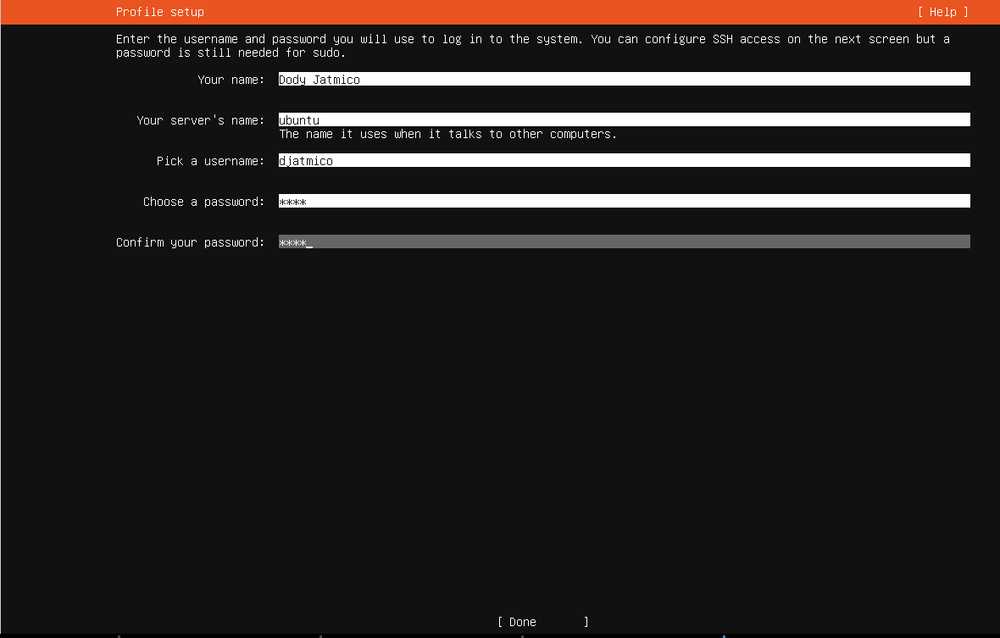  

17. Pilih install OpenSSH, lalu done.  
    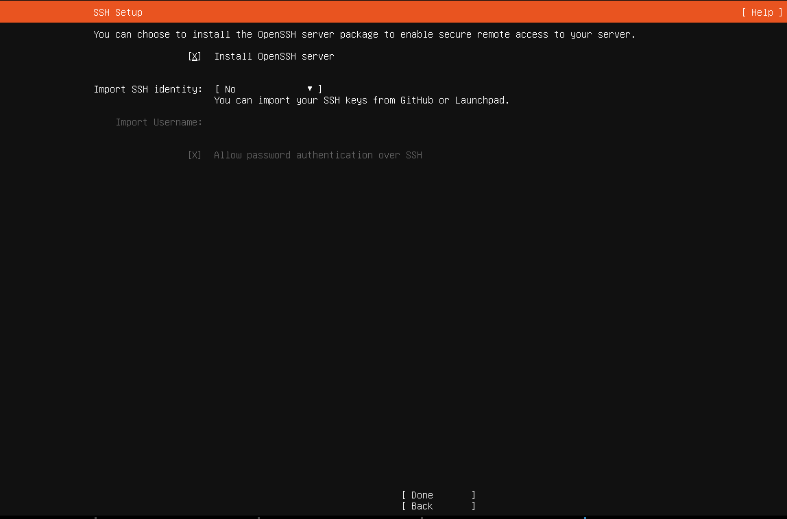  

18. Tunggu proses instalasinya.
    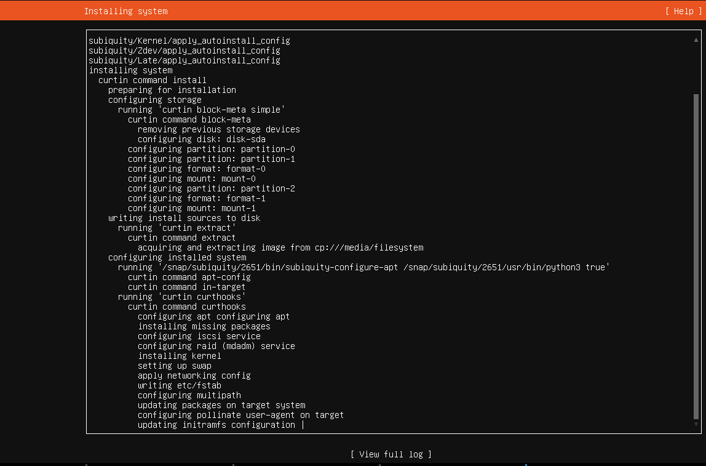  

    - Setelah instalasi selesai, reboot.  
    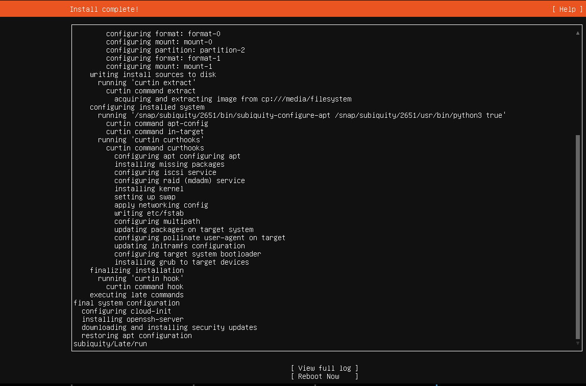  

    - Ubuntu server siap dijalankan dengan memasukkan username dan password yang sudah dibuat tadi.
    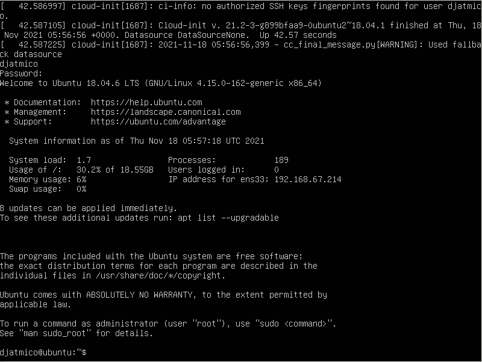  