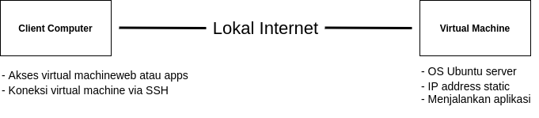

# **Week 1 : Fundamental DevOps & Cloud Computing**

- ## **DevOps**
  
  DevOps pada dasarnya adalah gabungan dari Development dan Operation. Sebuah kultur yang dirancang untuk meningkatkan kemampuan sebuah perusahaan dalam proses delivery aplikasi dengan kecepatan tinggi. Sehingga, tim pengembang dan operasi dapat melakukan proses *build, test* dan *release* perangkat lunak lebih cepat dan handal.  
  
  Pada week 1 ini, akan dijelaskan secara step by step mengenai ;

  - Instalasi ubuntu server melalui virtual machine sebagai server lokal.
  - Setup network di virtual machine.
  - Install dan deploy aplikasi nodejs   

       

- # **Cloud Computing**

  Cloud computing adalah proses komputerisasi sebuah teknologi yang berbasis internet. Cloud computing memungkinkan penggunanya untuk menyimpan dan mengolah data secara virtual.

  Tahapan yang dipelajari antara lain ;

  - Create and setup server AWS.
  - Setup server for apps.
  - Setup server for reverse proxy.
  - Setup custom domain.
  - Setup SSL configuration.   

       

# **Kebutuhan**

Sebelum memulai tugas di atas, hal-hal yang perlu dipersiapkan antara lain ;

- Server : Ubuntu server (18.x), web server (nginx) & AWS
- Security group : 22, 80, 443 & all traffic
- Aplikasi frontend : dumbflix-frontend   

# **Penyelesaian**

- [Install ubuntu server](install-ubuntu.md)
- [Setup-network](Setup-network.md)
- [Install-application](Install-application.md)