# **VMWARE - INSTALL APPLICATION**
## Make Server For Application on VMWare

1. Jalankan VMWare yang telah terinstall OS Ubuntu server.   
2. Login dan lakukan update dan upgrade terlebih dahulu dengan perintah ;

        sudo apt update -y && sudo apt upgrade -y
    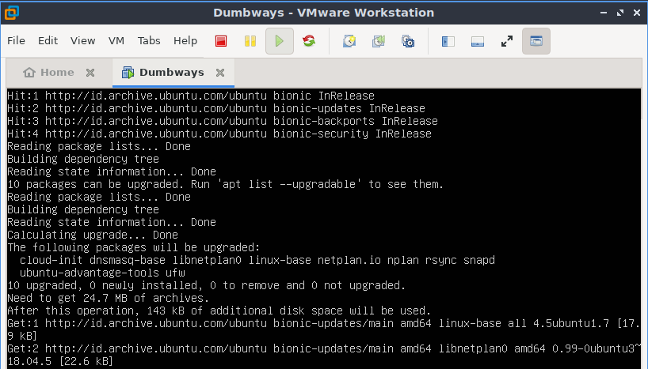  

3. Lakukan ssh, anggap VMWare sebagai server.

        ssh djatmico@192.168.67.100
    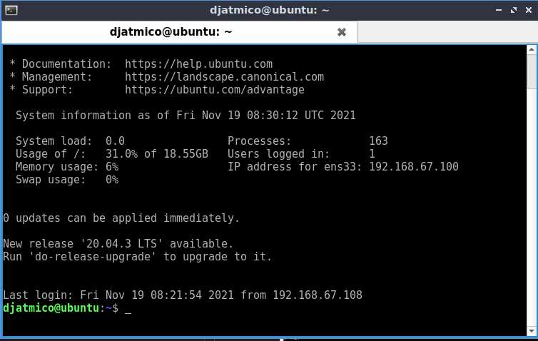  

    - Ubah atau tambahkan user terlebih dahulu.

            sudo adduser djat
    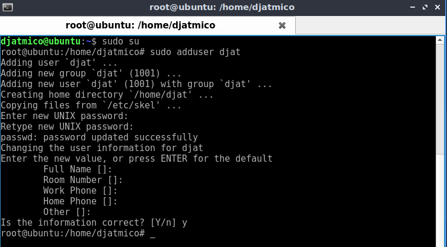  

    - Beri hak akses sudo pada user baru dan pindah user tersebut.

            sudo usermod -aG sudo djat
            sudo su - djat
        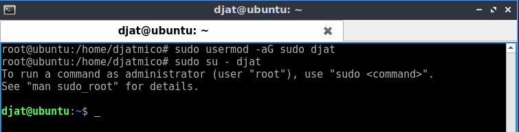 

4. Kita clone dahulu aplikasi yang akan kita pakai.

        git clone https://github.com/sgnd/dumbflix-frontend.git
    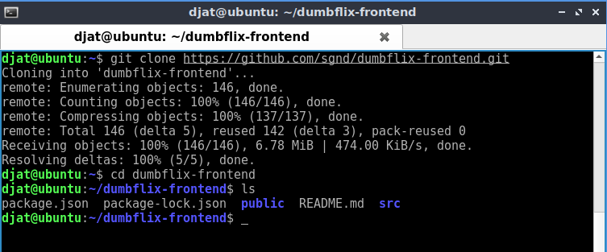  

5. Kemudian install aplikasi Node.JS versi 10.x, dengan perintah berikut ;

         curl -o- https://raw.githubusercontent.com/nvm-sh/nvm/v0.38.0/install.sh | bash
    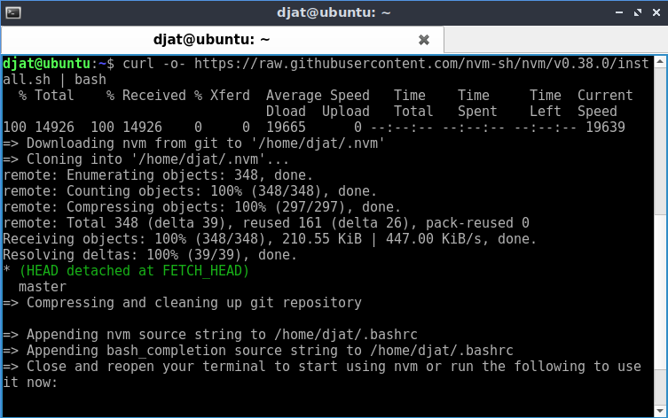  

   - Jalankan `exec bash` dan cek versi nvm nya.

            exec bash
            nvm -v
        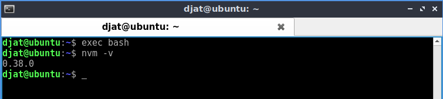  

    - Kemudian install node, konfirmasi hasil instalasinya.

            nvm install 10
            nvm use 10
            node -v
            npm -v
        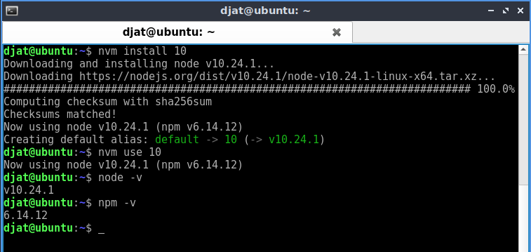  

    - Lakukan npm install terlebih dahulu.

            npm install
        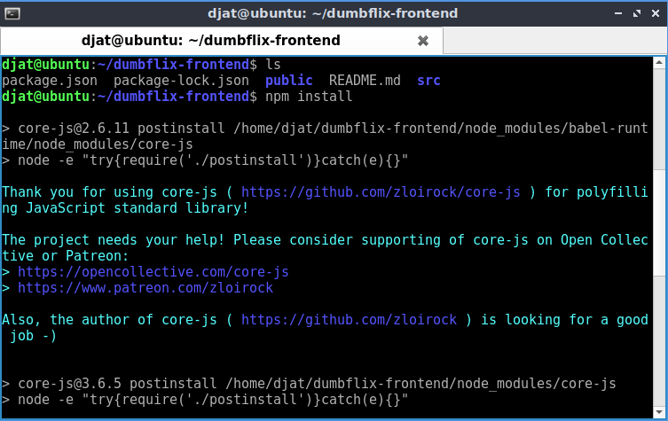  

    - Cek script apa yang akan dijalankan.

            cat package.json
        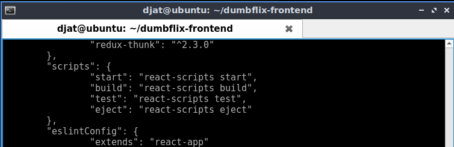  

    - Jalankan aplikasi.

            npm run start
        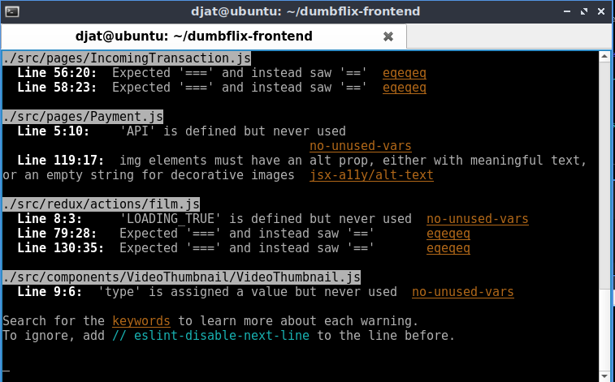  
        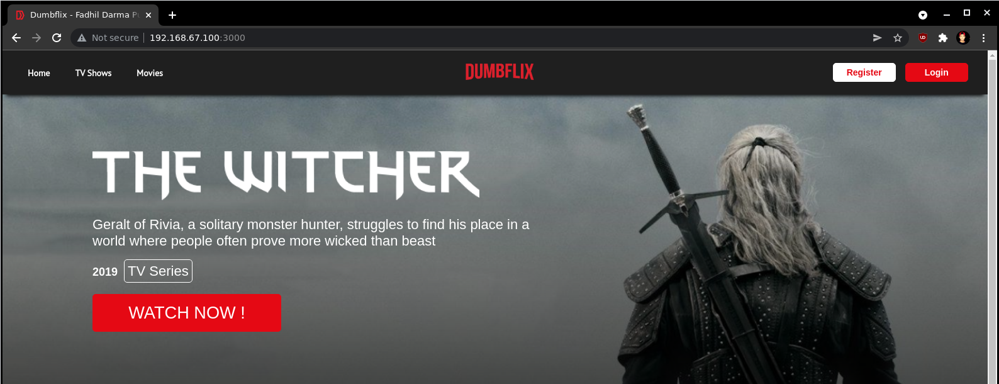   

# Deploy Apps by Nginx and Reverse Proxy

1. Install `nginx` terlebih dahulu apabila belum menginstallnya.
2. Install `pm2` agar aplikasi bisa tetap berjalan di background.
    
        npm install -g pm2
    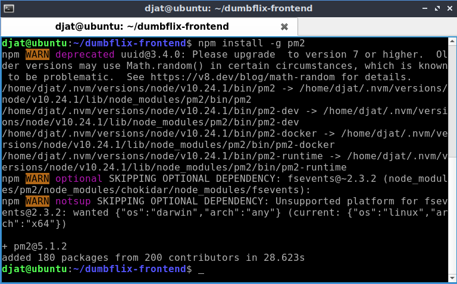  

3. Bikin file ecosystem di pm2 untuk menggenerate config.
   
        pm2 init simple
    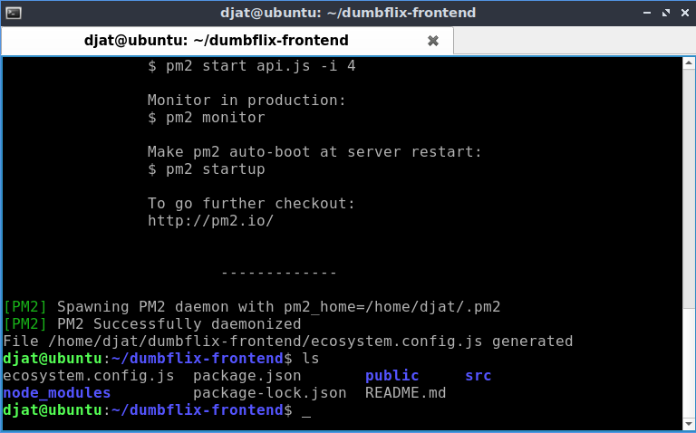  

    - Selanjutnya konfigurasi file ecosystem tadi.

            nano ecosystem.config.js
        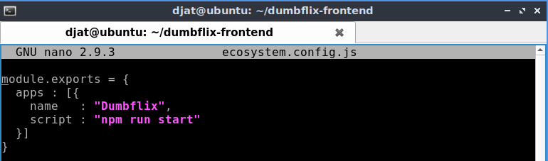  

    - Run pm2.

            pm2 start ecosystem.config.js
          

    - Cek log.

            pm2 logs 0 --lines 200
        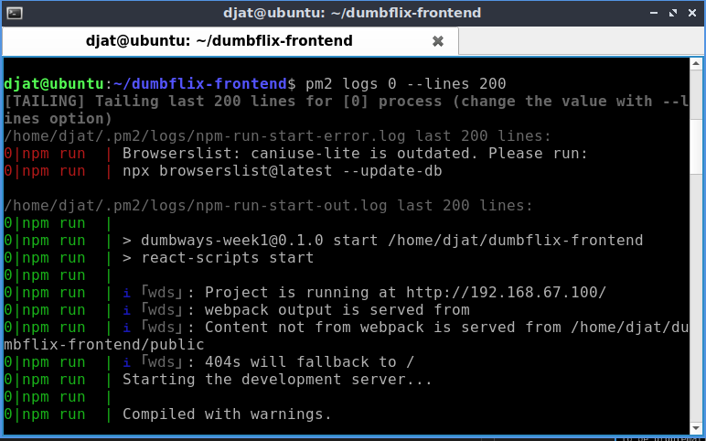  
          

4. Buat folder di dalam directory `/etc/nginx/`. Lalu beri izin user agar tidak perlu menggunakan `sudo` untuk merubah isi folder.

        sudo mkdir dumbflix
        sudo chown -R djat:djat dumbflix
    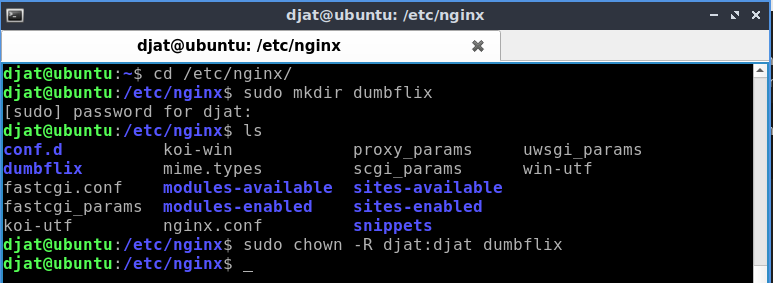  

5. Pindah ke directory `dumbflix` dan buat konfigurasi untuk reverse proxy.

        cd dumbflix/
        nano dumbflix.id
    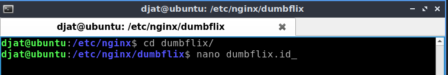  
    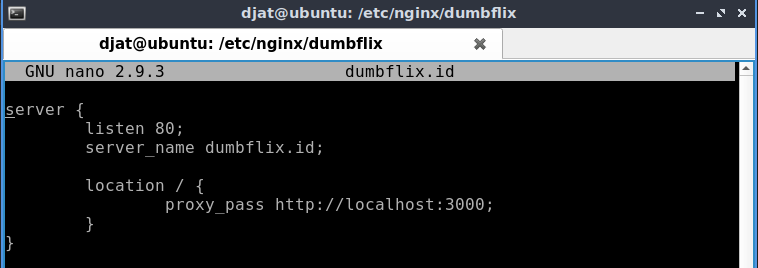  

6. Validasi config dan reload `nginx`.

        sudo nginx -t
        sudo systemctl reload nginx
    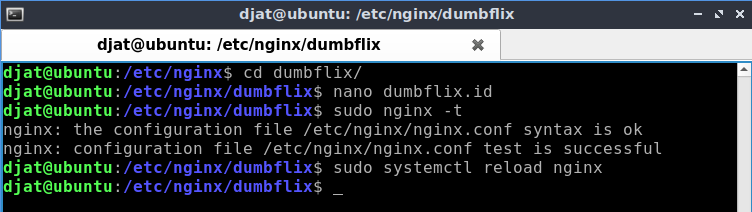  

7. Masukkan folder yang berisi config ke dalam `nginx.conf` agar config yang sudah dibuat terbaca oleh `nginx`.

        sudo nano nginx.conf
    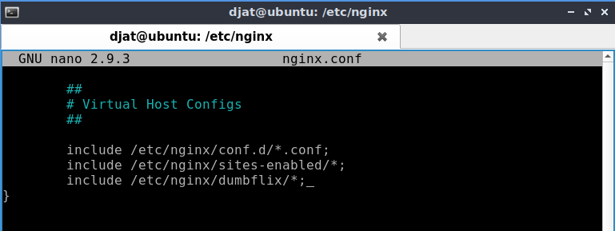  

    - Jangan lupa validasi dan reload `nginx`   

8. Setting hosts di `/etc/hosts`.

        sudo nano /etc/hosts
    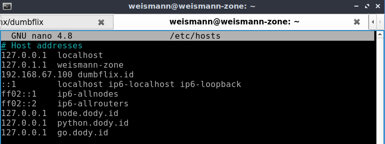  

9. Jalankan di browser,  berikut hasilnya ;
    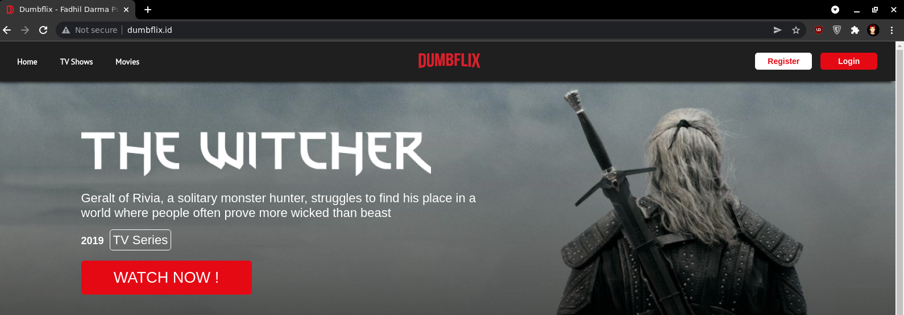

