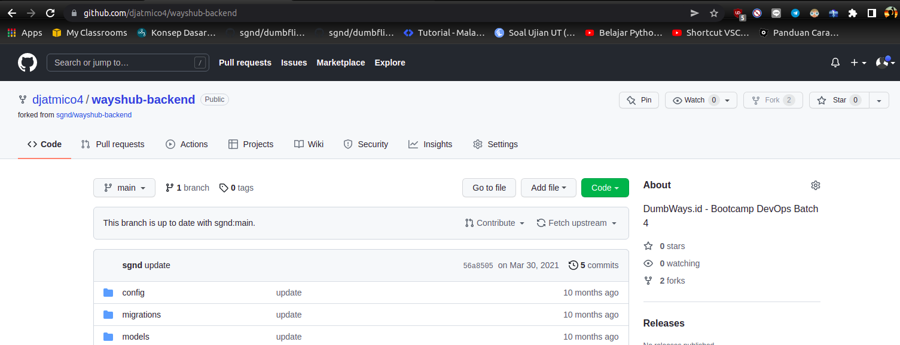
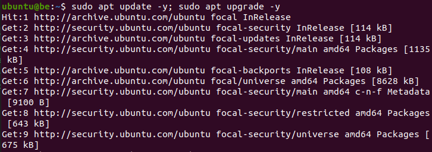
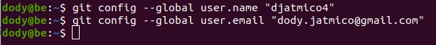
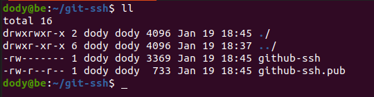
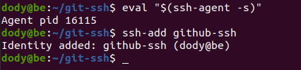
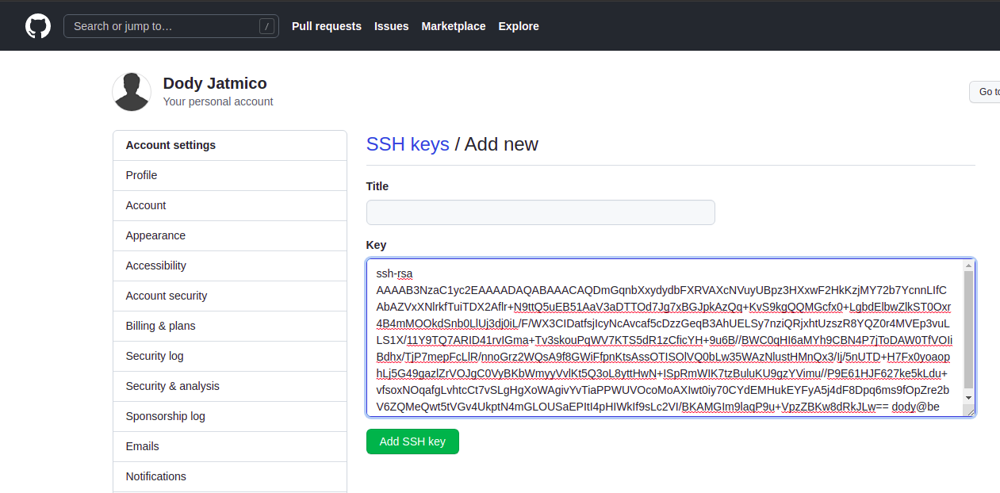
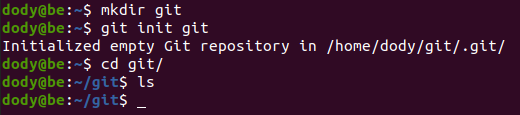
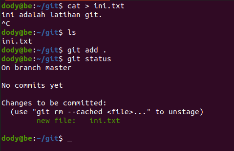
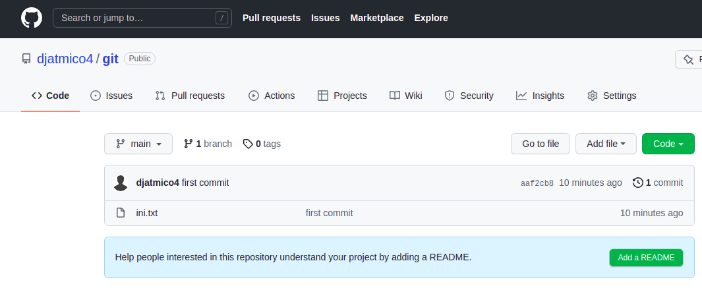

# **INSTALLATION GIT & SSH KEY**
## Fork Repository backend apps
 

1. Login ke akun Github.
2. Buka repository backend app yang akan di-fork, https://github.com/sgnd/wayshub-backend.
3. Pada halaman repository backend app, klik fork pada pojok kanan atas, maka otomatis kita akan masuk ke repository akun github kita.
      

## Buat SSH key untuk Git
 

1. Buat sebuah server baru untuk backend.  
   
   
2. Masuk kedalam server yang sudah dibuat, yaitu server backend.   
3. Lakukan update dan upgrade.

        sudo apt update -y; sudo apt upgrade -y
      

4. Cek apakah sudah terinstall git dan ssh.  
     

5. Buatlah git config terlebih dahulu.

        git config --global user.name "<username>"
        git config --global user.email "<email>"
      

6. Buat folder untuk menyimpan ssh key.
   
        mkdir git-ssh
      

7. Generate ssh key di dalam foder yang telah dibuat. lalu Jalankan perintah berikut ;

         ssh-keygen -t rsa -b 4096 -C "username@host"
      

8.  Hal tersebut akan menghasilkan 2 key, git-ssh dan git-ssh.pub.  
      
9.  Tambahkan ssh key yang telah di generate tadi, ketikkan perintah ;

         eval "$(ssh-agent -s)"
         ssh-add git-ssh
      

10. Login ke GitHub.
11. Masuk ke settings, pada bagian `Account settings` klik `SSH dan GPG keys`.
12. Untuk menambahkan ssh key, copy isi data ssh key yang sudah dibuat tadi yang berekstensi `.pub` kemudian paste ke bagian `key` lalu `Add ssh key`.  
      

13. Kemudian test koneksi ke github.

         ssh -T git@github.com
         

## Git pull, git commit, git push, and git merge

1. Pertama kita buat direktori baru untuk menyimpan perubahan inisiasi git di dalam direktori tersebut.

         mkdir <new-direktori>
         git init
        

   - Tambahkan file di dalamnya dan cek statusnya.

         cat > file (isi file)
         git add .
         git status
        

   - Lakukan commit.

         git commit -m "<isi pesan>"
        

   - Ubah nama branch.

         git branch -M <nama-branch-baru>
        

   - Add git remote.  
        

   - Jalankan git push & pull.  
        
        

   