# **SETUP DATABASES**
## Buat Server Baru Untuk Backend

1. Buat sebuah server baru untuk backend.  
   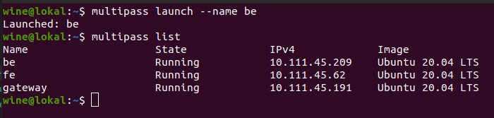   

## Install Database

1. Login ke server database.
2. Lakukan update and upgrade terlebih dahulu.
   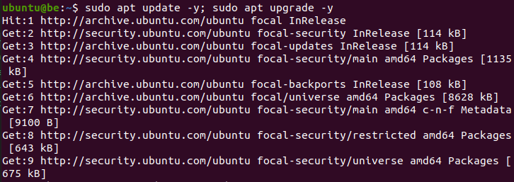  

3. Install mysql-server, lalu cek apakah sudah jalan.

        sudo apt install mysql-server
        sudo systemctl status mysql
    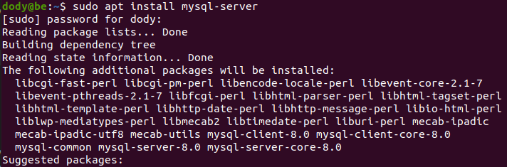  
    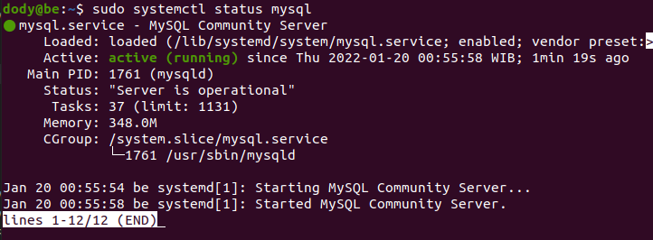  

4. Lakukan konfigurasi keamanan database berikut; 
   
        sudo mysql_secure_installation
    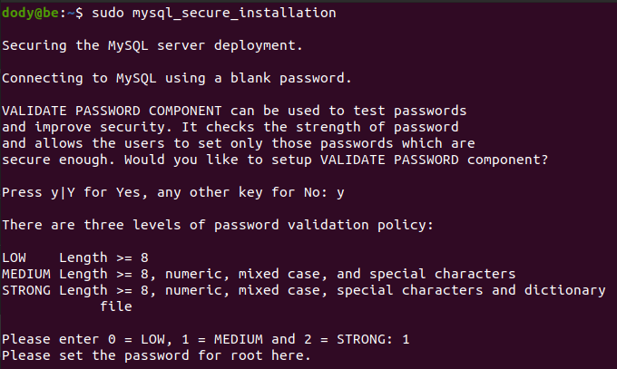  
    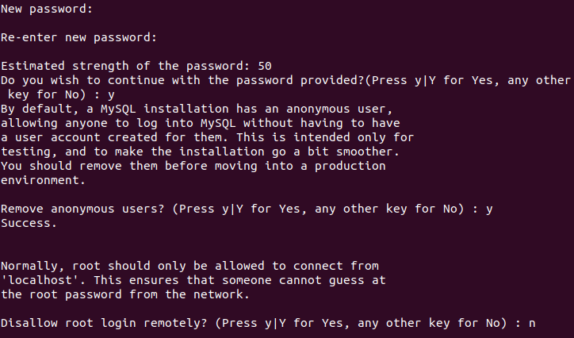  
    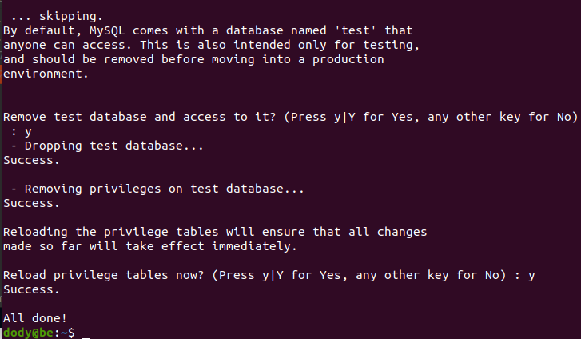   

## Remote Database Dari Klien

1. Buka folder `/etc/mysql/mysql.conf.d`, lalu edit file `mysqld.cnf`

        sudo nano mysqld.cnf
    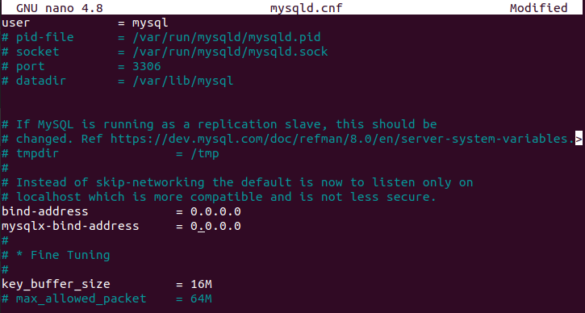  

   - Restart mysql service dengan perintah `sudo systemctl restart mysql`.   
  
2. Membuat konfigurasi mysql agar tidak menggunakan sudo.
   
        sudo mysql -uroot
    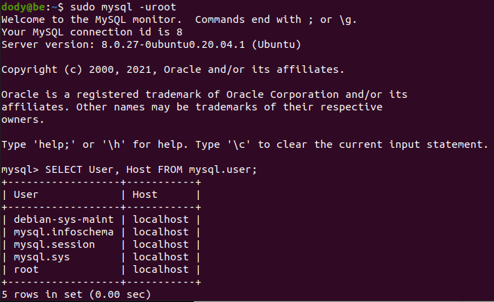  
    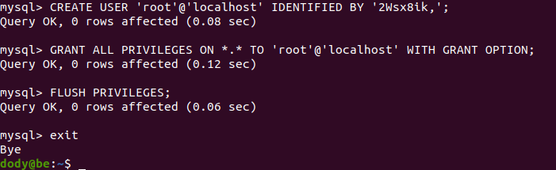  
    
3. Kemudian lakukan create user dengan perintah berikut agar dapat diakses oleh backend dan buat database wayshub.
    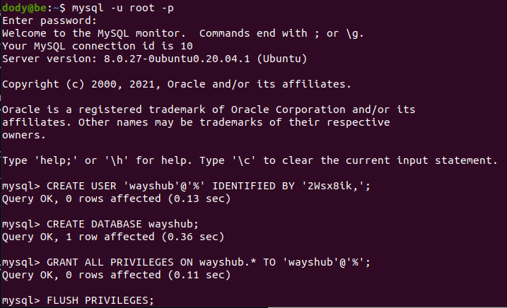  
    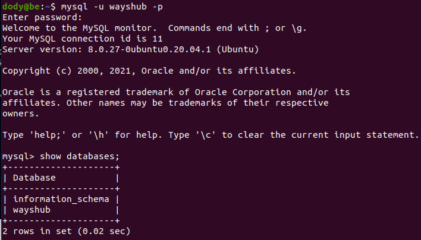