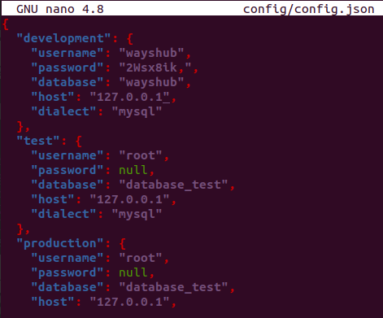

# **DEPLOYMENT BACKEND APP**

1. Login ke server backend.
2. Clone aplikasi dari https://github.com/sgnd/dumbflix-backend.git, kemudian rename menjadi `backend`.
   
        git clone https://github.com/sgnd/wayshub-backend.git

        mv wayshub-backend backend
      
      

3. Kemudian install node.js.

        curl -o- https://raw.githubusercontent.com/nvm-sh/nvm/v0.39.1/install.sh | bash
        
        exec bash
        nvm install 10
  
      
      

    - Jalankan npm install.

    - Kemudian kita rubah konfigurasi `/backend/config/config.json`.  
      

    - Copy file env.example menjadi env.  
       

## Import Database Dengan Sequelize

1. Install sequelize pada backend.

        npm install --save-dev sequelize-cli -g
      

2. Lakukan migrate, agar database yang didalam aplikasi termigrate kedalam sebuah database.

        sequelize db:migrate
      

    - cek apakah sudah berhasil termigrasi.  
      

3. Untuk dapat melakukan crud pada aplikasi online, kita pergi ke aplikasi frontend dan masuk ke dalam file dan folder `/wayshub/scr/config/api.js`;  
     

4. Jalankan backend app dengan pm2.  
     

5. Buka browser dan coba signup.  
   
   

