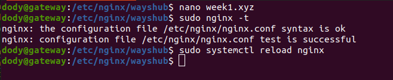

# **REVERSE PROXY FOR BACKEND APP**

1. Login ke server gateway terlebih dahulu.
2. Lakukan update and upgrade.
3. Cek apakah sudah terinstall `Nginx`. Jika belum, install terlebih dahulu.  
     

4. Masuk ke folder `/etc/nginx/wayshub/`
5. Kemudian buat file config untuk backend app `api.dody.wayshub.xyz`

        cd /etc/nginx/wayshub/
        nano api.dody.wayshub.xyz
      

    - Arahkan proxy_pass ke ip private server backend.
      

    - Save.
    - Lakukan validasi config dan reload `nginx`.

            sudo nginx -t
            sudo systemctl reload nginx
          

6. Karena kita tidak mempunyai server, maka untuk lokal harus menambahkan subdomain di /etc/hosts agar seolah kita mempunyai domain.
     

7. Buka browser dan coba jalankan.  
   