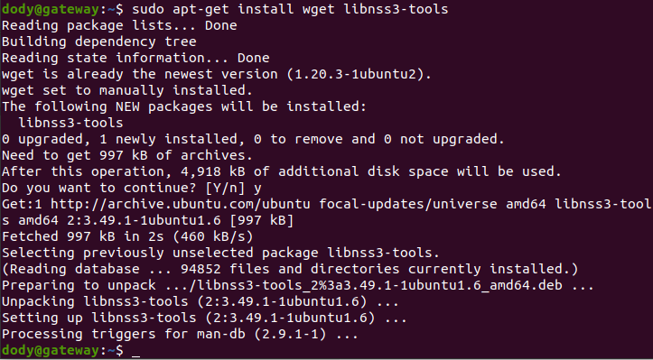
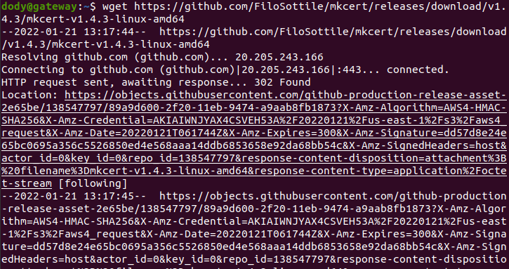
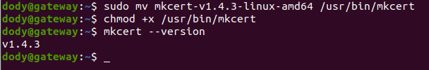
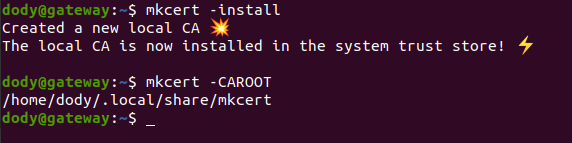
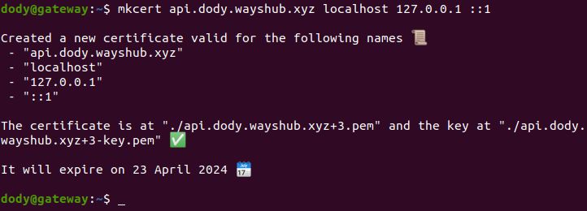
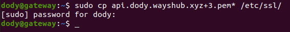
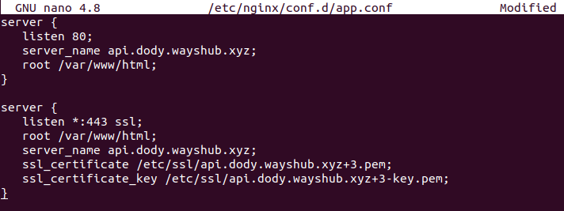

# **CUSTOM DOMAIN FOR BACKEND APP**

1. Sebelum menginstall utilitas Mkcert, kita perlu menginstall paket yang diperlukan ke server kita. Kita dapat menginstallnya dengan perintah berikut:

      sudo apt-get install wget libnss3-tools
     

   - Setelah semua paket diinstal, download mkcert versi terbaru dari Github.

         wget https://github.com/FiloSottile/mkcert/releases/download/v1.4.3/mkcert-v1.4.3-linux-amd64
        

   - Setelah mendownload Mkcert, pindahkan biner yang didownload ke sistem:

         sudo mv mkcert-v1.4.3-linux-amd64 /usr/bin/mkcert
   
   - Selanjutnya, tetapkan izin eksekusi ke mkcert:

         chmod +x /usr/bin/mkcert

   - Kemudian cek versi mkcert.  
     

2. Sekarang, jalankan perintah berikut untuk menghasilkan sertifikat CA lokal:

            mkcert -install

      - Kita dapat memeriksa letak sertifikat CA menggunakan perintah berikut:
  
            mkcert -CAROOT
        
            
3. Selanjutnya, kita dapat membuat sertifikat dan key file situs web yang dihosting secara lokal menggunakan perintah berikut:
      
       mkcert api.dody.wayshub.xyz localhost 127.0.0.1 ::1
        

4. Selanjutnya, kita perlu mengkonfigurasi `Nginx` untuk menggunakan sertifikat yang dihasilkan. Pertama, salin file sertifikat yang dihasilkan ke direktori /etc/ssl/:

            sudo cp api.dody.wayshub.xyz+3.pem* /etc/ssl/
        

      - Selanjutnya, atur kepemilikan yang tepat ke direktori root web Nginx:

            chown -R dody:dody /var/www/html/
      
      - Selanjutnya, buat file konfigurasi host virtual Nginx dengan perintah berikut:

            sudo nano /etc/nginx/conf.d/app.conf
        