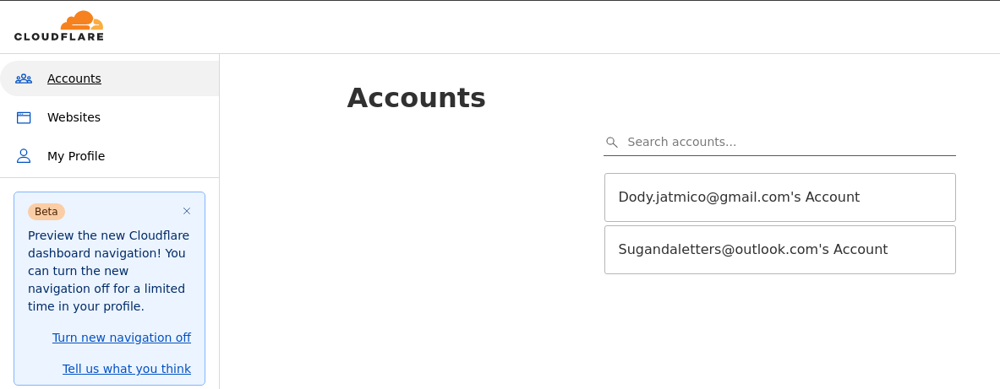
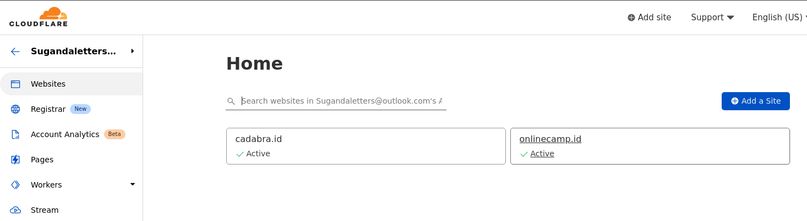
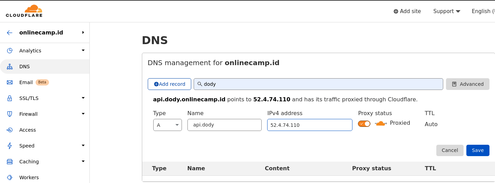

# **CUSTOM DOMAIN FOR BACKEND APP**

1. Login cloudflare terlebih dahulu.
2. Pilih akun `sugandaletters@outlook.com`
3. Pilih `onlinecamp.id` 
     
     

4. Klik menu `DNS`, lalu klik `add record`.
     

   - Isikan IPV4 address dengan IP public gateway instance.
   - Save.
   