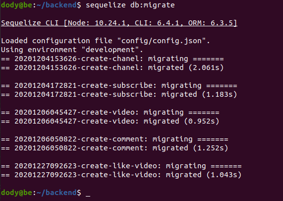

# **DEPLOYMENT BACKEND APP**

1. Login ke server backend.
2. Clone aplikasi dari https://github.com/sgnd/dumbflix-backend.git
   
        git clone https://github.com/sgnd/dumbflix-backend.git
      

    - Buka file `README.md ` di dalam folder backend.
      

3. Jalankan requirements nya.
   - Install node.js 10.x
   - Import database dumbflix.sql dengan sequlize
   - Copy .env.example to .env
   - Deploy dumbflix-backend with port 5000   
  
      
      

   - Change config/config.json to your database
      

4. Lakukan secure copy untuk database `dumbflix.sql` dari server backend ke dalam server database.

        scp -r dumbflix.sql host@ip:<tujuan>
      
       

## Import Database Dengan Sequelize

1. Install sequelize pada backend.

        npm install --save-dev sequelize-cli -g
      

2. Migrate database.

        sequelize db:migrate
      

3. Jalankan backend app dengan pm2
     

