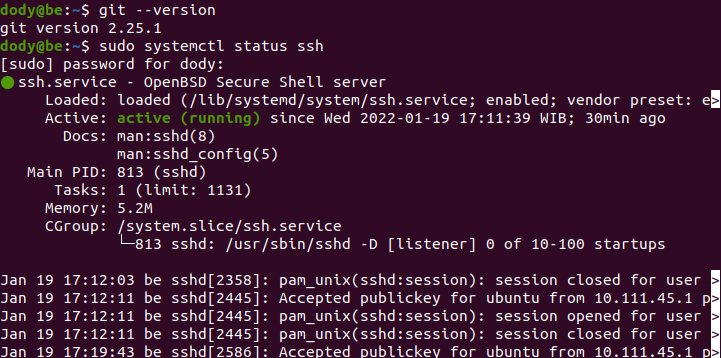
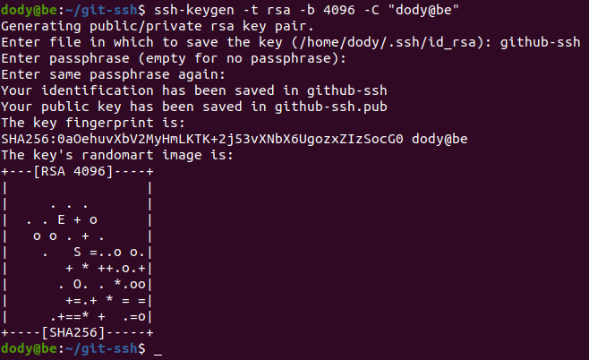
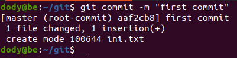

# **INSTALLATION GIT & SSH KEY**
## Fork Repository backend apps
 

1. Login ke akun Github.
2. Buka repository backend apps yang akan di-fork, https://github.com/sgnd/dumbflix-backend.
3. Pada halaman repository backend apps, klik fork mpada pojok kanan atas, maka otomatis kita akan masuk ke repository akun github kita.
      

## Buat SSH key untuk Git
 

1. Buat sebuah server di AWS.
     
     
     
     
     
     
     
     
     
     

2. Masuk kedalam server yang sudah dibuat, yaitu server backend dengan key.
     

3. Lakukan update dan upgrade.

        sudo apt update -y && sudo apt upgrade -y
      

4. Cek apakah sudah terinstall git dan ssh.
     

5. Buatlah git config terlebih dahulu.

        git config --global user.name "<username>"
        git config --global user.email "<email>"
      

6. Buat folder untuk menyimpan ssh key.
   
        mkdir ssh-key
      

7. Generate ssh key di dalam foder yang telah dibuat. lalu Jalankan perintah berikut ;
8.  Masukkan nama file kemudian passphrase.

         ssh-keygen -t rsa -b 4096 -C "email".
      

9. Hal tersebut akan menghasilkan 2 key, git-ssh dan git-ssh.pub.
      

10. Tambahkan ssh key yang telah di generate tadi, ketikkan perintah ; 

         eval "$(ssh-agent -s)" 
         ssh-add git-ssh
        
   
11. Login ke GitHub.
12. Masuk ke settings, pada bagian `Account settings` klik `SSH dan GPG keys`.
13. Untuk menambahkan ssh key, copy isi data ssh key yang sudah dibuat tadi yang berekstensi `.pub` kemudian paste ke bagian `key` lalu `Add ssh key`.
      

14. Kemudian test koneksi ke github.

         ssh -T git@github.com
         

## Git pull, git commit, git push, and git merge

1. Pertama kita buat direktori baru untuk menyimpan perubahan inisiasi git di dalam direktori tersebut.

         mkdir <new-direktori>
         git init
        

   - Tambahkan file di dalamnya dan cek statusnya.

         cat > file (isi file)
         git add .
         git status
        

   - Lakukan commit.

         git commit -m "<isi pesan>"
        

   - Tambahkan branch baru, lalu pindah ke branch baru dan buat file baru juga.

         git branch <nama-branch>
         git checkout <branch-baru>
         cat > fle (isi file)
        

   - Lakukan add dan commit.
   - Pindah ke branch development (branch awal).
   - Lakukan merge.

         git mnerge <nama-branch>
        

   - Add git remote.
        

   - Jalankan git push & pull.
        
        

   