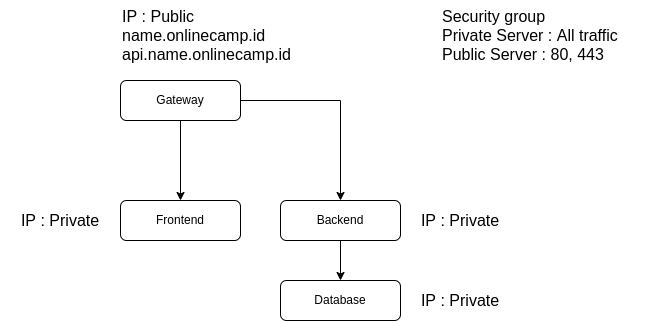

# **Week 2 : Manage Code and Database**

- ## **Manage Code**
  
  Pada week 2 kali ini, kita akan belajar memanage code & database. Git adalah sebuah version control system yang berfungsi untuk mengelola perubahan file dalam folder. Riwayat perubahan file tersebut disimpan menggunakan serangkaian `commit`. Kemudian SSH, Secure Shell (SSH) adalah sebuah protokol jaringan kriptografi untuk komunikasi data yang aman, login antarmuka baris perintah, perintah eksekusi jarak jauh, dan layanan jaringan lainnya antara dua jaringan komputer.

  Hal yang akan dipelajari ;
  - Fork https://github.com/sgnd/dumbflix-backend to your GitHub account.
  - Create SSH key for  the Git.
  - Git on the server can git pull, git commit, git push without username & password.   

- ## **Manage Database**
  
  Database merupakan kumpulan data yang disimpan secara sistematis di dalam komputer, di mana data tersebut dapat diolah atau dimanipulasi.

  Yang dipelajari antara lain ;

  - Setup databases.
  - Deployment backend app
  - Reverse proxy for backend app.
  - Custom domain for backend app.
  - SSL configuration for backend app.

   

- ## **Kebutuhan**
  
  Sebelum memulai tugas di atas, hal-hal yang perlu dipersiapkan antara lain ;

  - Server : AWS
  - Security group : All traffic & port 80, 443
  - Aplikasi frontend : Dumbflix
  - Aplikasi backend : Dumbflix   

# **Penyelesaian**

- [Install Git & SSH key](Install-Git-and-SSH-key.md)
