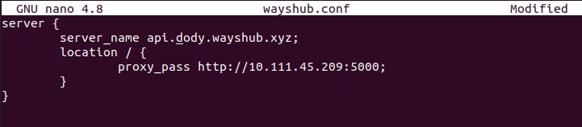

# **REVERSE PROXY FOR BACKEND APP**

1. Login ke server gateway terlebih dahulu.
2. Laakukan update and upgrade.
3. Install `Nginx`.
     

4. Masuk ke folder /etc/nginx/dumbflix
5. Kemudian buat file config untuk backend app `api.dody.onlinecamp.id`

        cd /etc/nginx/dumbflix
        nano api.dody.onlinecamp.id
      

    - Arahkan proxy_pass ke ip private server backend.
      

    - Save.
    - Lakukan validasi config dan reload `nginx`.

            sudo nginx -t
            sudo systemctl reload nginx