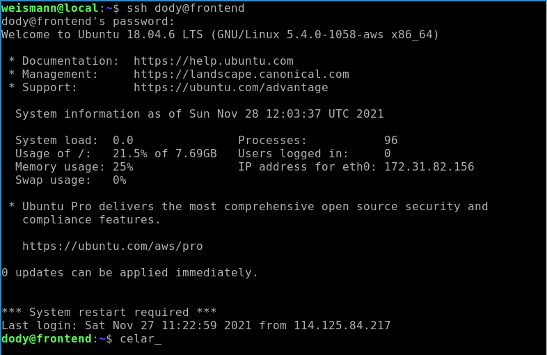
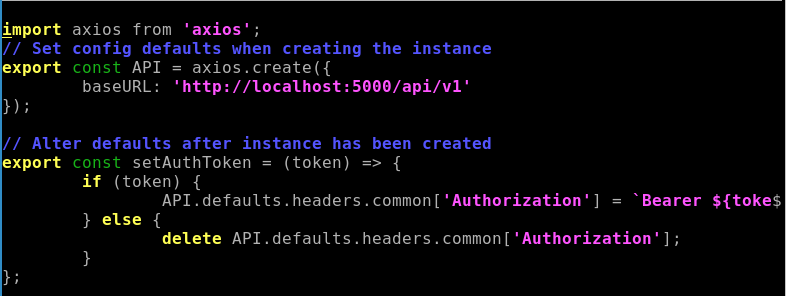
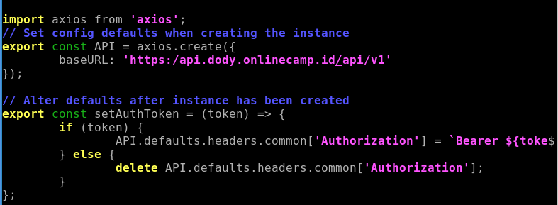
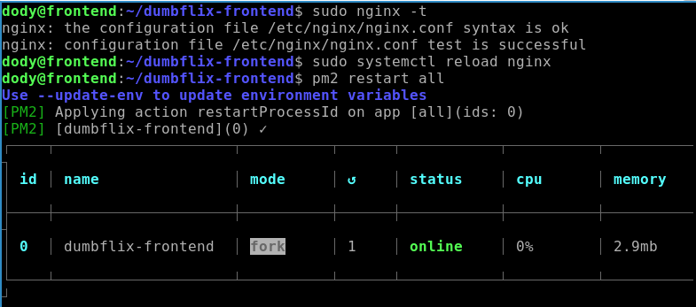

# **SSL CONFIGURATION FOR BACKEND APP**
## Arahkan Frontend Api.Js Ke Backend App

1. Login ke server frontend terlebih dahulu.  
     

2. Masuk ke folder /dumbflix-frontend/src/config/
3. Edit file api.js arahkan `baseURL`: https://api.dody.onlinecamp.id/api/v1.  
     
      

   - Save.
   - Validasi dan reload nginx.
   - Restart app.
     

## SSL Configuration

1. Login ke server gateway.
2. Lakukan update dan upgrade sistem.
3. Install certbot.
4. Jalankan perintah 

        sudo certbot certonly -d api.dody.onlinecamp.id
    ![]

