# **SETUP DATABASES**
## Buat Instance Baru Untuk Backend

1. Login ke AWS, pilih EC2.
2. Masuk ke instance, pilih `Launch instances`
3. Buat instances baru untuk database.
   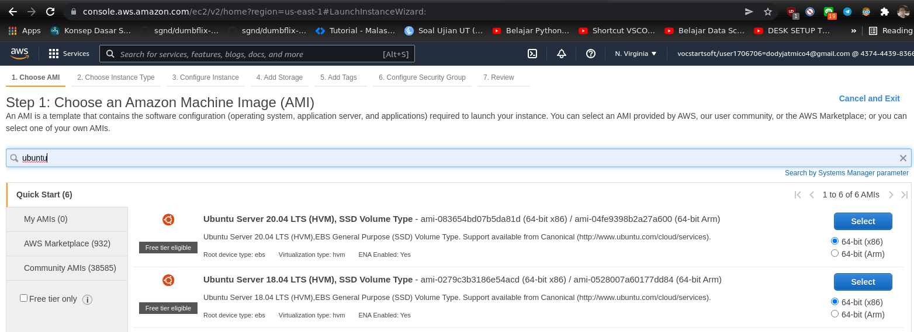  
   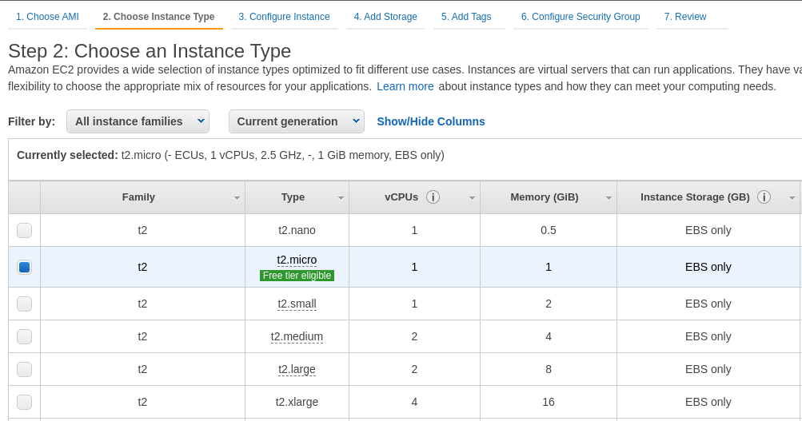  
   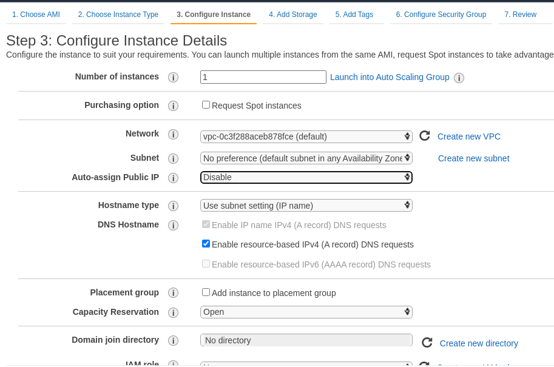  
   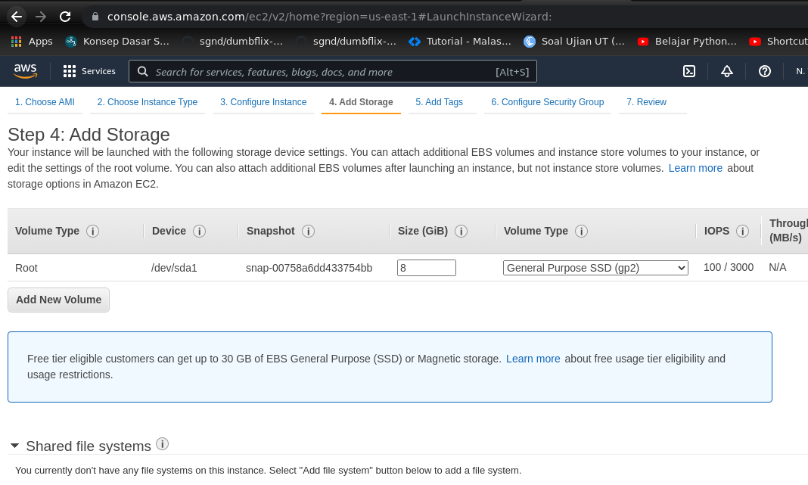  
   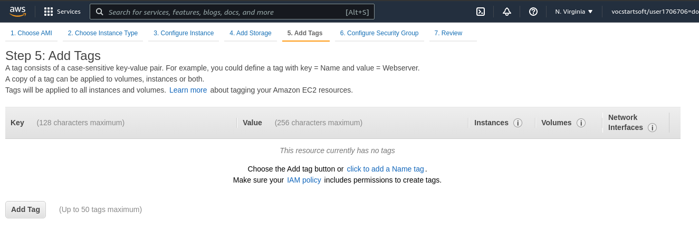  
   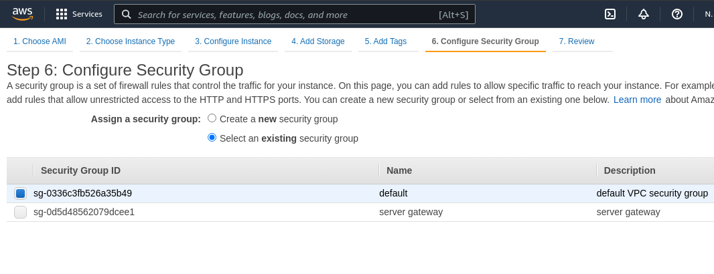  
   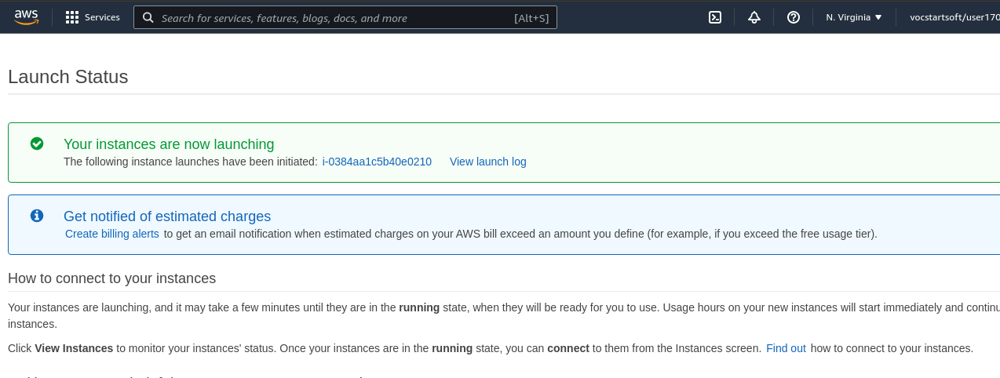  
     
   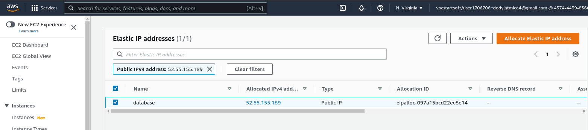  
   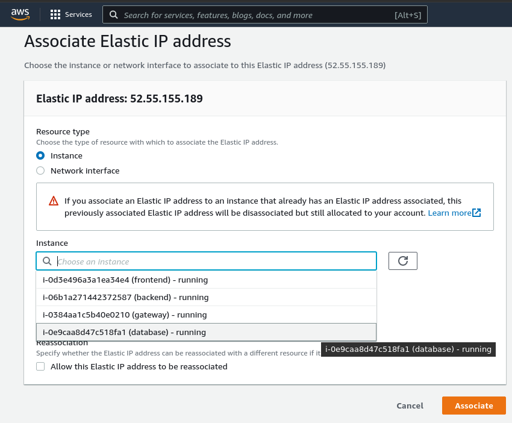  
   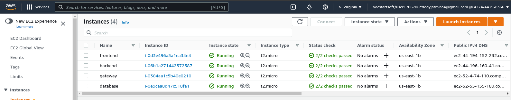   

## Install Database

1. Login ke server database.
2. Lakukan update and upgrade terlebih dahulu.
     

3. Install mysql-server, lalu cek apakah sudah jalan.

        sudo apt install myql-server
        sudo systemctl status mysql
    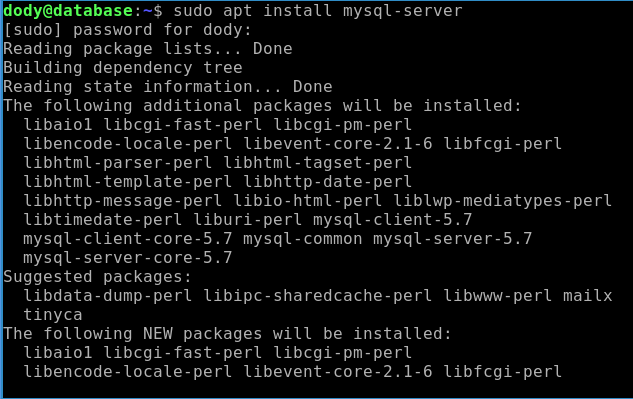  
    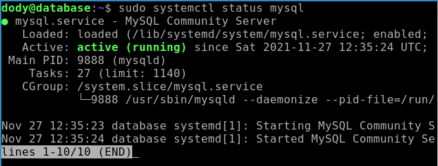  

4. Konfigurasi keamanan database.
   
        sudo mysql_secure_installation
    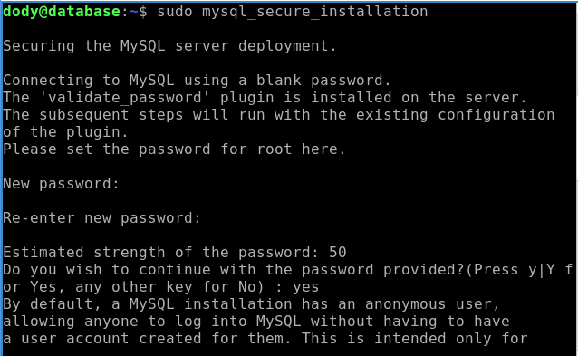   

## Remote Database Dari Klien

1. Buka folder `/etc/mysql/mysql.conf.d`, lalu edit file `mysqld.cnf`

        sudo nano mysqld.cnf
    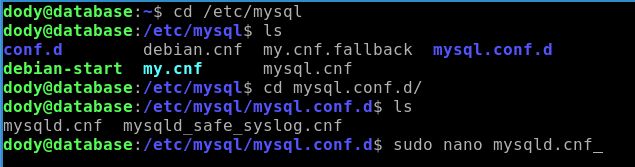  
    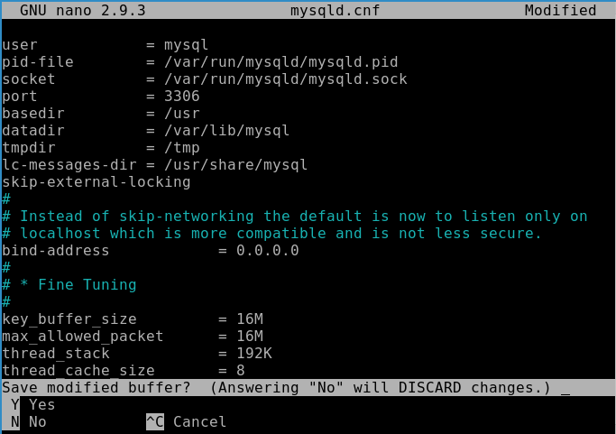  

   - Restart mysql service dengan perintah `sudo systemctl restart mysql`.   
  

2. Memberi akses ke host.
3. Membuat login tanpa sudo.
   
        sudo mysql -uroot
    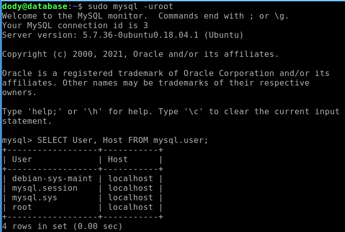  

    - Membuat user baru dan grant database.
    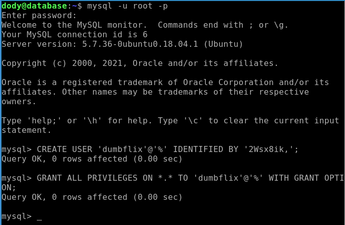  