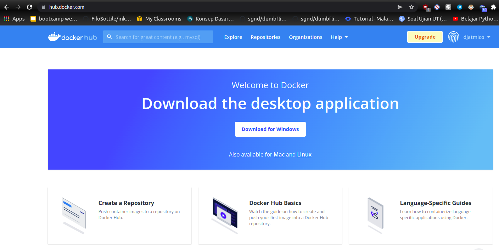

# **INSTALL DOCKER**
## Install Docker di Server Frontend dan Backend

1. Pertama, login terlebih dahulu ke server frontend dan backend. Di sini, untuk server frontend saya gabungkan dengan server gateway.
   
2. Update dan upgrade sistem.  

        sudo apt update -y; sudo apt upgrade -y
     
     
   
3. Perbarui apt untuk memungkinkan dapat menggunakan repositori melalui HTTPS.

        sudo apt-get install \
        ca-certificates \
        curl \
        gnupg \
        lsb-release
      
      

4. Tambahkan Official GPG key docker. 
   
        curl -fsSL https://download.docker.com/linux/ubuntu/gpg | sudo gpg --dearmor -o /usr/share/keyrings/docker-archive-keyring.gpg
      
      

    - Gunakan perintah berikut untuk mengatur repositori yang stabil. Bisa menggunakan stable atau nightly.

            echo \ "deb [arch=$(dpkg --print-architecture) signed-by=/usr/share/keyrings/docker-archive-keyring.gpg] https://download.docker.com/linux/ubuntu \ $(lsb_release -cs) stable" | sudo tee /etc/apt/sources.list.d/docker.list > /dev/null
          
          

5. Lakukan update sistem.
   
6. Install docker.

        sudo apt-get install docker-ce docker-ce-cli containerd.io
      
      

7. Cek versi docker dan pastikan sudah berjalan.  

        docker --version
        sudo systemctl status docker
     
      

## Sign Up & Log In to Docker Hub

1. Masuk ke web [hub docker](https://hub.docker.com/).
2. Kemudian silakan daftar / sign up.  
      

3. Login ke server frontend, lalu login docker menggunakan akun hub docker yang telah dibuat sebelumnya.

        docker login
    

    - Jalankan perintah berikut apabila terjadi kendala saat memasukkan `username` dan `password`

            sudo chmod 777 /var/run/docker.sock 