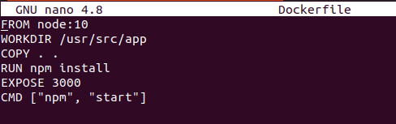
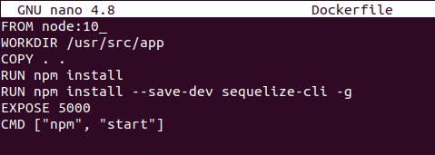
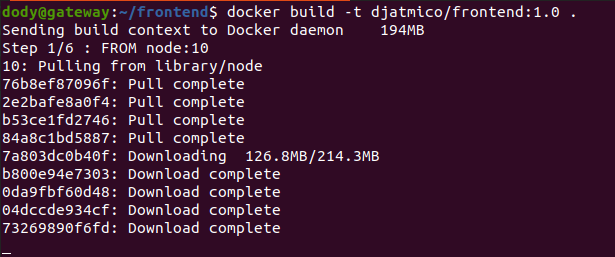
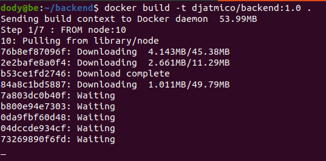
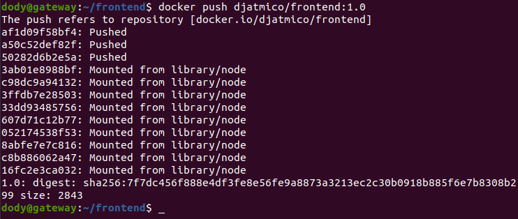
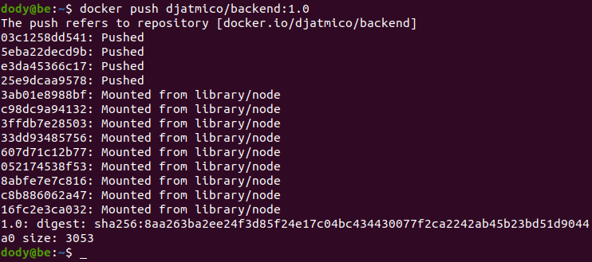

# **CREATE DOCKER IMAGES**
## Membuat Docker Images Untuk Frontend

1. Login ke server frontend dan backend.
2. Masuk ke dalam folder frontend & backend.
3. Buat docker file 
   
        nano Dockerfile
      

    - Lakukan hal yang sama di server backend.  
      
    
4. Buat docker image frontend dan backend app.
   
        docker build -t nama-file:tag
      
      

5. Push images ke reposiroty docker hub.

        docker push nama-images:tag
      
      
    
6. Kemudian kita bisa cek di akun docker hub kita, apakah sudah berhasil atau belum.  
    