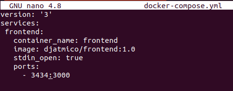
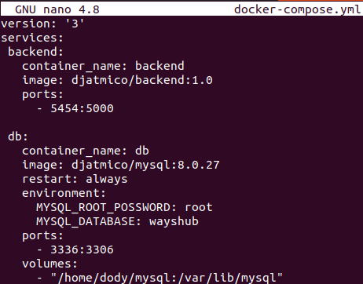
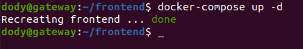
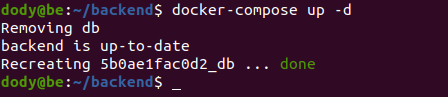
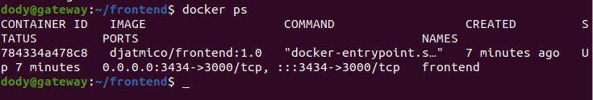
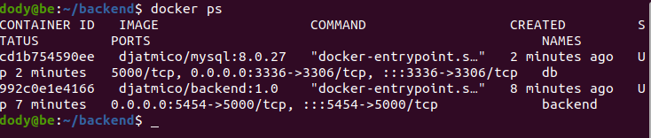
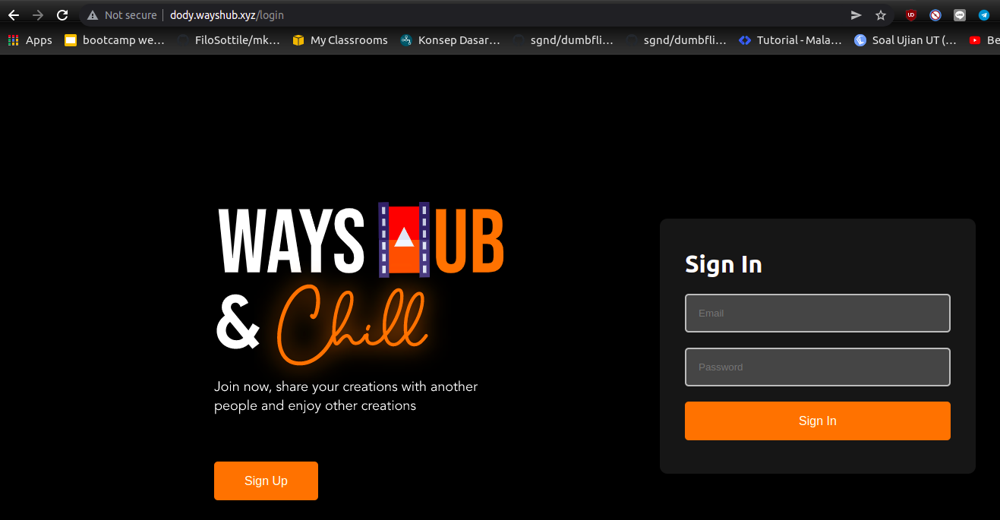
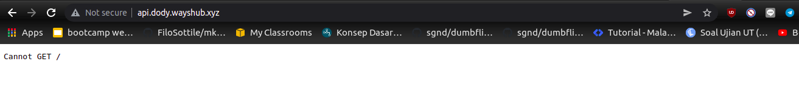

# **INSTALL APPLICATIONS**

1. Kita akan membuat container dengan docker compose. Pertama-tama login ke server frontend & backend.
2. Kemudian buat sebuah file docker-compose.yml dan ketikan perintah berikut di dalamnya (masing-masing di fe & be).
   
        nano docker-compose.yml
      
      

3. Lalu untuk membuat sebuah container ketikkan perintah berikut (masing-masing di fe & be) ;
   
        docker-compose up -d
      
      

4. Periksa apakah contianer sudah berjalan.

        docker ps
      
      

5. Periksa di browser apakah apps berjalan dengan baik.  
     
   