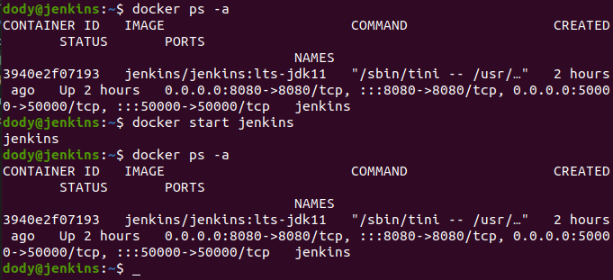
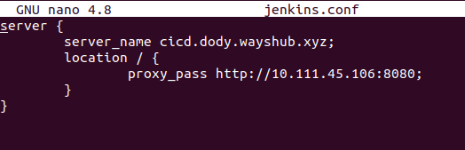
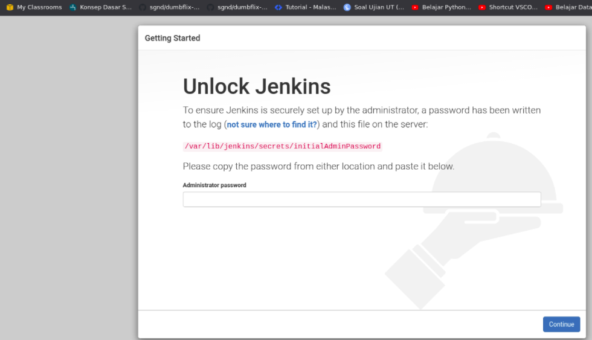

# **INSTALL JENKINS**
## Buat server jenkins

1. Pertama buatlah server untuk jenkins dengan multipass.
2. Login ke sever jenkins via SSH.
3. Update dan upgrade sistem.
4. Install docker pada server jenkins.

       curl -fsSL https://get.docker.com -o get-docker.sh
       sudo sh get-docker.sh

## Install Jenkins 

1. Kemudian install jenkins dari docker dengan menjalankan perintah

       docker run -p 8080:8080 -p 50000:50000 -v jenkins_home:/var/jenkins_home jenkins/jenkins:lts-jdk11
        
   
   `NB:` port 8080 untuk akses gui jenkins dan 50000 untuk jenkins master/slave - perintah -v untuk membuat volume jenkins yang ada pada directory jenkins_home - jenkins/jenkins merupakan images dari dockerhub - --name untuk memberikan nama container.

   - Jalankan container dengan perintah berikut ;

         docker ps -a
         docker start ${CONTAINER_ID or CONTAINER_NAME}
        

2. Kemudian kita setup reverse proxy untuk jenkins.

   - Login ke server gateway.
   - Masuk ke folder nginx /etc/nginx/
   - Buat konfigurasi file jenkins.conf  
     
   - Lakukan validasi dengan `sudo nginx -t; sudo systemctl reload nginx`.  

3. Buka browser dan arahkan ke `domain yang sudah kita buat`.
   
   
4. Masukkan initial admin password, bisa dilihat di 
   
        sudo docker exec ${CONTAINER_ID or CONTAINER_NAME} cat /var/jenkins_home/secrets/initialAdminPassword
      
    
    - Masukan password ke dalam browser tadi.
  
5. Pilih jenis instalasi plugin jenkins `pilih yang suggested plugins` dan tunggu proses instalasi plugin selesai.
   
6. Buat admin jenkins, simpan dan lanjut.  
     

7. Konfigurasi jenkins URL. Save and finish.

8. Tampilan dashboard jenkins.  
   