# **SETUP JENKINS JOBS**
## Konfigurasi Sistem di Jenkins

1. Install plugin `SSH Agent`.
   - Di halaman dashboard masuk ke `manage jenkins`.
   - Kemudian pilih `manage plugins`
   - Cari `ssh agent`.  
      
    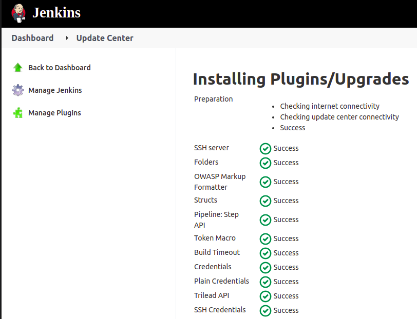  

## Create Jobs

1. Pada dashboard jenkins, pilih `new item` kemudian isikan nama dan pilih `Freestyle project`.  
   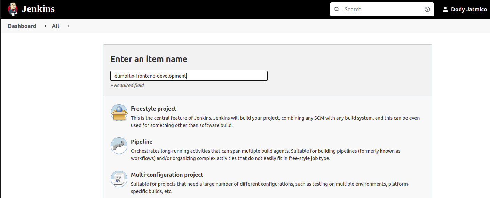  

2. Buatlah credentials terlebih dahulu untuk masing-masing  applikasi.  
   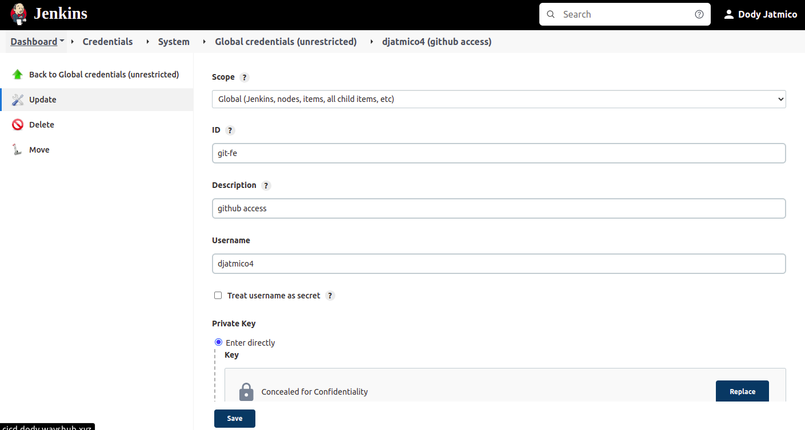  

3. Pada bagian `General` input deskripsi project (optional).
4. Pada bagian `Source code management` pilih `Git`. Lalu masukan reposiroty dan branch yang digunakan.  
   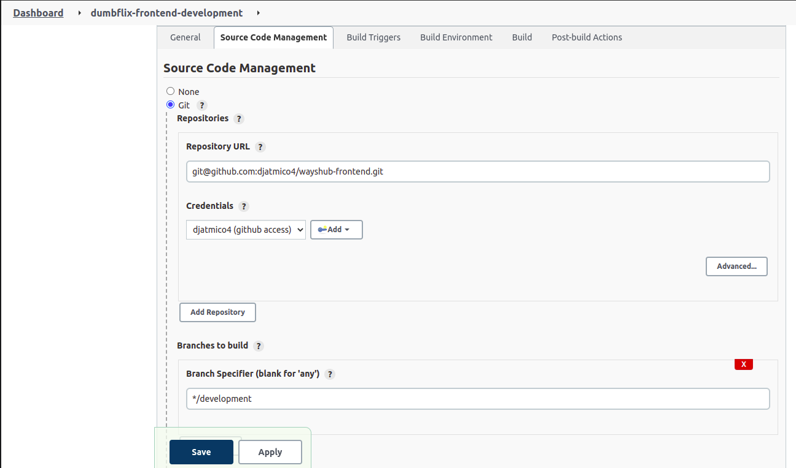  

5. Untuk `Build trigger` pilih `Github hook trigger for GITScm polling`.  
   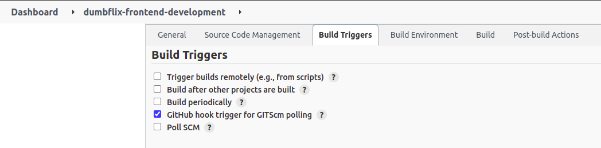  

6. Pada bagin `Build` pilih `Send files or execute commands over SSH`.  
   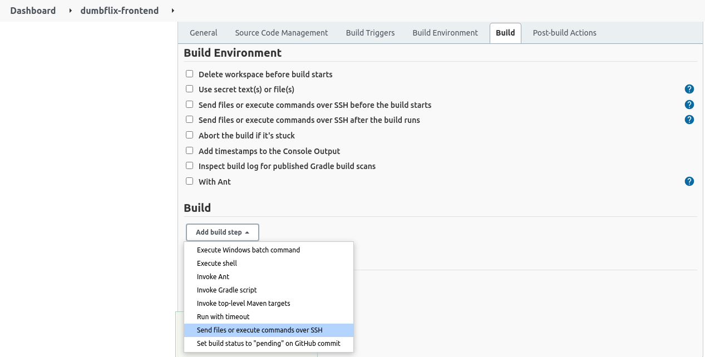  

7. Kemudian checklist `Verbose output in console` untuk bisa melihat log buildnya.  
   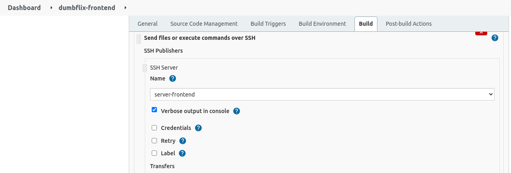  

8. Pada bagian `Transfer set` isi source file, remote directory dan exec command.  
   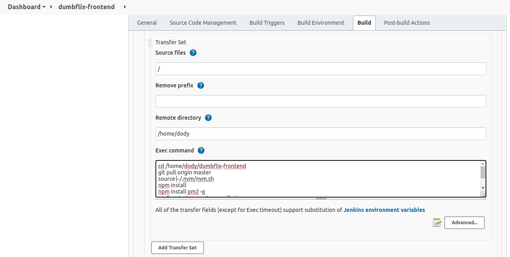  

   - Set `Exec timeout (ms)` jadi 0.
   - Setelah itu `Apply dan save`.
   - Build manual dengan `Build Now`  
  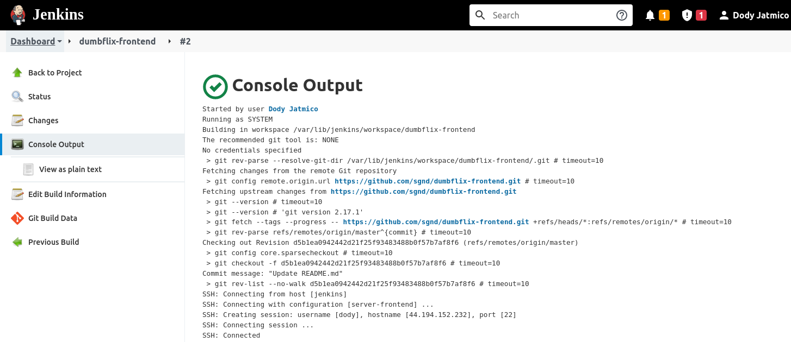   

## Setup Webhook Github

1. Login ke akun github.
2. Masuk ke halaman settings repository.
3. Pilih Webhook.
4. Add Webhook.
5. Masukkan hostname server jenkins payload URL `http://jenkins.dody.onlinecamp.id/github-webhook/`.
6. Kemudian pilih event `Just the push event`.
7. Checklist `Active`.
8. Lalu `Add Webhook`.  
   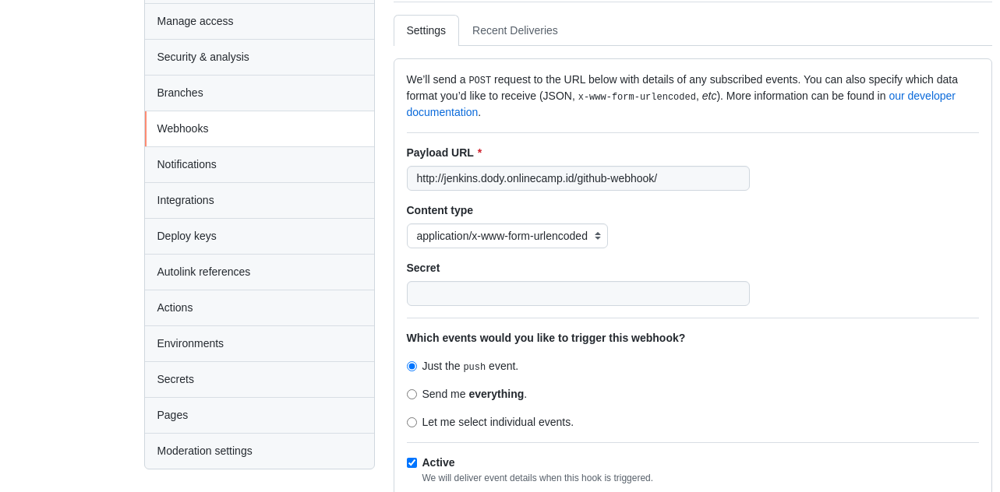  

9. Kemudian test webhook. Kita coba edit file README.md  
    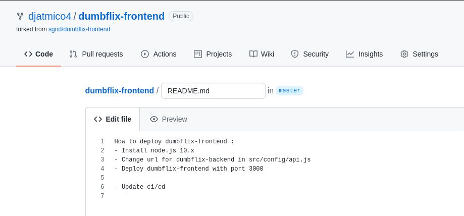  

    - Berikut hasilnya. Masuk ke jenkins dan lihat di status atau change-nya  
    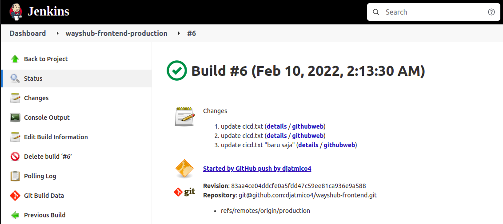