# **SETUP JENKINS JOBS**
## Kebutuhan

- Install plugin Publish Over SSH
- Instance/Server app IP address
- Multipass-ssh-key
- System configuration

## Konfigurasi Sistem di Jenkins

1. Install plugin `publish Over SSH`.
   - Di halaman dashboard masuk ke `manage jenkins`.
   - Kemudian pilih `manage plugins`
   - Cari publish over ssh.  
    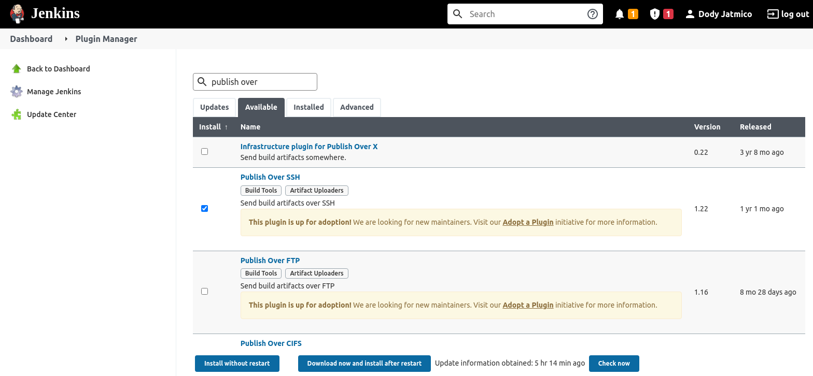  
    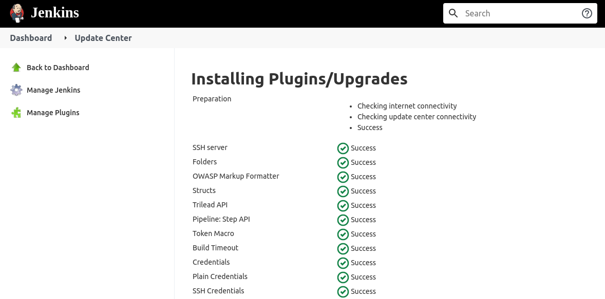   

2. Copy paste key pair yang digunakan server.  
   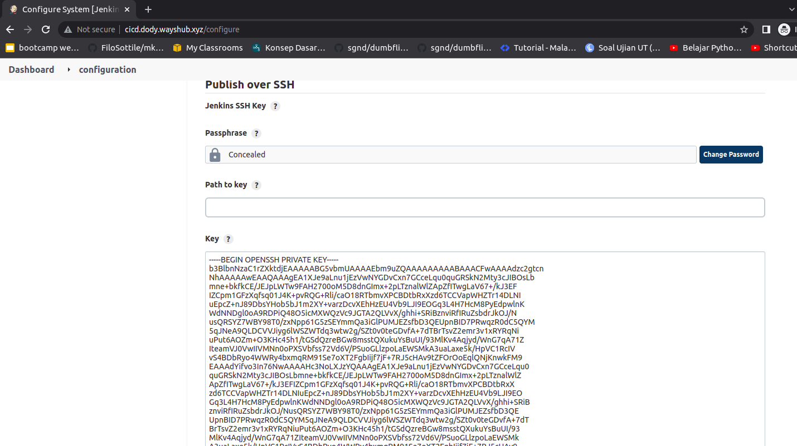  

3. Pilih `Add` beri nama server.
4. Masukkan hostname server.
5. Input username dan password bila sudah setting sebelumnya.
6. Beri nilai 0 pada `Timeout (ms)`.  
   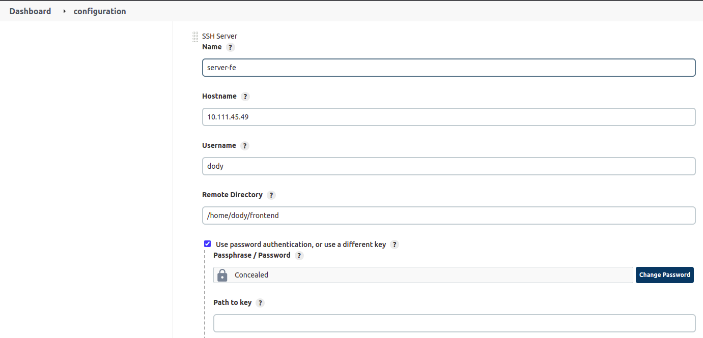  

   - Kemudian lakukan `Test Configuration` apabila muncul tulisan `success` maka konfigurasi berhasil.
   - Apply dan save.   

7. Setup credentials untuk akses gihtub.  
   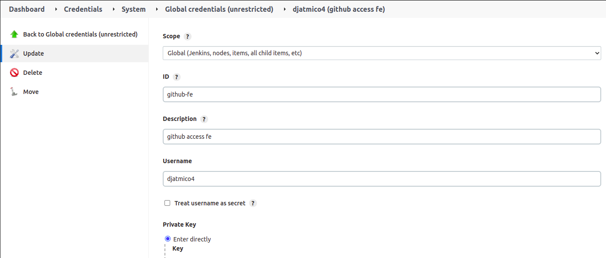

## Create Jobs

1. Pada dashboard jenkins, pilih `new item` kemudian isikan nama dan pilih `Freestyle project`.  
   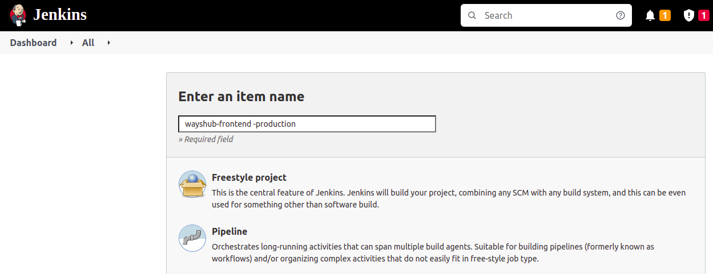  

2. Pada bagian `General` input deskripsi project (optional).
3. Pada bagian `Source code management` pilih `Git`. Lalu masukan reposiroty dan branch yang digunakan.  
   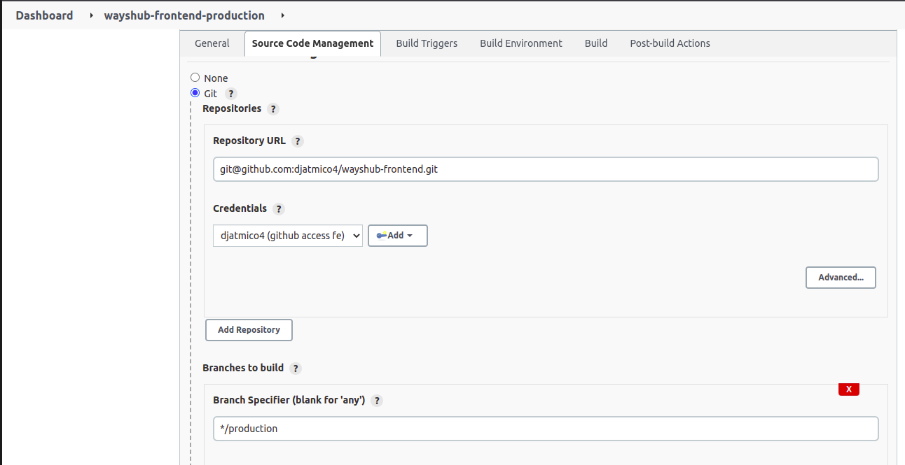  

4. Untuk `Build trigger` pilih `Github hook trigger for GITScm polling`.  
   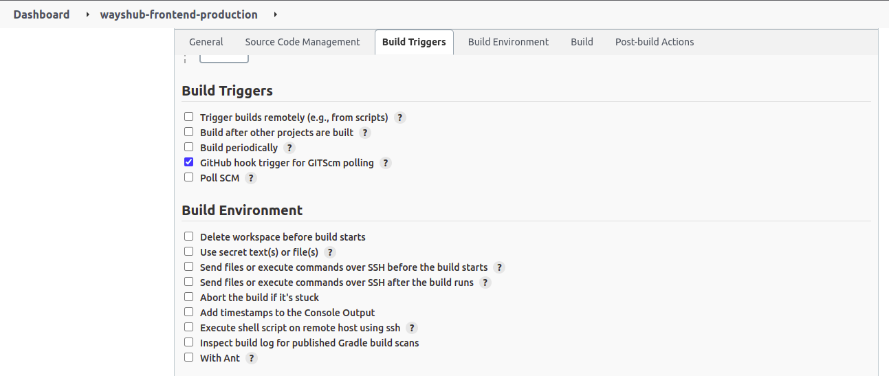  

5. Pada bagin `Build` pilih `Send files or execute commands over SSH`.  
   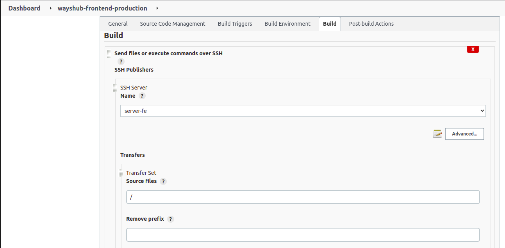  

6. Kemudian setup commandnya.  
   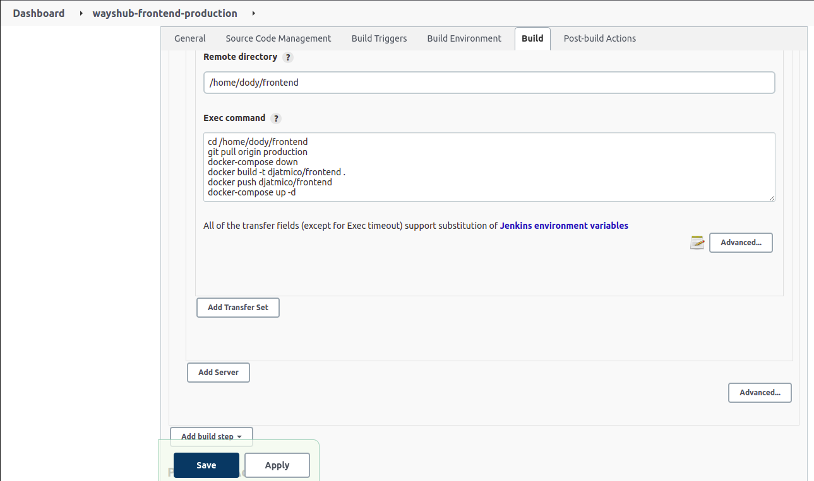  

   - Masuk ke `advance`
   - Set `Exec timeout (ms)` jadi 0.
   - Setelah itu `Apply dan save`.
   - Build manual dengan `Build Now`  
     

7. Lakukan hal yang sama ke server backend.

## Setup Webhook Github

1. Login ke akun github.
2. Masuk ke halaman settings repository.
3. Pilih Webhook.
4. Add Webhook.
5. Masukkan hostname server jenkins yang sudah diforward menggunakan `Ngrok`.
6. Kemudian pilih event `Just the push event`.
7. Checklist `Active`.
8. Lalu `Add Webhook`.  
   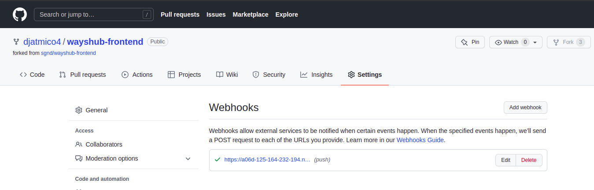  

9. Kemudian test webhook. Kita coba tambahkan file `cicd.txt`  
    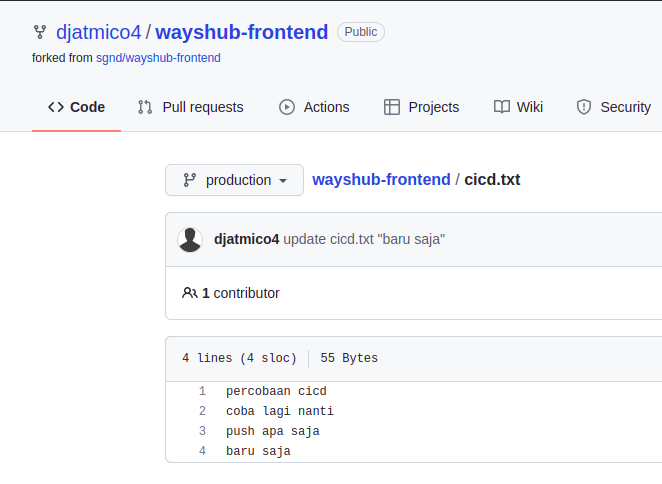  

    - Berikut hasilnya. Masuk ke jenkins dan lihat di status atau change-nya  
    