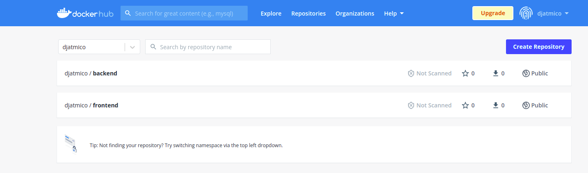

# **CREATE DOCKER IMAGES**
## Membuat Docker Images Untuk Frontend

1. Login ke server frontend dan backend.
2. Download images node js, dengan menjalankan perintah 
   
        docker pull node:14.18.1-alpine
      
      

3. Masuk ke dalam folder dumbflix-frontend.
4. Buat docker file 
   
        sudo nano Dockerfile
      

- Lakukan hal yang sama di server backend.
      

5. Buat docker image frontend danb backend app.
   
        docker build -t nama-file:tag
      
      

6. Buat container dari image frontend dan backend.
   
        docker container create --name nama-container -p 3131:3000 nama-images:tag
      

        docker container create --name nama-container -p 5151:5000 nama-images:tag
      

7. Push images ke reposiroty docker hub.

        docker push nama-images:tag
      
      
    
8. Kemudian kita bisa cek di akun docker hub kita, apakah sudah berhasil atau belum.  
    