# **INSTALL APPLICATIONS**

1. Kita akan membuat container dengan docker compose. Pertama-tama login ke server frontend & backend.  
   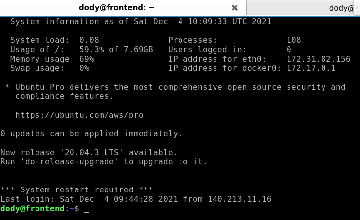  
   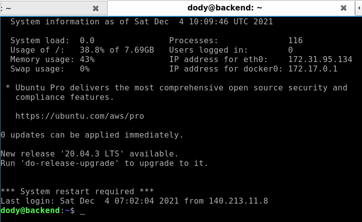  

2. Install docker compose (masing-masing di fe & be).

        sudo curl -L "https://github.com/docker/compose/releases/download/1.29.2/docker-compose-$(uname -s)-$(uname -m)" -o /usr/local/bin/docker-compose

        sudo chmod +x /usr/local/bin/docker-compose
        
        docker-compose --version
    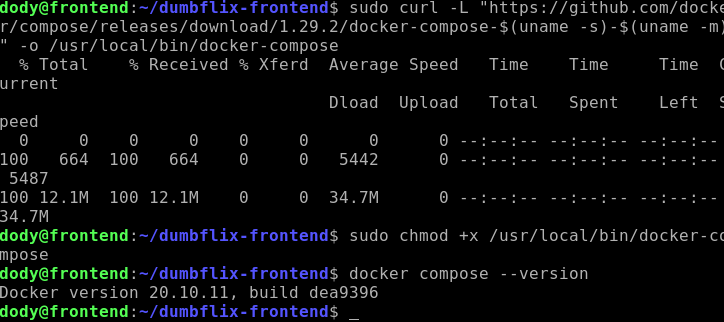  
    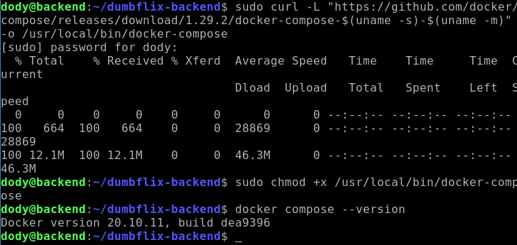  

3. Kemudian buat sebuah file docker-compose.yml dan ketikan perintah berikut di dalamnya (masing-masing di fe & be).
   
        nano docker-compose.yml
    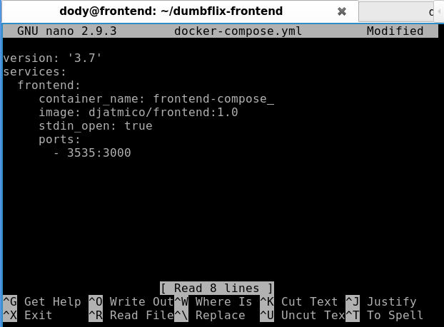  
    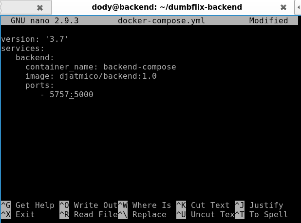  

4. Lalu untuk membuat sebuah container ketikkan perintah berikut (masing-masing di fe & be) ;
   
        docker-compose up -d
    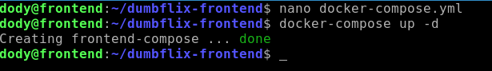  
    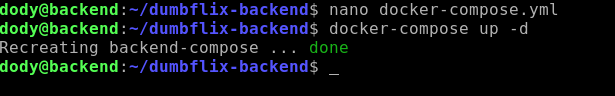  

5. Periksa apakah contianer sudah berjalan.

        docker ps
    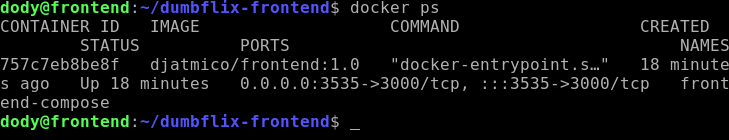  
    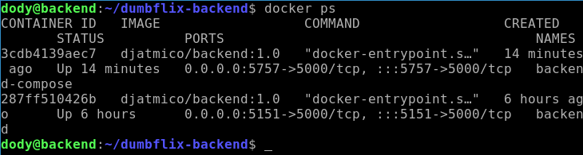  

6. Periksa di browser apakah apps berjalan dengan baik dengan memasukan `ip:port`.  
   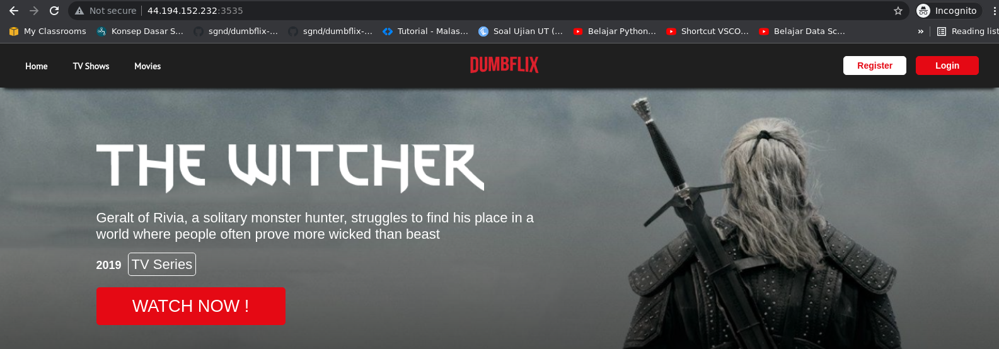  
   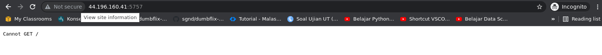