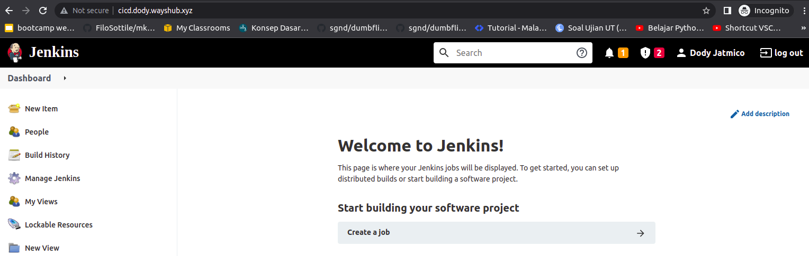

# **INSTALL JENKINS**
## Buat AWS Instance

1. Login ke akun AWS.
2. Buat instance baru untuk jenkins.
3. Login ke ke instance jenkins vis SSH.
4. Update dan upgrade sistem
5. Install Jenkins LTS. 

## Install Jenkins 

1. Install java terlebih dahulu.
   
        sudo apt install openjdk-8-jdk

   - Tambahkan apt repository jenkins 
  
            wget -q -O - https://pkg.jenkins.io/debian-stable/jenkins.io.key | sudo apt-key add -

   - Eksekusi kode berikut ;
  
            sudo sh -c 'echo deb http://pkg.jenkins.io/debian-stable binary/ > /etc/apt/sources.list.d/jenkins.list'

   - Update sistem.  
    

2. Install jenkins.  
     

3. Buka browser dan arahkan ke `ip-address-server:8080`.  
     

4. Masukkan initial admin password, bisa dilihat di 
   
        sudo cat /var/lib/jenkins/secrets/initialAdminPassword
      

    - Masukan password ke dalam browser tadi.   
  
5. Pilih jenis instalasi plugin jenkins(pilih yang suggested plugins) dan tunggu proses instalasi plugin selesai.
6. Buat admin jenkins, simpan dan lanjut.
     

7. Konfigurasi jenkins URL. Save and finish.
     

8. Tampilan dashboard jenkins.
      

## Reverse Domain for Jenkins

1. Pertama login ke akun cloudflare.
   - Pilih akun `sugandaletter@outlook.com` dan domain `onlinecamp.id`.
   - Masuk ke menu DNS.
   - Add record untuk `jenkins jenkins.dody.onlinecamp.id`
   - save.  
    

2. Kemudian kita setup reverse proxy untuk jenkins.
   - Login ke server gateway.
   - Masuk ke folder nginx `/etc/nginx/`
   - Buat konfigurasi file `jenkins.dody.onlinecamp.id`  
    
    

  - Lakukan validasi dan reload nginx.

3. Buka browser dan arahkan ke `jenkins.dody.onlinecamp.id`  
     