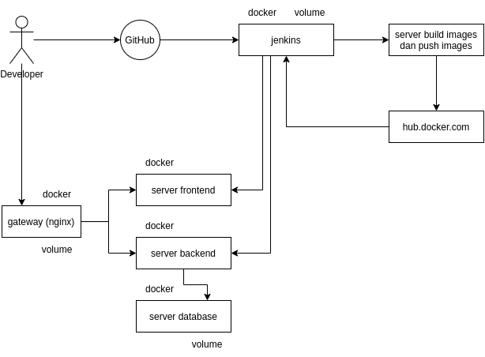

# **Week 3 : Docker & CI/CD**

- ## **Docker**
  
  Pada week 3 kali ini, kita akan belajar tentang docker & CI/CD. Docker adalah perangkat lunak yang dapat digunakan untuk membuat, menguji dan menerapkan aplikasi dengan cepat. Docker menjadikan perangkat lunak kedalam unit yang disebut container, dimana di dalamnya memiliki semua yang diperlukan perangkat lunak agar dapat berfungsi termasuk aplikasi dan dependencies.

  Hal yang akan dipelajari ;
  - Install docker.
  - Create docker images.
  - Install applications.   

- ## **CI/CD**
  
  CI/CD merupakan kependekan dari continuous integration (CI) dan continuous delivery (CD), yakni sebuah proses otomatisasi untuk memastikan bahwa kode aplikasi baru selalu diuji, aman dan siap untuk digunakan tepat pada waktunya.

  Hal yang akan dipelajari ;
  - Install jenkins.
  - Setup jenkins jobs.

   

- ## **Kebutuhan**
  
  Sebelum memulai tugas di atas, hal-hal yang perlu dipersiapkan antara lain ;

  - Server : AWS
  - Security group : All traffic & port 80, 443
  - Aplikasi frontend : Dumbflix
  - Aplikasi backend : Dumbflix   

 **Penyelesaian**

- [Install Docker](1.Install-docker.md)
- [Create Docker Images](2.Create-docker-image.md)
- [Install Applications](3.Install-application.md)
- [Install Jenkins](4.Install-jenkins.md)
- [Setup Jenkins Jobs](5.Setup-jenkins-job.md)