# **SETUP MONITORING SERVER**

1. Buat server baru di multipass.
2. Di sini aya menggunakan ansisble untuk instalasi node exporter ke banyak server.   

## Install Node Exporter di Server

1. Pertama-tama siapkan install node-exporter tiap server disini saya menggunakkan ansible.
2. untuk konfigurasi instalasi node-exporter seperti berikut;  
   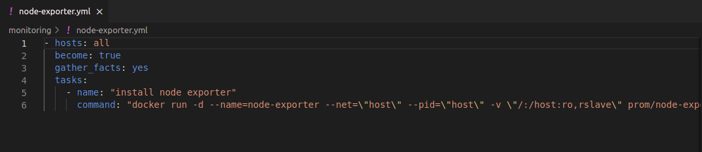  
     

   - Berikut adalah hasilnya;  
   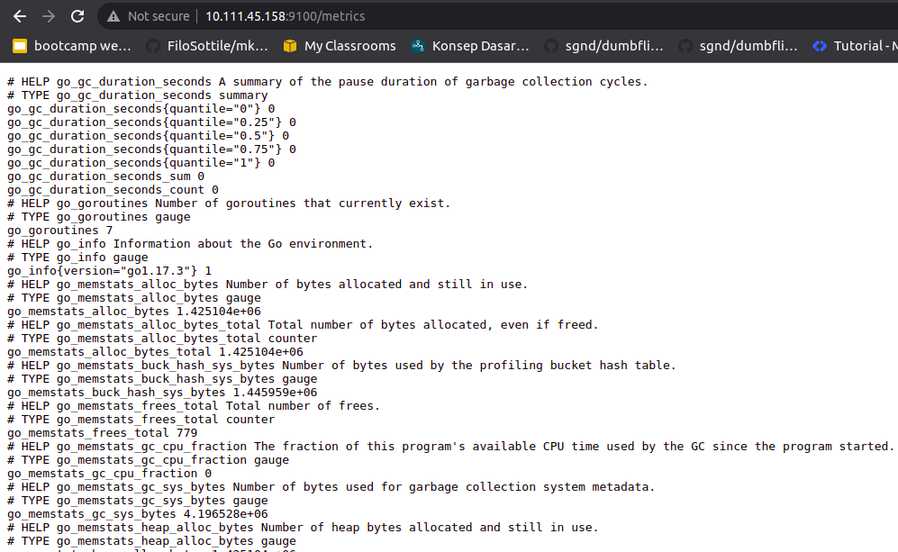  
   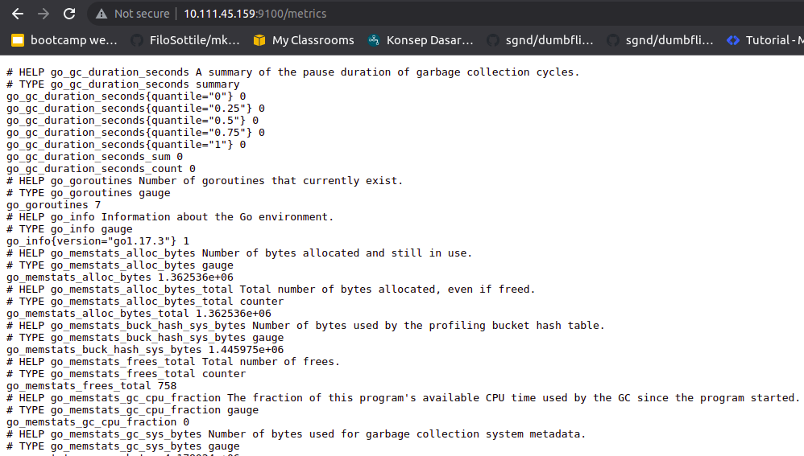  
   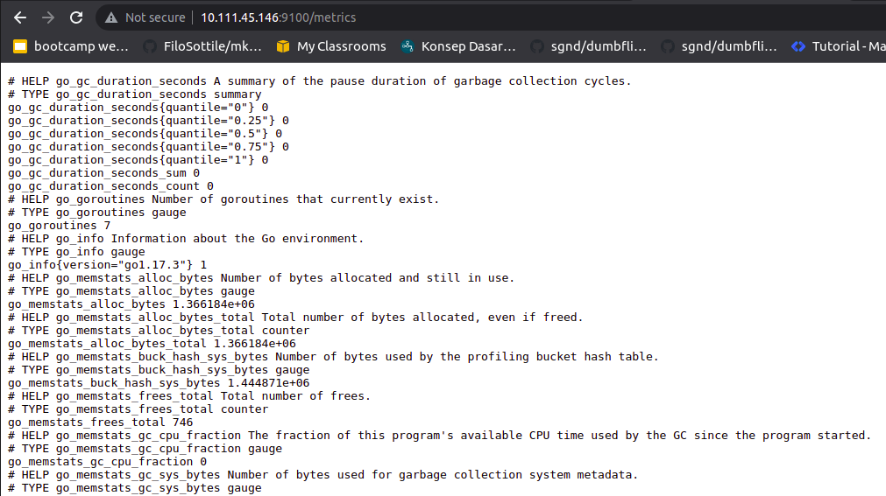  
   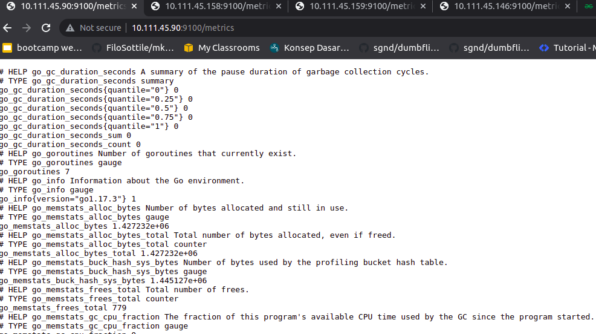   

## Install Prometheus di Monitoring Server

1. Di sini saya juga menggunakan ansible.
2. Untuk konfigurasi instalasi grafana dan promethus seperti ini;  
   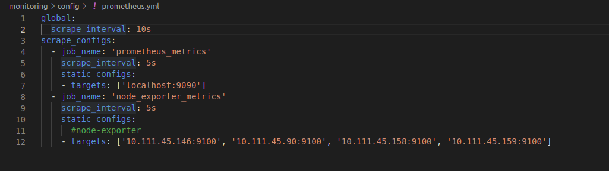  
   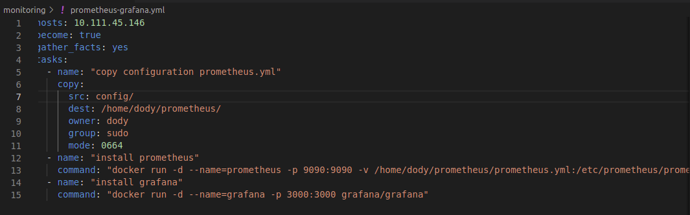  

3. Jalankan ansible playbooknya.  
   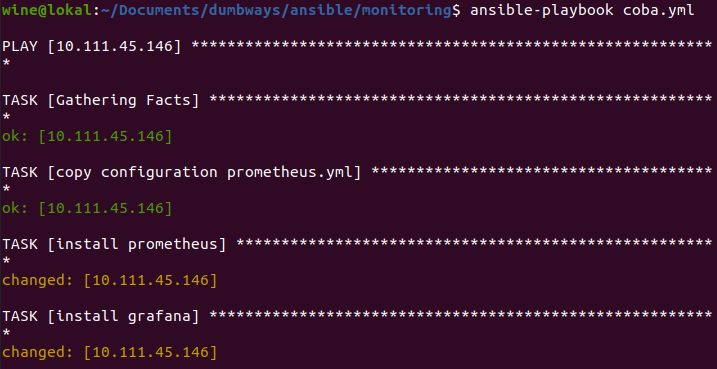  

4. Siapkan reverse proxy untuk prometheus dan grafana.  
   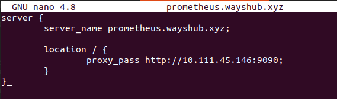  
   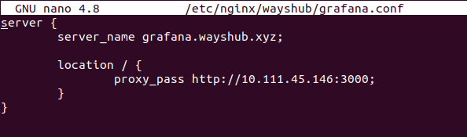  

5. Kemudian buka browser dan akses domain tersebut. Hasilnya sebagai berikut.     
   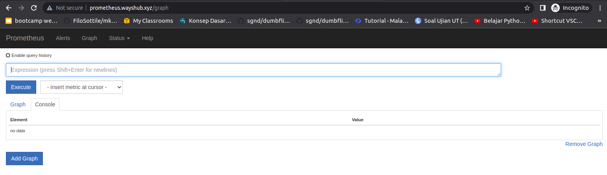  
   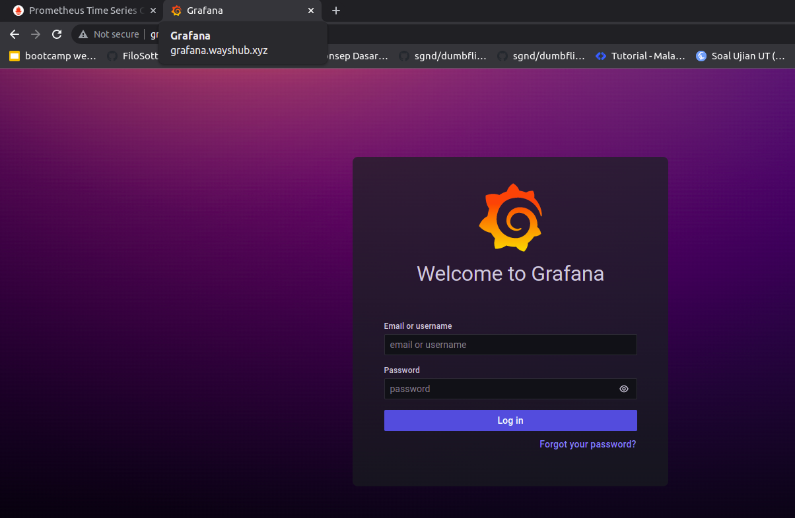  
   